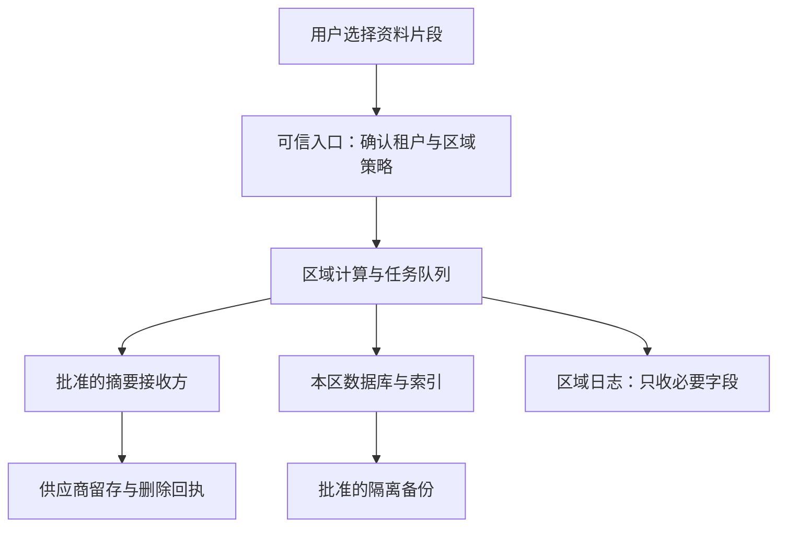

# 跨区域隐私工程知识点讲义

## PRIVACY-02 跨区域合规、数据分级与前端工程控制

“主库在境内，为什么还要检查跨区域处理？”因为聊天正文可能留在主库，报错截图却去了另一家日志平台；模型调用没有跨区，客服远程查看附件也可能形成另一条访问路径。

本讲沿用一项具体功能：学习系统把用户选中的资料片段交给供应商生成摘要。我们要回答：哪些事实先确认，什么决定允许发送，规则服务失败后页面怎么表现，以及用户删除资料时怎样找到所有副本。工程负责执行经确认的规则并留下证据，法律适用和路径选择需要结合实际业务作专业判断。

### 学习前先确认

- 直接前置：[PRIVACY-01 数据最小化、同意、留存与用户权利](../chinese-guides/privacy-01-data-minimization-consent-retention-rights.md#privacy-01)。本讲会直接使用处理目的、依据、撤回、数据地图、保留和删除传播。

### 一、先收集四类事实，再讨论能否传输

不要从“用户 IP 是哪个国家”直接跳到允许或禁止。至少要确认四类事实：

| 事实 | 摘要功能中的问题 | 容易漏掉的变化 |
| --- | --- | --- |
| 主体 | 向哪些地区、哪些类型的人提供服务？是否涉及儿童或员工？ | 产品增加了新的服务地区 |
| 处理者 | 谁决定处理目的？哪家供应商受托处理？谁能远程访问？ | 换了签约法人或子处理方 |
| 数据 | 是公开教材、账号标识、私人笔记，还是含健康信息的附件？规模如何？ | 文本框从固定选项改成自由输入 |
| 流动 | 在哪里收集、计算、存储、备份、支持和恢复？ | 故障时自动切换到全球端点 |

locale 表示界面语言，IP 可能经过代理，账户地区可能很久没有更新。这些是待核实的线索，不能单独作为法律适用结论。地区事实应记录来源、更新时间和可更正方式；无法确认的高风险上传先停止，已有本地阅读功能可以继续。

例如，一个使用中文界面的用户，属于服务欧盟市场的租户，资料存储在欧洲区域，支持人员从另一地区访问。只看 locale 会把四个维度挤成一个“中文用户”，随后所有判断都可能错位。

### 二、分类说明是什么，分级说明出事有多大影响

**数据分类（Data Classification）**回答内容属于哪一类；分级描述泄露、篡改或不可用造成的影响。两者要并列保留。

| 对象 | 应保留的类别事实 | 控制考虑 |
| --- | --- | --- |
| 公开发布的教程标题 | 公开内容；仍需确认实际用途和授权范围 | 普通缓存和内容完整性 |
| 用户账号与笔记的关联 | 个人信息及对应处理目的 | 最小访问范围、导出和删除 |
| 含就诊记录的附件 | 可能涉及敏感个人信息，需要专业确认 | 更严格的访问、传输和留存 |
| Session Cookie、签名下载链接 | 凭证或可访问数据的能力 | 禁止进入一般日志，短期有效、可撤销 |
| 可能命中行业重要数据目录的集合 | 独立记录认定线索与适用结论 | 按当前目录和规则复核 |

“高风险”不等于某一法律类别；一个字段也可能同时涉及多种类别。不能把所有数据压成 high / low，再丢掉处理依据、目的和地区信息。

分类元数据应由可信服务端、受控目录或经过验证的处理流程产生。客户端传来的 `dataClass: "public"` 只能算声明。自由文本、截图和附件可能包含字段名看不出来的内容；扫描工具也可能漏报。未知应保持未知，不能为了让请求通过而填成普通数据。

摘要、embedding、哈希和缩略图不自动成为匿名数据。分类变更还要传播到已有索引、日志、导出和供应商副本，相关原因可回看[派生数据与匿名的区别](../chinese-guides/privacy-01-data-minimization-consent-retention-rights.md#三哈希向量和摘要不自动等于匿名)。

### 三、数据驻留要覆盖一整条路径

**数据驻留（Data Residency）**是存储和处理位置的约束。选中了一个数据库区域，还不足以说明整个功能满足约束。



每一条箭头都要补上目的、接收方、字段、区域、保存期限和负责人。还要在图外检查谁可以进入这些节点：远程客服、运维、密钥管理员和供应商支持人员可能建立新的访问路径。

例如，主库和队列在批准区域，应用却把完整请求体发送给默认全球 APM collector，仍然存在额外流动。备份复制和灾备恢复也一样：当前请求没有跨区，不代表夜间任务不会复制过去。

前端 region 参数不能直接决定出口。服务端从可信租户配置选择区域和供应商，错误入口应在接收正文之前阻断或引导到正确入口。用于找路的全局目录只保留必要元数据，不应为了定位笔记，再集中复制一份笔记正文。

### 四、把法律资料记录为可复核的来源快照

本讲的官方资料复核日期为 **2026 年 9 月 19 日**。下面是本讲使用的主要文本与补充资料，不是某一业务的完整法律清单：

| 来源 | 时间信息 | 本讲用它确认什么 |
| --- | --- | --- |
| 《中华人民共和国个人信息保护法》 | 2021 年 11 月 1 日施行 | 处理原则、依据、敏感信息、个人权利及跨境提供的基本要求 |
| 《促进和规范数据跨境流动规定》 | 2024 年 3 月 22 日公布并施行 | 安全评估、标准合同、认证及相关免予情形的衔接 |
| 《网络数据安全管理条例》 | 2025 年 1 月 1 日施行 | 网络数据处理、个人信息、重要数据及跨境等要求 |
| 《个人信息出境认证办法》 | 2026 年 1 月 1 日施行 | 采用认证路径时的相关规则 |
| 网信部门 2026 年 7 月的数据出境答问 | 2026 年 7 月发布 | 告知、同意等问题的现行官方解释入口 |

阈值可能同时涉及处理者性质、数据类别、统计窗口、规模、地区或行业规则。不要把记忆中的几条数字写进前端，就当作自动完成了法律分析。正式配置应引用已确认适用的文本、业务事实、批准范围和复核期限。

还有一个容易混淆的边界：2024 年规定第二条对未被告知、未被公开发布为重要数据的情形作了明确安排，不能自行改写成“任何分类未知都依法必须先做重要数据出境安全评估”。企业为了控制未知高风险传输而暂停发送，是内部保守控制；是否负有某项法定义务，需要依据具体规则判断。

同样，免予某种申报或路径要求，不自动免除仍适用的告知、安全保护等义务。选择欧洲部署区也不会自动完成 GDPR 或其他适用规则的分析。新增欧盟服务地区、变更远程访问方或迁移供应商，都应触发事实更新和专业复核。

### 五、批准的是具体处理活动，不是永久打开一个开关

**策略版本（Policy Version）**应指向一份范围清楚的批准记录。至少要说明：谁的数据、什么类别、做什么用途、交给谁、在哪处理、使用什么路径、何时失效，以及由谁负责重新复核。

可以把三个状态分开理解：

| 状态 | 示例 | 它不能替代什么 |
| --- | --- | --- |
| 用户选择 | 同意这一项可选摘要处理，版本为 4 | 不能代替适用的跨境条件 |
| 专业复核结论 | 活动 review-demo-17 在指定事实下可按指定路径执行 | 不能代替实际访问控制 |
| 运行结果 | 2026-09-19 的请求确实发到批准区域，日志未含正文 | 不能证明未来每次处理都符合规则 |

若某项处理以同意为依据，撤回应停止后续相应处理；若适用其他依据，就不应伪造一个“已同意”来放行。不同目的、接收方和数据类别也不应共用一个永不过期的 `crossBorderConsent = true`。

下面的例子只模拟一种**依赖用户同意的可选摘要功能**，不声称所有处理都必须以同意为依据。策略里的 review-demo-17 是虚构教学编号，不能作为真实法律批准。

### 六、把服务端出口判断写成可解释的结果

下面是一个纯函数模型。输入假定已由可信服务端完成身份确认、字段校验和分类；实际系统还要从受控配置读取策略，不能把请求体里的 policy 原样传进来。它没有发送网络请求，也不是能够直接上线的合规服务。

```ts example=privacy02-egress-gate
type Region = 'CN' | 'EU';
type DataClass = 'ordinary' | 'sensitive' | 'unknown';
type Facts = {
  tenant: string; purpose: string; processingRegion: Region;
  dataClass: DataClass; importantDataReview: 'resolved' | 'unresolved';
  consent: 'granted' | 'denied' | 'unknown';
};
type Policy = {
  version: string; reviewRef: string; expiresAt: number;
  tenant: string; purpose: string; processingRegion: Region;
  classes: readonly ('ordinary' | 'sensitive')[];
  destination: string;
};
type Decision =
  | { kind: 'review_required'; reason: string }
  | { kind: 'deny'; reason: string }
  | { kind: 'allow'; destination: string; policyVersion: string };

function decide(facts: Facts, policy: Policy | null, now: number): Decision {
  if (!policy || !policy.reviewRef || now >= policy.expiresAt) {
    return { kind: 'review_required', reason: 'POLICY_UNAVAILABLE' };
  }
  if (facts.dataClass === 'unknown' || facts.importantDataReview === 'unresolved') {
    return { kind: 'review_required', reason: 'CLASSIFICATION' };
  }
  if (facts.tenant !== policy.tenant || facts.purpose !== policy.purpose) {
    return { kind: 'deny', reason: 'SCOPE' };
  }
  if (facts.processingRegion !== policy.processingRegion) {
    return { kind: 'deny', reason: 'REGION' };
  }
  if (!policy.classes.includes(facts.dataClass)) {
    return { kind: 'review_required', reason: 'DATA_CLASS' };
  }
  if (facts.consent === 'unknown') {
    return { kind: 'review_required', reason: 'CHOICE_UNAVAILABLE' };
  }
  if (facts.consent === 'denied') return { kind: 'deny', reason: 'CHOICE' };
  return { kind: 'allow', destination: policy.destination, policyVersion: policy.version };
}
const now = Date.UTC(2026, 8, 19);
const facts: Facts = {
  tenant: 'demo-school', purpose: 'optional-summary', processingRegion: 'CN',
  dataClass: 'ordinary', importantDataReview: 'resolved', consent: 'granted',
};
const policy: Policy = {
  version: 'demo-v3', reviewRef: 'review-demo-17', expiresAt: now + 86_400_000,
  tenant: 'demo-school', purpose: 'optional-summary', processingRegion: 'CN',
  classes: ['ordinary'], destination: 'summary-cn-approved',
};
function show(value: Decision) {
  return value.kind === 'allow'
    ? value.kind + ':' + value.destination + ':' + value.policyVersion
    : value.kind + ':' + value.reason;
}
console.log(show(decide(facts, policy, now))); // => allow:summary-cn-approved:demo-v3
console.log(show(decide(facts, null, now))); // => review_required:POLICY_UNAVAILABLE
console.log(show(decide({ ...facts, dataClass: 'unknown' }, policy, now))); // => review_required:CLASSIFICATION
console.log(show(decide({ ...facts, dataClass: 'sensitive' }, policy, now))); // => review_required:DATA_CLASS
console.log(show(decide({ ...facts, processingRegion: 'EU' }, policy, now))); // => deny:REGION
console.log(show(decide({ ...facts, consent: 'denied' }, policy, now))); // => deny:CHOICE
console.log(show(decide(facts, policy, policy.expiresAt))); // => review_required:POLICY_UNAVAILABLE
const euPolicy: Policy = { ...policy, version: 'demo-eu-v1', reviewRef: 'review-demo-eu', processingRegion: 'EU', destination: 'summary-eu-approved' };
console.log(show(decide({ ...facts, processingRegion: 'EU' }, euPolicy, now))); // => allow:summary-eu-approved:demo-eu-v1
```

最后两种区域结果说明：拒绝来自“这份策略不覆盖该路径”，不是代码在宣布某个地区永远允许或永远禁止。真实更换区域需要新的复核和策略版本，例子中的 euPolicy 只是另一组虚构输入。

importantDataReview 表示内部分类复核是否收束，不代表开发者自行作出重要数据的法律认定。allow 也只表示这组输入通过了这些教学条件；实际执行时还须检查批准配置未被撤销、目的地可信、权限有效，并让网络出口服从同一结果。

返回的是受控目的地编号，不是客户端传来的 URL。解析编号时使用服务端 allowlist，限制重定向和网络出口，防止代码作出 allow 之后，底层 SDK 又把正文送往别处。外部输入的解析可回看[TS-07 的运行时边界](../chinese-guides/ts-07-runtime-contracts-validation-error-models.md#ts-07)。

### 七、页面应在正文发送前说明当前状态

前端负责把状态讲清楚，服务端负责再次判断。顺序应该是“确定活动与必要事实 → 取得选择和判断 → 开始被允许的上传”，不能先把附件发给供应商，再显示跨区域确认弹窗。

| 状态 | 可显示的文案 | 可用动作 |
| --- | --- | --- |
| 正在核验 | 正在确认摘要服务的处理位置 | 保留选中内容，暂不上传 |
| 允许 | 将把所选片段交给已说明的摘要服务 | 发起本次摘要 |
| 用户拒绝 | 已关闭这项可选处理 | 继续阅读或手动整理 |
| 需要复核 | 暂时无法确认这份附件的处理条件 | 删除附件、使用已批准功能或等待复核 |
| 规则服务不可用 | 暂时无法确认处理条件，内容尚未发送 | 稍后重试、保留受控草稿 |

“受控草稿”也有存储位置和清理边界，不是无条件把敏感内容写进 localStorage。刷新页面、换账号和退出后，应按明确规则恢复或清除，避免共享电脑上的下一位用户读到前一位内容。

旧客户端、直接调用 API、篡改按钮状态都不能绕过服务端判断。网络失败还要区分“确认未发送”与“已发送但结果未知”：后一种情况应查询任务状态，不能对用户说“数据一定没有离开设备”。

### 八、日志只收定位所需的字段

日志 SDK 经常自动收集 URL、请求体、附件名和用户标识。这条旁路可能绕开主业务已经做好的最小化和区域路由。

```ts example=privacy02-safe-log
type Failure = {
  requestId: string; code: 'TIMEOUT' | 'DENIED';
  policyVersion: string; region: 'CN' | 'EU';
  attachmentUrl: string; prompt: string; cookie: string;
};
function toOperationalEvent(input: Failure) {
  return {
    requestId: input.requestId, code: input.code,
    policyVersion: input.policyVersion, region: input.region,
  };
}
const event = toOperationalEvent({
  requestId: 'demo-request-7', code: 'TIMEOUT',
  policyVersion: 'demo-v3', region: 'CN',
  attachmentUrl: 'https://files.example/note?signature=demo-secret',
  prompt: '这里是私人笔记', cookie: 'sid=demo-secret',
});
console.log(JSON.stringify(event)); // => {"requestId":"demo-request-7","code":"TIMEOUT","policyVersion":"demo-v3","region":"CN"}
console.log('attachmentUrl' in event, 'prompt' in event, 'cookie' in event); // => false false false
```

这个例子演示字段白名单投影，不是通用日志脱敏器。requestId 等字段也必须来自受控生成或校验，不能让攻击者把正文塞进允许的字符串字段。异常 message、breadcrumb、录屏、崩溃上报和重试队列要另外检查，不能只清理一个函数就宣布所有日志安全。

日志仍需批准的接收区域、访问范围和保留规则；有 requestId 不表示已匿名。需要查原始问题时，在受控系统里按权限查询，优先用合成数据复现，不把生产附件复制到聊天群。

### 九、供应商故障不能悄悄改变批准范围

API client 应从可信策略解析 endpoint 和凭证。区域端点不可用时，可以停止、在批准区域短期排队，或者切换到事先批准且当前仍有效的替代路径。不能因可用性下降就自动启用全球默认 endpoint。

供应商台账至少包含实际服务区、存储副本、远程访问、子处理方、默认留存、训练用途、删除入口和事件联系流程。总部地址不能代替实际处理位置；合同里的承诺也需要与控制台配置和运行证据相互核对。

加密保护传输或介质，不抹去数据到达哪里、谁能解密处理的事实。集中 KMS 和远程密钥管理员也可能带来额外访问路径。客户端加密能缩小可见范围，但检索、恢复和元数据仍要分析，不能用“已加密”替代区域复核。

新增 SDK、模型版本或供应商子处理方时，比较变化的是哪些事实。即使 API 签名完全没变，只要地区、用途或留存发生变化，也可能需要停止旧路径并重新批准。

### 十、队列执行时重新核对当前规则与选择

入队时允许，不保证几小时后还允许。用户可能撤回选择，策略可能到期，接收方也可能被停用。队列不能把旧 allow 当作永久通行证。

```js example=privacy02-queue-recheck
const job = { id: 'demo-job', policyVersion: 'v3', choiceRevision: 4 };
const current = { policyVersion: 'v3', policyActive: true, choiceRevision: 4, choiceGranted: true };
function canStart(job, current) {
  return current.policyActive && current.choiceGranted
    && job.policyVersion === current.policyVersion
    && job.choiceRevision === current.choiceRevision;
}
console.log(canStart(job, current)); // => true
current.choiceGranted = false;
current.choiceRevision += 1;
console.log(canStart(job, current)); // => false
current.choiceGranted = true; // 重新同意，不自动恢复旧任务
current.choiceRevision += 1;
console.log(canStart(job, current)); // => false
const freshJob = { ...job, choiceRevision: current.choiceRevision };
console.log(canStart(freshJob, current)); // => true
current.policyActive = false;
console.log(canStart(freshJob, current)); // => false
```

这里比较版本只是开始条件的一部分。真实消费者还要重新读取当前主体、数据分类、用途、期限、接收方与权利状态，运行完整判断，并在发送边界前处理并发变更。长任务应定义取消点；不能承诺撤回能倒转已经发生的传输。

过期任务要按规则取消和清理载荷，不能一直“稍后重试”。策略从 v3 更新到 v4 时，也不该只改任务上的版本号来凑相等；需要根据新事实重新判断并记录新决定。

### 十一、多区域删除必须等到范围内的结果可说明

权利请求需要定位所有相关区域、索引、队列、日志和供应商副本。可以用最小路由目录找到负责人，再由区域内工作流执行，不必把全部正文集中到一个“删除中心”。

对照[PRIVACY-01 的删除观察页](../chinese-guides/privacy-01-data-minimization-consent-retention-rights.md#九运行删除观察页看见部分成功为什么不是完成)：本区主库成功、另一地区供应商超时，整体仍有未完成范围。重试要沿用稳定请求编号，不重复创建无限任务，也不把先前成功的步骤退回起点。

区域恢复时先读取最新删除墓碑、限制处理和撤回记录，再开放服务。备份只能按已说明的边界隔离和淘汰，不能成为恢复旧数据、旧同意和旧策略的捷径。处理需要受限保留的例外时，也应明确用途、权限和到期规则。

导出和更正同样需要范围核对。导出不能因跨区域查询方便而混入另一租户的记录，更正后还要考虑搜索展示和下游副本的同步。任务摘要应说清楚已完成、等待、失败和受限保留的部分。

### 十二、用事实变化与执行证据完成一次复核

一次有用的复核材料应让工程、安全和隐私负责人看懂同一件事：这项活动处理了什么，采用哪份结论，运行控制如何执行，失败时会停在哪里。

| 变化或故障 | 应观察的行为 | 证据的边界 |
| --- | --- | --- |
| 地区或分类未知 | 高风险正文没有发送，进入复核 | 说明内部阻断生效，不等于作出法律认定 |
| 用户拒绝可选处理 | 相应请求和排队执行停止 | 不把其他适用依据一并伪造成拒绝 |
| 规则服务失败或版本到期 | 不回落到默认全球路径 | 保留错误原因、时间与待处理任务 |
| 普通附件升级为敏感内容 | 旧范围不能继续放行 | 分类来源和重新批准记录可追溯 |
| 供应商切换区域或子处理方 | 更新数据流并重新确认适用范围 | 同一产品名不代表处理事实相同 |
| 从单一区域扩展到欧盟服务 | 重新核对主体、角色、规则和控制 | 部署地址不是完整适用性结论 |
| 删除只完成一部分 | 显示处理中并追踪剩余范围 | 没有回执的部分不能计为完成 |

用合成数据核对目的地、发送字段、策略版本、日志载荷和删除状态，再与受控配置对账。生产还需要检查区域资源、访问主体与供应商清单是否漂移；讲义中的纯函数输出不能证明真实网络出口已经受控。

遇到事实冲突、重要数据认定线索、行业特殊要求或来源过期，保留最小必要事实并交给相应负责人复核。产品文案可说明“本次处理通过了指定范围的检查”，不要给出无法证明的“完全合规”总括承诺。

### 参考与延伸阅读

- [中华人民共和国个人信息保护法](https://www.samr.gov.cn/wljys/gzzd/art/2023/art_3ef1e889c1e644d4b65b5f5c7f432386.html)：处理依据、跨境提供、个人权利与相关义务。
- [促进和规范数据跨境流动规定](https://www.cac.gov.cn/2024-03/22/c_1712776611775634.htm)：按正式条文区分路径、免予情形及仍适用义务。
- [网络数据安全管理条例](https://app.www.gov.cn/govdata/gov/202409/30/520076/article.html)：2025 年起施行的相关要求。
- [个人信息出境认证办法](https://www.cac.gov.cn/2025-10/17/c_1762449728720008.htm)：2026 年起施行的认证路径规则。
- [国家网信办数据出境相关答问](https://www.cac.gov.cn/2026-07/24/c_1786638883119336.htm)：本次复核使用的官方补充解释。
- [欧盟 GDPR 官方文本](https://eur-lex.europa.eu/eli/reg/2016/679/oj/eng)：扩展服务地区时需结合具体事实核对适用范围及传输等要求。
