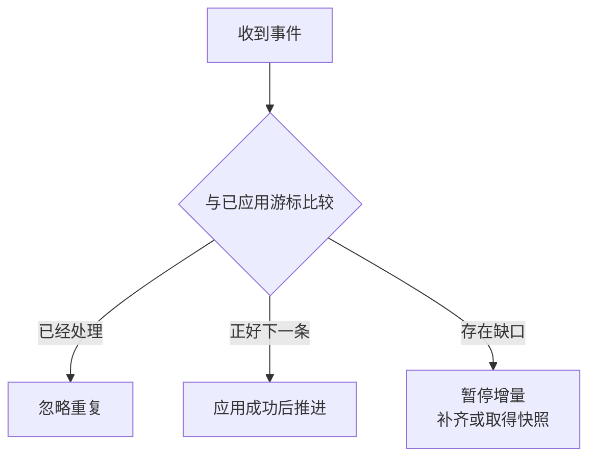

# 连接重新打开以后，怎样知道消息已经补齐

## REALTIME-01 SSE、WebSocket、WebTransport 与消息可靠性

资料标题发生变化，阅读页通过推送及时更新。网络断开后，连接很快恢复，界面亮起“已连接”；但中间少了一条发布事件，用户看到的列表仍然不完整。连接恢复与数据恢复不是同一个结果。

本讲先定义消息的含义，再比较传输方式，最后运行一个真实 SSE 观察页。它会故意重复事件、切断响应、制造缺口和缩短历史窗口。所有消息都是本地合成资料，不涉及真实账号、通知或生产连接。

### 学习前先确认

- 直接前置：[NET-01 浏览器网络协议、Fetch 与请求可靠性](../chinese-guides/net-01-browser-network-fetch-reliability.md#net-01)。先理解 HTTP、连接、超时、取消与网络结果。
- 直接前置：[BIZ-07 异常边界、幂等与一致性](../chinese-guides/biz-07-errors-idempotency-eventual-consistency.md#biz-07)。本讲使用重复效果、未知结果和事件恢复的基本区分。

### 一、消息的确认要说清已经走到哪一步

“已发送”可能只说明客户端把消息交给了 API，不说明服务端已经接收、持久化、广播，更不说明其他用户已读。设计消息前先选定每个状态对应的事实。

```js example=realtime01-ack-meaning
const stages = ['created', 'queued', 'accepted', 'committed', 'applied'];
function hasReached(actual, required) {
  const a = stages.indexOf(actual), r = stages.indexOf(required);
  return a >= 0 && r >= 0 && a >= r;
}
console.log(hasReached('queued', 'committed'));
console.log(hasReached('committed', 'applied'));
console.log(hasReached('applied', 'committed'));
// => false
// => false
// => true
```

本例约定应用顺序如数组所示，别的系统可能有不同阶段；它不证明真实持久化。作用是逼我们把 UI 文案放到明确位置，不把 socket 的 `send()` 返回当成业务成功。

消息目录还要说明方向、大小、峰值、可容忍延迟、能否丢弃、重复是否安全、顺序范围和可恢复多久。光标位置通常可以用新值覆盖旧值；发布、扣减和审计事件则不能照搬这个策略。

### 二、协议选择跟着消息任务走

| 方式 | 适合观察的任务 | 仍需自己设计 |
| --- | --- | --- |
| 轮询或长轮询 | 低频状态、可靠快照查询 | 退避、时效、取消和条件读取 |
| SSE | 服务端持续下发通知、进度、日志 | 授权、事件留存、恢复游标和处理确认 |
| WebSocket | 持续双向消息、互动协作 | 应用 ACK、重放、版本、队列边界 |
| WebTransport | 有依据的多流或数据报需求 | 支持与可达性、消息可靠性分类、回退 |

客户端偶尔发布指令、服务端频繁通知，可以用 HTTP 写入加 SSE 下行，不一定要把所有操作搬进双向连接。低频状态查询用有限轮询也可以达到延迟目标。

“浏览器有这个 API”只证明接口入口存在，不证明目标服务器、代理和网络能够建立连接。选型时同时考虑部署链、运行成本、恢复复杂度和实际桌面环境，不凭协议名称判断先进程度。

### 三、SSE 帧有格式，事件 ID 却没有自动业务语义

**Server-Sent Events** 使用 `text/event-stream` 的 UTF-8 文本流。浏览器 `EventSource` 解析事件，事件之间用空行分隔；注释行可以用作保持连接的信号。

```text
id: 102
event: material
data: {"seq":102,"title":"摄影基础"}

```

这个事件的 `id` 可用于重新连接时的 `Last-Event-ID`，但浏览器不会替应用保存可重放日志。更重要的是，浏览器记住某个已解析 ID，不等于业务处理函数已经成功把事件写进状态或本地数据库。

若消息处理需要异步事务，应维护“最后连续应用成功”的游标，并围绕它设计恢复。原生自动重连的 ID 与应用确认游标不能未经分析就当同一值。多行 data、retry 和事件 ID 的具体解析规则以 [HTML 标准](https://html.spec.whatwg.org/multipage/server-sent-events.html) 为准。

原生 EventSource 构造接口不提供任意自定义请求头选项。需要认证时，使用符合安全策略的同源会话或明确的受控方案；不能为了方便把长期令牌放到 URL。自行用 fetch 读取流又需要自己处理分帧、重连和取消，不等于只换一个构造函数。

### 四、可靠传输不等于业务恰好处理一次

**WebSocket** 建立双向连接，在同一连接中传递有序消息。断线前是否提交、重连后是否重复，以及跨节点事件顺序，都不由这一传输性质保证。客户端若并发异步处理消息，即使到达有序，处理完成也可能乱序。

经典浏览器 WebSocket API 没有接收端自动背压；`bufferedAmount` 反映发送队列的字节，不是接收业务队列长度。发送缓冲归零也不是服务端业务 ACK。[MDN WebSocket](https://developer.mozilla.org/en-US/docs/Web/API/WebSocket)

**WebTransport** 提供流和数据报等不同通信能力，常见部署围绕 HTTP/3。可靠流内部顺序与不同流之间的顺序是不同保证，数据报也不适合承载不能丢的业务变化。独立流可以减少彼此等待，但仍共享网络容量和拥塞影响。

使用前检查当前浏览器、运行时、服务器和网络能力，并实际验证连接；UDP/QUIC 不可达时的回退要保护核心任务。不能只检测 `typeof WebTransport` 后就宣称服务可用。[MDN WebTransport](https://developer.mozilla.org/en-US/docs/Web/API/WebTransport)

### 五、只推进已经连续应用的游标

假设本例事件序号在当前订阅流内连续，当前应用到 102，收到 104 就存在缺口。对于增量事实，不能先把游标写成 104，然后永远跳过 103。

```ts example=realtime01-contiguous-cursor
type MaterialEvent = { seq: number; title: string };
type Projection = { seq: number; title: string };
function apply(current: Projection, event: MaterialEvent): { result: string; state: Projection } {
  if (event.seq <= current.seq) return { result: '重复或旧事件', state: current };
  if (event.seq !== current.seq + 1) return { result: '存在缺口，停止推进', state: current };
  return { result: '已应用', state: { ...event } };
}
let state: Projection = { seq: 102, title: '摄影基础' };
for (const event of [{ seq: 104, title: '摄影实践' }, { seq: 103, title: '摄影进阶' }, { seq: 103, title: '摄影进阶' }]) {
  const next = apply(state, event); state = next.state;
  console.log(next.result, state.seq);
}
// => 存在缺口，停止推进 102
// => 已应用 103
// => 重复或旧事件 103
```

代码相信事件已经按协议解析，只展示游标规则。真实流的 ID 可能不连续，例如全局序列经权限筛选后自然跳号，此时不能机械要求 `+1`，应使用服务器定义的续接 token、前驱关系或订阅内顺序协议。

快照也要带一致的水位：先取得“截至 S 的快照”，再重放 S 之后的事件，并确认历史仍覆盖这段窗口；否则需要缓冲、重取或其他协调。简单“先 GET，再连上”可能漏掉两步之间的变化。



### 六、用真实 SSE 观察重复、续接和补齐

保存完整文件为 `events-lab.mjs`，用 Node.js 22 运行 `node events-lab.mjs`，打开打印的地址。选择场景后点击“开始观察”；重复事件不会推进两次，断线场景会按应用游标续接，缺口与历史过期则要求获取完整快照。

```js example=realtime01-events-lab runtime=project file=events-lab.mjs
import { createServer } from 'node:http';
const events = [
  { seq: 101, title: '摄影入门' }, { seq: 102, title: '摄影基础' },
  { seq: 103, title: '摄影进阶' }, { seq: 104, title: '摄影实践' },
  { seq: 105, title: '摄影作品复盘' },
];
const client = `
const el = id => document.getElementById(id);
let source = null, timer = null, generation = 0, attempts = 0;
let applied = 100, title = '尚未同步';
function log(text) { const li = document.createElement('li'); li.textContent = text; el('log').append(li); while (el('log').children.length > 20) el('log').firstElementChild.remove(); }
function render() { el('cursor').textContent = String(applied); el('title').textContent = title; }
function stop() { generation += 1; clearTimeout(timer); timer = null; if (source) source.close(); source = null; }
function reset() { stop(); attempts = 0; applied = 100; title = '尚未同步'; el('log').replaceChildren(); el('status').textContent = '等待开始'; render(); }
function connect() {
  stop(); const mine = generation;
  if (++attempts > 3) { el('status').textContent = '达到重连预算，请检查后手动恢复'; return; }
  const mode = el('mode').value;
  const stream = new EventSource('/events?after=' + applied + '&mode=' + encodeURIComponent(mode)); source = stream;
  el('status').textContent = '正在连接，从应用游标 ' + applied + ' 继续';
  stream.onopen = () => { if (mine === generation) el('status').textContent = '已连接，仍需核对数据'; };
  stream.addEventListener('material', event => {
    if (mine !== generation) return;
    let data; try { data = JSON.parse(event.data); } catch { stop(); el('status').textContent = '消息损坏，请获取快照'; return; }
    if (!data || typeof data !== 'object' || !Number.isSafeInteger(data.seq) || typeof data.title !== 'string' || event.lastEventId !== String(data.seq)) { stop(); el('status').textContent = '协议不符，请获取快照'; return; }
    if (data.seq <= applied) { log('忽略重复 ' + data.seq); return; }
    if (data.seq !== applied + 1) { log('缺口：当前 ' + applied + '，收到 ' + data.seq); stop(); el('status').textContent = '存在缺口，请获取完整快照'; return; }
    applied = data.seq; title = data.title; render(); log('应用 ' + applied);
  });
  stream.addEventListener('reset', () => { if (mine !== generation) return; stop(); el('status').textContent = '历史已过期，请获取完整快照'; log('服务端要求重建快照'); });
  stream.addEventListener('done', () => { if (mine !== generation) return; stop(); el('status').textContent = '已补齐到当前水位 ' + applied; });
  stream.onerror = () => {
    if (mine !== generation) return; stream.close(); source = null;
    el('status').textContent = '连接中断，等待有限重连'; log('从已应用游标 ' + applied + ' 恢复');
    timer = setTimeout(() => { if (mine === generation) connect(); }, 300 * attempts);
  };
}
el('start').onclick = () => { attempts = 0; connect(); };
el('stop').onclick = () => { stop(); el('status').textContent = '已停止观察，保留当前副本'; };
el('mode').onchange = reset;
el('snapshot').onclick = async () => {
  stop(); const mine = generation; el('status').textContent = '正在读取快照';
  try {
    const response = await fetch('/snapshot', { cache: 'no-store' });
    if (!response.ok) throw new Error('snapshot'); const data = await response.json();
    if (mine !== generation) return;
    if (!data || typeof data !== 'object' || !Number.isSafeInteger(data.seq) || typeof data.title !== 'string') throw new Error('shape');
    applied = data.seq; title = data.title; render(); log('采用快照 ' + applied); attempts = 0; connect();
  } catch { if (mine === generation) el('status').textContent = '快照失败，可重试'; }
};
window.addEventListener('pagehide', stop); reset();
`;
const html = `<!doctype html><html lang="zh-CN"><meta charset="utf-8"><title>事件恢复观察室</title>
<style>:root{font:16px/1.8 system-ui,"Microsoft YaHei",sans-serif;color:#183f38;background:#edf3ef}*{box-sizing:border-box}body{margin:0;padding:36px}main{max-width:1120px;margin:auto}h1{font-size:34px;margin:6px 0}h2{font-size:21px;margin:0 0 12px}.tag{font-size:13px;letter-spacing:.1em;color:#55776a}section{background:white;border:1px solid #cdddD3;border-radius:16px;padding:25px;margin:20px 0}.grid{display:grid;grid-template-columns:1fr 1fr;gap:20px}.grid>*{min-width:0}button,select{font:inherit;padding:8px 12px;border:1px solid #93b3a5;border-radius:8px;background:#f6faf7;color:inherit;margin:8px 5px 8px 0}button{cursor:pointer}button:focus-visible,select:focus-visible{outline:3px solid #b67b22;outline-offset:3px}#cursor{font-size:42px;font-weight:700}#status{color:#815619;font-weight:650}#log{padding-left:24px;max-height:350px;overflow:auto}.muted{font-size:14px;color:#5c766b}</style>
<main><div class="tag">B22 · 连接状态 / 应用游标 / 完整快照</div><h1>事件恢复观察室</h1><p>收到事件、应用成功和连接打开，分别观察。</p>
<section><label for="mode">故障场景</label><select id="mode"><option value="normal">重复事件</option><option value="cut">102 后断线再续接</option><option value="gap">缺少 103</option><option value="expired">历史窗口已过期</option></select><div><button id="start">开始观察</button><button id="stop">停止观察</button><button id="snapshot">获取完整快照</button></div><p id="status" role="status"></p></section>
<div class="grid"><section><h2>当前资料副本</h2><p id="title"></p><p class="muted">最后连续应用的游标</p><div id="cursor">100</div><p class="muted">演示水位为 105；连接打开并不等于已经补齐。</p></section><section><h2>应用记录</h2><ol id="log" aria-label="事件处理记录"></ol><p class="muted">只保留最近 20 条诊断；服务端事件是固定的合成数据。</p></section></div></main><script src="/client.js"></script></html>`;
const server = createServer((req, res) => {
  const url = new URL(req.url ?? '/', 'http://localhost');
  res.setHeader('Cache-Control', 'no-store');
  if (req.method !== 'GET') { res.writeHead(405, { Allow: 'GET' }); res.end(); return; }
  if (url.pathname === '/') { res.writeHead(200, { 'Content-Type': 'text/html; charset=utf-8' }); res.end(html); return; }
  if (url.pathname === '/client.js') { res.writeHead(200, { 'Content-Type': 'text/javascript; charset=utf-8' }); res.end(client); return; }
  if (url.pathname === '/snapshot') { res.writeHead(200, { 'Content-Type': 'application/json' }); res.end(JSON.stringify(events.at(-1))); return; }
  if (url.pathname !== '/events') { res.writeHead(404); res.end(); return; }
  const raw = req.headers['last-event-id'] ?? url.searchParams.get('after') ?? '100';
  const after = Number(raw), mode = url.searchParams.get('mode');
  if (!/^\d+$/.test(String(raw)) || !Number.isSafeInteger(after)) { res.writeHead(400); res.end('Invalid cursor'); return; }
  res.writeHead(200, { 'Content-Type': 'text/event-stream; charset=utf-8' });
  res.write(': stream started\n\n');
  if (after < (mode === 'expired' ? 102 : 100) || after > 105) { res.end('event: reset\ndata: {}\n\n'); return; }
  let rows = events.filter(e => e.seq > after);
  if (mode === 'normal') rows = rows.flatMap(e => e.seq === 102 ? [e, e] : [e]);
  if (mode === 'gap') rows = rows.filter(e => e.seq !== 103);
  let index = 0, timer;
  const tick = () => {
    if (res.destroyed) return;
    if (mode === 'cut' && after === 100 && index === 2) { res.end(); return; }
    const event = rows[index++];
    if (!event) { res.end('event: done\ndata: {}\n\n'); return; }
    if (!res.write('id: ' + event.seq + '\nevent: material\ndata: ' + JSON.stringify(event) + '\n\n')) { res.destroy(); return; }
    timer = setTimeout(tick, 140);
  };
  res.on('close', () => clearTimeout(timer)); tick();
});
server.listen(Number(process.env.PORT ?? 43742), '127.0.0.1', () => console.log('观察页：http://127.0.0.1:' + server.address().port));
```

观察页在错误时关闭原生自动重连，由应用以自己的确认游标建立新连接；总共最多三次连接尝试，手动操作可重新开始。为了容易看出时序，重连延迟使用简单倍数；生产环境需要按负载增加抖动和退避上限。

固定事件日志只存在进程内，重启后重放的是同一组教学数据；快照也固定在 105，没有实现持续写入时的快照竞态、认证和持久日志。发送缓冲满时主动断开，避免无限堆积，这是本例的容量处理选择，不是通用服务器背压方案。

### 七、重复、乱序与快照需要分别解释

至少一次交付意味着消费者可能再次收到同一事件，应在业务效果边界处理去重。只在当前 WebSocket 实例里保存 seen 集合，不能覆盖刷新、重连和进程切换。

完整快照可以用同一对象的较新版本替换旧快照；增量“增加 1”不能在缺前一项时直接跳过去。不同实体的版本号也不能直接比较成全局时间。快照与增量的区别见 [BIZ-07](../chinese-guides/biz-07-errors-idempotency-eventual-consistency.md#七旧快照可以忽略增量缺口不能随手跳过)。

处理异步副作用时，应用记录与游标应按需要一起持久化；否则先推进游标后崩溃，副作用可能永远遗漏，先做副作用后崩溃，又可能重复。客户端状态演示不能证明数据库事务或外部系统的恰好一次效果。

### 八、慢消费者需要有边界的队列

```js example=realtime01-coalesce-presence
const latest = new Map();
function receive(update) {
  if (!latest.has(update.person) && latest.size >= 2) return '容量已满，拒绝新实体';
  const previous = latest.get(update.person);
  if (!previous || update.version > previous.version) latest.set(update.person, update);
  return '保留该实体最新位置';
}
receive({ person: 'lin', version: 1, x: 10 });
receive({ person: 'lin', version: 3, x: 30 });
receive({ person: 'lin', version: 2, x: 20 });
receive({ person: 'mei', version: 1, x: 5 });
console.log(latest.get('lin').x, latest.size);
console.log(receive({ person: 'zhou', version: 1, x: 0 }));
// => 30 2
// => 容量已满，拒绝新实体
```

这是允许覆盖的光标状态，丢掉的是中间位置。发布事件、计费记录和审计日志不能直接使用同样策略。对不可丢事件，可以减少订阅、暂停生产，或断开后从持久游标恢复；恢复窗口不够时要能回到快照。

真实容量还要限制字节、单条大小和最老消息年龄，不能只数数组长度。渲染批次可以合并，但不要因为页面只画了最后值就丢掉必须执行的业务处理。

### 九、连接身份不是永久订阅许可

会话过期、角色撤销和机构切换时，已有订阅也必须响应。服务器验证订阅主题与每个业务命令的权限；客户端传入房间 ID，不等于具有访问权限。

浏览器 WebSocket 可能携带匹配的 Cookie，应校验允许的 Origin，并按业务设计跨站保护；WebSocket 不应被误当成自动受普通 fetch CORS 规则保护。错误消息和游标也不能泄露其他机构的事件是否存在。

退出时关闭连接、停止重连、失效旧回调，并处理私有缓存与游标。下一账号不能继承上一账号“最后应用到哪里”。后台标签页计时器可能节流，连接对象仍显示 open，也不能证明业务链路健康。

### 十、实时事件把查询与写入连接起来

对于“资料已变化”的通知，最稳妥的起点往往是定向失效查询；若事件确实携带完整、已授权的新对象，再按版本更新副本。查询模型见 [DATA-01](../chinese-guides/data-01-server-state-cache-keys-invalidation-deduplication.md#十预取与实时通知都只是刷新策略的一部分)。

如果本地存在乐观覆盖，收到的远端事实应更新正确基线，再按操作状态决定如何显示。不能让旧通知覆盖已确认新标题，也不能一直用乐观值遮住服务端拒绝。相关状态见 [DATA-02](../chinese-guides/data-02-optimistic-updates-conflicts-offline-mutations.md#四没有收到成功不等于操作已经失败)。

降级为轮询时，说明数据更新方式改变；回到长连接时，用同一水位或恢复协议接续。重新亮起“实时”标签，不应掩盖切换期间遗漏的消息。

### 十一、多实例与长期连接扩大版本责任

粘性会话不能代替持久日志与共享事件身份。连接迁移到另一节点以后，仍要知道可恢复的游标、日志保留窗口及最新快照。presence 可以短期丢失后重建，必须保存的业务事实则先可靠提交，再广播。

旧连接可能跨过多次部署。握手能力、事件类型、Schema 版本、历史消息解码与旧消费者支持期都要维护。未知关键版本应明确恢复或升级，不要按相似字段猜测。

容量关注连接数、订阅量、心跳、广播扇出和慢端缓冲，也关注重连时的尖峰。心跳只证明特定层有活动，不等于每条业务事件都被应用；应把连接、数据新鲜度和未确认操作分开观测。

### 十二、验证恢复后的事实，而不只看收到消息

少量关键场景就能发现很多问题：重复 102、缺少 103 却收到 104、游标过期、处理中断、身份切换、慢消费者。分别记录连接状态、已应用水位、当前副本与恢复结果。

SSE 本机实验不能替代真实代理空闲超时、WebSocket ACK 或 WebTransport 的网络能力验证。协议选择确定以后，再对目标部署链做必要观察；不要为了一篇概念讲义安装三套生产基础设施。

日志保留安全的事件和连接关联号，指标按消息类别控制基数，不把每个 ID 当指标标签。观察最终业务事实与权威查询是否一致，比统计“重连成功多少次”更接近用户真正关心的可靠性。

### 动手想一想

浏览器已经解析事件 104，但应用只持久化到 102 就崩溃。重连应从哪个位置恢复？再说明在一个并不连续编号的订阅流中，为什么不能直接把 104 减 102 当成丢了两条消息。

### 参考与延伸阅读

- [MDN：Using server-sent events](https://developer.mozilla.org/en-US/docs/Web/API/Server-sent_events/Using_server-sent_events)：查阅 EventSource、事件格式与连接处理。
- [HTML 标准：Server-sent events](https://html.spec.whatwg.org/multipage/server-sent-events.html)：核对事件 ID、重连和解析规则。
- [MDN：WebSocket](https://developer.mozilla.org/en-US/docs/Web/API/WebSocket)：核对浏览器 API 与背压限制。
- [MDN：WebTransport](https://developer.mozilla.org/en-US/docs/Web/API/WebTransport)：查看流、数据报及当前能力边界。
