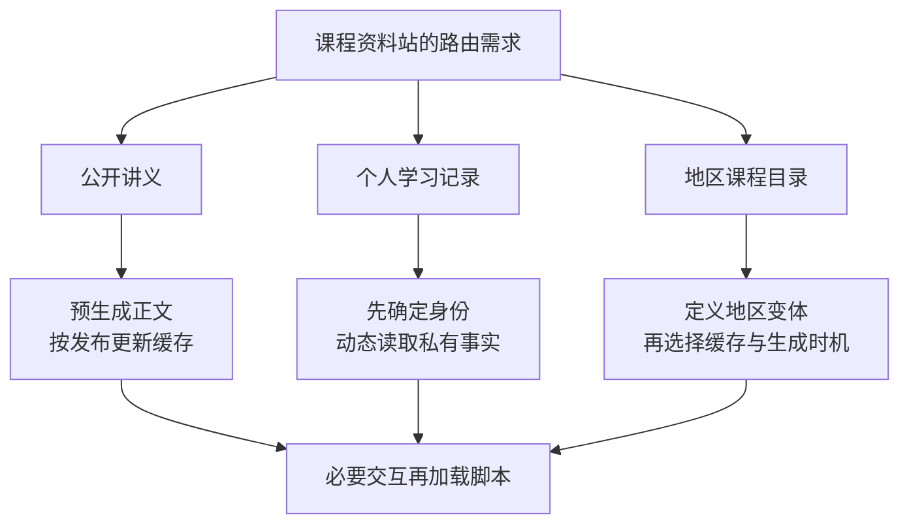

# 同一个网站，哪些内容应该在哪里生成

## RENDER-01 SPA、SSR、SSG、ISR 与混合渲染决策

公开讲义希望打开就能读，个人学习记录必须按账号隔离，课程目录又会随地区变化。如果一律“全部 SSR”，服务器可能等待许多本不重要的数据；如果一律“全部静态化”，个人记录又可能被误放进公共缓存。

选择渲染策略，先回答四个问题：数据何时取得，HTML 何时生成，结果可以被谁复用，哪些交互必须等待脚本。本讲使用一个自编课程资料站比较这些决定。例子用于判断边界，不要求当前系统更换框架或新增公开访问。

### 学习前先确认

- 直接前置：[NET-01 浏览器网络协议、Fetch 与请求可靠性](../chinese-guides/net-01-browser-network-fetch-reliability.md#net-01)。本讲沿用网络请求、HTTP 缓存、状态码和取消的基础，不重复浏览器内部渲染细节。

### 一、SPA 是导航方式，CSR 是生成界面的方式

**SPA** 通常让后续导航在同一文档中完成，不必每次取得整份新 HTML。**CSR** 表示浏览器通过 JavaScript 生成界面。它们经常同时出现，但并不相等。

首访由服务器生成正文，之后在客户端切换章节，是 SSR 加客户端导航；一个传统多页站也可以在某页用 JavaScript 生成复杂图表。讨论时把“首访怎样得到内容”和“之后怎样导航”分别说清。

SSR、SSG 的区分通常强调请求时生成还是提前生成；它们都可以配上少量脚本，也可以配上较大的客户端应用。ISR 是特定框架和托管体系提供的增量更新策略，并非浏览器识别的一种 HTTP 页面类型。

| 要决定的事 | 可以分别选择 |
| --- | --- |
| 主要 HTML 何时产生 | 构建时、请求时、浏览器运行时 |
| 数据何时刷新 | 构建、每次请求、后台再生、客户端刷新 |
| 后续导航 | 新文档请求，或客户端路由 |
| 交互接管 | 无脚本、局部增强、局部或整树 Hydration |
| 复用范围 | 公共、受控变体、私有或不存储 |

这些维度组合后，才是一条真实路由的方案。“我们用了 SSR”仍然没有回答缓存和交互的问题。

### 二、把内容可读与交互可用放到时间线上

服务器首字节到达、正文出现和收藏按钮可用，可能相隔很久。测量时不能把第一项改善直接说成全部体验改善。

```js example=render01-critical-path
function estimate(mode, t) {
  if (mode === 'csr') {
    const scriptReady = t.shell + t.script;
    const readable = scriptReady + t.data + t.paint;
    return { readable, interactive: readable };
  }
  const readable = t.data + t.transfer + t.paint;
  return { readable, interactive: readable + t.script + t.hydrate };
}
const t = { shell: 40, script: 240, data: 180, transfer: 40, paint: 20, hydrate: 90 };
for (const mode of ['csr', 'ssr']) {
  const result = estimate(mode, t);
  console.log(`${mode}：正文 ${result.readable} ms，交互 ${result.interactive} ms`);
}
// => csr：正文 480 ms，交互 480 ms
// => ssr：正文 240 ms，交互 570 ms
```

这是一张假设顺序执行的教学时间表，不是浏览器性能预测器。真实传输、预加载和数据请求可能并行，浏览器也可能增量解析。它要说明的只是：SSR 可以让正文先出现，但若还下载相同脚本并执行接管，交互不一定更早。

实际比较应记录相同设备、数据、网络和缓存条件。TTFB 看响应开始，LCP 看主要可见内容，INP 看实际交互响应；“交互就绪”还需要定义本页哪项动作已可靠可用，不能与其中任意一个指标直接画等号。

### 三、CSR 适合的场景，也需要可恢复的起点

私有学习控制台交互密集，搜索引擎无需索引个人记录，CSR 可以是简单合理的起点：返回应用壳，加载当前路由代码，认证后请求个人数据，再显示界面。

但应用壳很快返回不等于没有等待。若主脚本失败，只剩空白；若请求串行，用户会先等代码、再等身份、再等数据。先找真实依赖，能并行的独立请求并行，首路由脚本保持必要规模，加载和错误状态保留恢复入口。

静态应用壳可以公开分发，私有 API 仍必须认证和授权。壳里不应提前放入某个用户的记录。首次加载、直接深链接、刷新和账号切换都需要正确结果；只检查客户端点击下一页，会漏掉静态托管的 fallback 和状态码问题。

### 四、SSR 把数据等待移到响应路径

**SSR** 在请求过程中形成 HTML。对当前身份才能决定的内容，它可以先在服务端读取数据并输出可读页面；主要文本不一定要等浏览器请求第二次数据。

等待并没有消失，只是换了位置。数据库延迟、上游调用和冷启动进入响应关键路径。如果公开标题 50 ms 就有，个性推荐需要 2 秒，是否值得让整份正文等待推荐，应按用户任务决定。

SSR 并不天然要求 Hydration。传统服务器模板加链接和表单可以直接工作；使用需要在客户端接管的组件框架时，才要继续计入状态序列化、客户端下载与运行成本。

私人 HTML 通常应避免共享缓存。若连浏览器持久缓存都不希望保存，使用适当的 `no-store` 策略并核对各缓存层；单纯在缓存键里加用户 ID，并不等于已经解决撤权、权限变化或数据留存。

### 五、SSG 把生成成本放到发布之前

**SSG** 提前把公开讲义生成 HTML。请求来了可以直接分发文件，服务端不必为每次阅读重新组织相同内容。

代价主要出现在更新路径：构建读取哪个数据版本，失败时如何处理，多久完成发布，旧内容何时停止被缓存。几百篇帮助文档可能适合整体生成，数量很大或变化频繁的目录则要考虑构建耗时和增量范围。

构建环境能读取的秘密，不代表都可以进入产物。课程作者邮箱、内部备注和草稿内容如果混进 HTML 或脚本，静态托管会忠实地把它们发给访问者。应从源头选择公开字段，再检查生成产物。

公开正文配上客户端收藏和个人进度是常见组合。静态部分继续共享，私有部分在正确身份下请求；不要为了节省一次 API 调用，把所有用户的进度预生成在同一个文件里。

### 六、ISR 的再生成间隔不是严格陈旧上限

**ISR** 让部分页面在构建后更新，同时继续复用已生成结果。不同框架与配置可能按时间触发、按事件失效，或首次访问时生成；要查实际版本的行为，不能把一个名称当完整协议。

常见的后台再生流程是：页面超过新鲜期后，某次请求仍拿到旧页，同时触发更新；更新成功后后续请求拿到新页。没有请求、再生耗时或持续失败，都可能延长旧页存在的时间。

```js example=render01-stale-timeline
const oldPage = { title: '摄影入门', generatedAt: 0 };
function plan(page, now, refreshAt, maxStaleAge) {
  const age = now - page.generatedAt;
  if (age < refreshAt) return '直接使用';
  if (age <= maxStaleAge) return '可暂用旧页，同时安排更新';
  return '不可继续使用旧页，重新获取或明确失败';
}
console.log(plan(oldPage, 59, 60, 180));
console.log(plan(oldPage, 61, 60, 180));
console.log(plan(oldPage, 181, 60, 180));
const regenerated = { title: '摄影基础', generatedAt: 190 };
console.log(plan(regenerated, 191, 60, 180));
// => 直接使用
// => 可暂用旧页，同时安排更新
// => 不可继续使用旧页，重新获取或明确失败
// => 直接使用
```

这里是自编应用策略，时间单位为秒，不是 Next.js 配置，也没有实现锁、缓存或实际再生。它把“希望多久更新”和“最多允许多旧”拆成两个条件。若业务承诺十分钟内必定更新，单独设置一个再生间隔通常不足以证明承诺。

删除、撤回和转私有尤其不能只等自然过期。所有相关缓存对象和变体需要按规则失效，失败时不能继续公开已撤回内容。普通文字更新是否允许短暂旧版本，与撤权规则可以不同。当前框架行为可参考 [Next.js ISR 指南](https://nextjs.org/docs/app/guides/incremental-static-regeneration)，本文不依赖其特定配置默认值。

### 七、缓存键描述哪些请求可以共享结果

缓存键的核心问题是：两个请求映射到同一对象时，返回内容是否真的可互换？公开中文目录与英文目录不同，地区选择也可能影响结果，必须与缓存策略一起定义。

```ts example=render01-cache-scope
type Page =
  | { scope: 'public'; path: string; locale: string; city: string }
  | { scope: 'private'; path: string; user: string };
function sharedKey(page: Page): string | null {
  if (page.scope === 'private') return null;
  return JSON.stringify([page.path, page.locale, page.city]);
}
const sh: Page = { scope: 'public', path: '/catalog', locale: 'zh-CN', city: 'shanghai' };
const bj: Page = { ...sh, city: 'beijing' };
console.log(sharedKey(sh) === sharedKey(bj));
console.log(sharedKey({ scope: 'private', path: '/progress', user: 'lin' }));
// => false
// => null
```

函数只表达自编的共享资格与键，不配置 CDN，也不负责认证。地区值应先规范化到允许集合，任意字符串直接进键会制造大量变体。实验分组、语言和设备提示也应检查是否真正改变输出，不要无差别把所有请求头加入键。

HTTP 的 `private` 限制共享缓存存储，仍可能允许私人缓存；`no-cache` 允许存储但复用前需要验证；`no-store` 要求不要存储本次交换。它们不是同义词，也不会自动清除历史缓存或框架自行维护的数据缓存。[RFC 9111](https://www.rfc-editor.org/rfc/rfc9111.html)

Cookie 存在不等于所有缓存都会自动跳过。`Vary` 也需要实际缓存实现支持，不能代替授权。最直接的观察是用不同身份请求，检查原始 HTML、响应头及共享对象中是否出现不该复用的数据。

### 八、混合渲染按内容责任拆开

一页有动态按钮，不代表整页都必须动态生成；一页主体公开，也不代表边栏的个人记录可以共享。选择单位通常是具有相同数据时效和权限范围的路由或区域。



例如本例可以先采用：讲义 SSG，个人记录 CSR，目录由可缓存的公共地区数据生成，收藏独立请求。若目录需要频繁变更，再比较请求时渲染与增量生成；不要为了凑齐术语，强迫每条路由使用不同模式。

还要明确数据所有权：服务器注入的初始快照由客户端复用，还是启动后再次查询？再次查询可以是有意刷新，但应避免相互不知道的两层同时请求并覆盖。页面和数据缓存的失效责任不能只写“框架会处理”。

### 九、状态码和元数据也属于页面输出

一篇不存在的公开资料，服务器始终返回 200 应用壳，客户端稍后才显示“未找到”，与服务器直接返回 404 不是相同的 HTTP 结果。分享预览、抓取器、缓存和监控可能在脚本执行前就作出判断。

SSR 或 SSG 可以帮助交付主要内容和元数据，却不自动保证索引结果。canonical、链接可发现性、robots、重定向和内容权限仍需正确。私有学习记录不应为了搜索展示而泄露。

重要的登录、授权、存在性和重定向应在发头前处理。流式输出开始后，后续部分错误通常不能把已发送的 200 改成 500；这要求按区域设计恢复，详见 [RENDER-02](../chinese-guides/render-02-streaming-ssr-hydration-islands.md#render-02)。

完整刷新和客户端导航应得到一致的业务结论。客户端“能点进去”不代表直接打开 URL 的静态托管规则、缓存头和错误页面也正确。

### 十、故障策略要和正常策略一起选择

SSG 构建失败，可以保留上一份合格制品，但应明确本次内容没有发布。后台再生失败，是否继续提供旧页取决于陈旧和权限约定。SSR 上游失败，可以降级次要区块，但不能用成功正文掩盖关键资料根本不存在。

| 故障 | 需要事先说明的结果 |
| --- | --- |
| 公开讲义新版本生成失败 | 旧版是否仍可读，何时停止，编辑者如何知情 |
| 私有记录 API 超时 | 页面保留什么，是否只是暂时未知 |
| 次要推荐失败 | 主体能否继续阅读，推荐区如何恢复 |
| 新脚本文件 404 | 旧 HTML 能否找到对应资源，是否有刷新入口 |
| 内容撤回失效失败 | 如何立即阻止继续公开，而不是无限用旧页 |

`stale` 不是万能兜底。缓存的便利不能推翻资料撤回、授权和数据留存约束。跨层变化没有同步时，需要事件、失效记录和定期核对，相关恢复思路见 [BIZ-07](../chinese-guides/biz-07-errors-idempotency-eventual-consistency.md#十一对账把漏掉的差异变成可追踪的修复)。

### 十一、比较策略时固定用户任务与观测条件

选三条代表路径通常比给全站下口号更有用：首次打开公开正文，刷新私有记录，发布新标题后重新读取。分别记录缓存未命中、命中、失效后和依赖失败的结果。

观察原始 HTML 是否包含正文，页面何时可读，关键动作何时可靠响应，发了多少脚本与重复请求。性能比较使用相同桌面条件与多次样本，按路由和缓存情况分组；这里不需要为了术语另外投入移动端适配。

一次合成时间表不能证明真实性能，更不能从单次最好结果推断全部用户。实际发布还可用现场观测核对实验室判断。检查规模与风险相称，但私有数据隔离和状态码不能只靠最终截图猜。

### 十二、把决定写成可调整的路由卡

一张路由卡记录：谁访问、主要任务、数据更新来源、允许陈旧、共享范围、生成位置、交互方式、失败行为、部署约束和复核条件。这样框架升级或业务变化时，可以逐项判断是否仍成立。

静态托管、Node 服务、边缘运行时和 serverless 的执行、流式、缓存及持久化能力不同。多实例 ISR 还需要共同存储或协调，否则每个实例可能提供不同版本。平台宣传支持某功能，不代表项目当前配置已满足这些条件。

迁移先选边界清晰的路由，保留基线和回退方法。旧 HTML 仍可能引用旧构建的脚本，所以内容哈希、资源保留窗口与发布切换要配合；回滚还需考虑缓存和数据模型。决策依据及当前证据可以按 [BIZ-08](../chinese-guides/biz-08-requirement-acceptance-traceability.md#十把性能和易用性也写成可观察承诺) 记录。

### 动手想一想

讲义可接受几分钟旧标题，但撤回后不能继续公开。能否用同一个“再生失败就一直返回旧页”处理两者？分别写出正常更新与撤回的事实、期限和失败动作。

### 参考与延伸阅读

- [web.dev：Rendering on the Web](https://web.dev/articles/rendering-on-the-web)：比较生成时机与客户端工作，注意示意模型不等于项目测量。
- [RFC 9111：HTTP Caching](https://www.rfc-editor.org/rfc/rfc9111.html)：查证 HTTP 缓存指令和复用条件。
- [Next.js：ISR](https://nextjs.org/docs/app/guides/incremental-static-regeneration)：查看具体框架实现与限制，不把它的默认值推广成通用 Web 规则。
- [NET-01：缓存与网络结果](../chinese-guides/net-01-browser-network-fetch-reliability.md#net-01)：复习页面之外的请求、缓存和错误边界。
