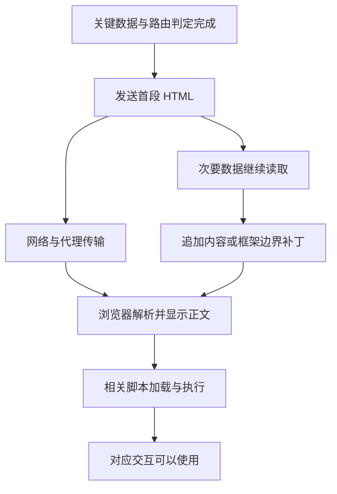

# 正文已经出现，为什么按钮还不能用

## RENDER-02 流式 SSR、Hydration 与 Islands 架构

课程正文已经准备好，延伸阅读还需要两秒。如果服务器等两者全部完成才发送页面，读者会一直空等；如果先发正文，读者可以早一点开始。但正文出现之后，收藏按钮可能还在等脚本，客户端也可能拿着另一份数据开始接管。

本讲把“数据就绪”“字节到达”“内容显示”和“交互就绪”分别观察。前半部分解释流式边界与 Hydration，后半部分提供一个只用 Node 内置模块的完整本地观察页。观察页演示真实 HTTP 分段与原生增强，不把普通 DOM 事件绑定冒充 React Hydration。

### 学习前先确认

- 直接前置：[RENDER-01 SPA、SSR、SSG、ISR 与混合渲染决策](../chinese-guides/render-01-spa-ssr-ssg-isr-hybrid-decisions.md#render-01)。先理解 HTML 生成时机、缓存范围和客户端脚本成本。

### 一、找出是谁让主要内容继续等待

假设资料正文 80 ms 就绪，延伸阅读 1500 ms，个人进度 500 ms。如果渲染函数先等待一个包含全部数据的 Promise.all，HTML 就被最慢的依赖拦住。并发读取减少串行等待，却没有移除“等所有结果才能输出”的屏障。

先问用户能否独立使用已完成区域。正文不依赖推荐，可以先交付；余额与同一时刻的可扣金额若必须保持一致，则不能为了更快而随意拆成两份快照。边界来自业务关系，而不是只看组件文件分开了没有。

次要数据可以延迟到达、失败后局部显示错误，但不应让正文假装失败。反过来，核心资料不存在或无权访问，就不应该先发送它的公开外壳，再等待后续区域补一个拒绝。

### 二、流式输出沿服务器、网络和浏览器逐步发生

**Streaming SSR** 让服务器在整页全部完成之前输出可用 HTML，后续继续发送其他内容。HTTP 流中的一段写入，不一定对应浏览器收到的一块数据，更不一定对应一次绘制。



代理缓冲、压缩、流控和浏览器解析都会影响到达与显示。服务器调用 `write()`，只能证明尝试写出；本机 curl 能看到分段，也不能证明生产 CDN 后仍按同样时序交付。过度切小块还会增加调度成本。

原生 HTML 可以顺序追加；框架也可以发送占位替换所需的 HTML 和指令。后者是框架协议，必须由匹配版本的客户端处理。不能把任何 JSON 流都称为流式 SSR，也不能从某框架的私有补丁格式推断通用浏览器机制。

### 三、开始发送以后，状态码的决定窗口已经改变

响应头发出后，后来的推荐失败通常不能把原来的 200 改成 500。该失败仍需在页面对应区域和服务端记录中表达，不能因为 HTTP 是 200 就当整页业务成功。

顶层认证、资源存在性和必要重定向应尽量在首段前决定。每个私有子区域也要独立执行相应授权；父路由可访问不代表用户拥有全部子资源。

以 React 的 Node 流式 API 为例，`onShellReady` 适合在 shell 就绪后开始发送，`onAllReady` 可以等待全部内容；一旦开始流式响应就不能再调整已发送状态码。React 对部分错误的客户端恢复有其自身规则，不是所有框架都一样。[renderToPipeableStream](https://react.dev/reference/react-dom/server/renderToPipeableStream)

如果选择等关键数据完成再发头，TTFB 可能稍晚，却换来正确状态和稳定主体。是否值得要回到本页任务，不能只为了抢首字节牺牲结果含义。

### 四、Hydration 需要客户端重建一致的首次理解

**Hydration** 通常让客户端框架在已有服务器标记上建立状态与交互关系，而不是从空容器开始画页面。这里保留英文，因为“注水”容易遮住实际发生的工作。

客户端下载并执行相关组件代码，使用初始数据形成它对界面的理解，再接管已有内容。已经能阅读，不代表 JavaScript 已下载，也不代表需要该运行时的按钮已可靠响应。

不同框架可能有事件回放和优先接管机制，但不能假设所有用户操作都自动排队。能用原生链接和表单的操作，可以先保留原生路径；必须依赖脚本的按钮，在未就绪时应给明确状态，避免看起来可用却丢失操作。

SSR 本身可以完全不使用 Hydration，普通服务端模板加少量脚本也是合法方案。React Server Components 又有独立边界，相关内容见 [REACT-09](../chinese-guides/react-09-compiler-rsc-security-upgrades.md#react-09)，不要把三者当同一术语。

### 五、首次渲染使用同一快照，再考虑刷新

服务器显示 v4 标题，客户端首轮却用刚查询到的 v5；服务端按 UTC 显示日期，客户端按本地时区重新格式化；两边各自生成随机 ID。这些都可能让首次内容不一致。

```ts example=render02-shared-snapshot
type Snapshot = { title: string; version: number; dateLabel: string };
function view(s: Snapshot): string { return `${s.title} · v${s.version} · ${s.dateLabel}`; }
const server: Snapshot = { title: '摄影入门', version: 4, dateLabel: '2026-09-20' };
const initialClient: Snapshot = { ...server };
const refreshed: Snapshot = { ...server, title: '摄影基础', version: 5 };
console.log(view(server) === view(initialClient));
console.log(view(server) === view(refreshed));
console.log(view(refreshed));
// => true
// => false
// => 摄影基础 · v5 · 2026-09-20
```

例子只比较确定性输出，不执行框架 Hydration，也不校验网络输入。真实实现要安全传递初始快照，让客户端首次使用它；接管后再按策略刷新。时间、随机值和需要稳定的 ID 同样要共享或使用框架支持的确定方式。

浏览器专属信息可以先用一致占位，接管后读取，再明确更新。无效 HTML 嵌套也会被浏览器修正，导致 DOM 与代码预期不同；并非所有 mismatch 都是数据版本问题。

React 明确要求首次输出与服务器一致，差异应作为 bug 修复，不保证自动修正所有属性。大面积使用 `suppressHydrationWarning` 隐藏日志，不会让事实一致。[hydrateRoot](https://react.dev/reference/react-dom/client/hydrateRoot)

### 六、序列化状态就是向浏览器公开数据

HTML 里不可见的 JSON、脚本中的初始状态、框架传输载荷，都能被收到响应的人读取。只隐藏 DOM 节点不会保护已经发出的字段。

先构造最小公开 DTO，再选择适合嵌入位置的安全序列化方式。JSON 字符串合法，不等于可以不处理就放进 HTML 的 script 元素；HTML 解析器仍会识别脚本结束标记。

```js example=render02-safe-state
const dto = { title: '</script>', version: 4 };
const serialized = JSON.stringify(dto).replace(/</g, '\\u003c');
console.log(serialized.includes('</script>'));
console.log(JSON.parse(serialized).title === dto.title);
console.log(Object.keys(JSON.parse(serialized)).join(','));
// => false
// => true
// => title,version
```

这里说明 JSON 在 HTML 原始文本中的结束标记问题，只处理自编 DTO，不是通用 HTML sanitizer。属性、URL、富文本等上下文另有要求；读取后仍要按数据合同检查，展示普通文本用 `textContent`，不能再把解析出的标题交给 `innerHTML`。

真实框架优先使用其支持的序列化路径，配合 CSP、必要 nonce 与输出最小化。不要手拼整个服务端实体，也不要因为某字段暂时“客户端没用到”就允许秘密进入页面。进一步的信任边界见 [SEC-01](../chinese-guides/sec-01-xss-csrf-trust-boundaries.md#sec-01)。

### 七、Islands 把客户端工作限制在需要交互的区域

**Islands Architecture** 让正文等静态区域保持 HTML，只有播放器、收藏或局部筛选这样的区域加载客户端逻辑。它关心交互所有权与加载范围，不要求每座岛一定使用不同框架。

正文无需脚本，计划表单先用原生提交，旁边的快捷加时按钮再由脚本增强，是容易理解的起点。复杂编辑器如果所有面板都共享撤销历史和即时状态，拆成很多互相发消息的岛反而会增加协调成本。

不同岛可以按重要度加载：主要操作尽早，页尾装饰可在可见或空闲时处理。以 Astro 为例，`client:load`、`client:idle`、`client:visible` 是它的具体调度入口，不能当作浏览器属性或跨框架通用 API。[Astro Islands](https://docs.astro.build/en/concepts/islands/)

延迟加载并非免费：先点击时要有可理解反馈，脚本失败有恢复，公共依赖避免重复下载。选择性 Hydration 与 Islands 都可能减少一次性客户端工作，但前者通常仍由框架调度同一应用的边界，二者不宜直接画等号。

### 八、运行一个真的分段页面，分开观察脚本和内容

把下面完整文件保存为 `stream-lab.mjs`，用 Node.js 22 执行 `node stream-lab.mjs`，打开终端打印的本地地址。没有外部依赖、真实账号或数据库，所有状态都来自固定资料和 URL 中的合成参数。

先打开流式模式，正文会先到达；延伸阅读默认延迟两秒。把 `scriptDelay` 改为 3000，观察增强按钮还在等脚本时，原生表单是否能提交；把 `mode` 改为 `buffered`，对照整页等待。`fail=1` 只让延伸阅读失败。

```js example=render02-stream-lab runtime=project file=stream-lab.mjs
import { createServer } from 'node:http';

const port = Number(process.env.PORT ?? 43741);
let serial = 0;
function wait(ms, signal) {
  return new Promise(resolve => {
    if (signal.aborted) { resolve(false); return; }
    const finish = value => { clearTimeout(timer); signal.removeEventListener('abort', aborted); resolve(value); };
    const aborted = () => finish(false);
    const timer = setTimeout(() => finish(true), ms);
    signal.addEventListener('abort', aborted, { once: true });
  });
}
const number = (text, fallback, max) => text !== null && /^\d+$/.test(text) && Number.isSafeInteger(Number(text)) && Number(text) <= max ? Number(text) : fallback;
const escape = text => text.replace(/[&<>"']/g, c => ({ '&':'&amp;', '<':'&lt;', '>':'&gt;', '"':'&quot;', "'":'&#39;' }[c]));
const island = `
const input = document.getElementById('minutes');
const button = document.getElementById('add');
button.addEventListener('click', () => {
  const current = Number(input.value);
  if (input.value === '' || !Number.isInteger(current) || current < 0 || current > 180) {
    document.getElementById('island-status').textContent = '先填写 0 至 180 的整数分钟。'; return;
  }
  input.value = String(Math.min(180, current + 5));
  document.getElementById('island-status').textContent = '已在本地加 5 分钟；提交后由服务器读取。';
});
button.disabled = false;
document.getElementById('island-status').textContent = '增强脚本已就绪；原生提交始终可用。';
`;
const style = `
:root{font:16px/1.8 system-ui,"Microsoft YaHei",sans-serif;color:#183f38;background:#edf3ef}*{box-sizing:border-box}
body{margin:0;padding:36px}main{max-width:1080px;margin:auto}h1{font-size:34px;margin:4px 0 10px}h2{font-size:21px;margin:0 0 12px}
nav{display:flex;gap:18px;flex-wrap:wrap;margin:18px 0}a{color:#236b59;text-underline-offset:4px}section{border:1px solid #cdded4;border-radius:16px;padding:25px;background:white;margin:20px 0}
.columns{display:grid;grid-template-columns:1.3fr 1fr;gap:20px}.columns section{min-width:0}.tag{letter-spacing:.12em;font-size:13px;color:#56796c}
label{display:block}input,button{font:inherit;border:1px solid #91b6a7;border-radius:8px;padding:8px 12px;color:inherit;background:#f6faf7}input{width:105px}button{cursor:pointer;margin:8px 5px 8px 0}button:disabled{opacity:.5;cursor:default}
button:focus-visible,input:focus-visible,a:focus-visible{outline:3px solid #af771b;outline-offset:3px}.muted{font-size:14px;color:#5b766a}.error{background:#fff7e8;border-color:#d9bc82}
`;
const server = createServer(async (req, res) => {
  const id = ++serial, controller = new AbortController();
  res.on('close', () => { if (!res.writableFinished) console.log(id, '连接关闭，停止等待'); controller.abort(); });
  try {
    const url = new URL(req.url ?? '/', 'http://localhost');
    res.setHeader('Cache-Control', 'no-store');
    if (req.method !== 'GET') { res.writeHead(405, { Allow: 'GET' }); res.end('Method Not Allowed'); return; }
    if (url.pathname === '/island.js') {
      if (!await wait(number(url.searchParams.get('delay'), 600, 5000), controller.signal)) return;
      res.writeHead(200, { 'Content-Type': 'text/javascript; charset=utf-8' }); res.end(island); return;
    }
    if (url.pathname !== '/') { res.writeHead(404); res.end('Not Found'); return; }
    const mode = url.searchParams.get('mode') === 'buffered' ? 'buffered' : 'stream';
    const delay = number(url.searchParams.get('delay'), 2000, 5000);
    const scriptDelay = number(url.searchParams.get('scriptDelay'), 600, 5000);
    const minutes = number(url.searchParams.get('minutes'), 30, 180);
    const title = escape('摄影入门：先读正文，再等延伸阅读');
    const shell = `<!doctype html><html lang="zh-CN"><head><meta charset="utf-8"><title>分段阅读观察室</title><style>${style}</style></head><body><main>
      <div class="tag">B21 · 内容到达 / 脚本就绪</div><h1>分段阅读观察室</h1>
      <p id="mode">当前模式：${mode}；延伸阅读 ${delay} ms；脚本 ${scriptDelay} ms</p>
      <nav aria-label="观察模式"><a href="/?mode=stream">分段发送</a><a href="/?mode=buffered">等待完整页面</a><a href="/?scriptDelay=3000">脚本晚到</a><a href="/?fail=1">延伸阅读失败</a></nav>
      <div class="columns"><section id="summary"><h2>${title}</h2><p>先决定画面要表达什么，再观察光线、主体与背景。正文可以独立阅读，不必等待推荐结果。</p><p>这里由服务器直接输出 HTML。刷新、关闭脚本或让延伸阅读失败，都不会改变已经交付的正文。</p><p class="muted">这是固定教学资料，不保存真实学习进度。</p></section>
      <section><h2>本次阅读计划</h2><p id="confirmed">服务器读到的计划：${minutes} 分钟</p>
      <form method="get" action="/"><input type="hidden" name="mode" value="${mode}"><input type="hidden" name="scriptDelay" value="${scriptDelay}"><input type="hidden" name="delay" value="${delay}">
      <label for="minutes">计划分钟数</label><input id="minutes" name="minutes" type="number" min="0" max="180" step="1" value="${minutes}" required>
      <div><button type="submit">用原生表单提交</button><button type="button" id="add" disabled>快捷加 5 分钟</button></div></form>
      <p id="island-status" role="status" class="muted">增强脚本尚未就绪；可以直接输入并提交。</p></section></div>
      <script async src="/island.js?delay=${scriptDelay}"></script>
      <p class="muted">延伸阅读独立到达；若下方结果没有完整到达，可刷新重试。</p>`;
    const tail = url.searchParams.get('fail') === '1'
      ? '<section id="recommendation" class="error"><h2>延伸阅读暂不可用</h2><p>正文与计划表单仍可用。</p><a href="/">重新加载</a></section>'
      : '<section id="recommendation"><h2>延伸阅读已到达</h2><p>下一步可以观察同一场景的顺光与侧光，比较主体轮廓。</p></section>';
    const headers = { 'Content-Type': 'text/html; charset=utf-8', 'Content-Security-Policy': "default-src 'none'; script-src 'self'; style-src 'unsafe-inline'; form-action 'self'; base-uri 'none'; frame-ancestors 'none'" };
    if (mode === 'stream') { res.writeHead(200, headers); res.write(shell); console.log(id, '首段已写出'); }
    if (!await wait(delay, controller.signal)) return;
    if (mode === 'buffered') { res.writeHead(200, headers); res.write(shell); console.log(id, '完整模式开始写出'); }
    res.end(tail + '</main></body></html>'); console.log(id, '文档完成');
  } catch {
    if (res.destroyed) return;
    if (!res.headersSent) { res.writeHead(500, { 'Content-Type': 'text/plain; charset=utf-8' }); res.end('观察页发生错误'); }
    else res.destroy();
  }
});
server.listen(port, '127.0.0.1', () => {
  console.log(`观察页：http://127.0.0.1:${server.address().port}`);
});
```

它顺序追加普通 HTML，异步脚本只增强一个按钮，没有框架补丁、虚拟树接管或真实持久化。表单使用 GET 是因为它只改变当前展示参数；发布、付款等写操作不能照搬成 GET。

查看 Network 的文档响应和脚本时间线，再试着关闭 JavaScript：正文、链接和原生表单仍可使用，快捷按钮保持禁用。中途停止加载会关闭连接，服务端取消等待计时器；它没有执行任何业务写入，因此也不涉及业务回滚。代码只演示小型响应，不代替生产服务的容量、背压和超时治理，相关基础见 [NODE-04](../chinese-guides/node-04-http-bff-production-engineering.md#node-04)。

### 九、区域可以独立到达，事实却不能随意混版

资料正文读取 v4，慢区域随后读取 v5，两者是否能同时出现，取决于业务允许的快照范围。推荐列表通常可以独立刷新；同一份授权结论与私有内容则不能各用互不相关的旧状态。

如果要求一致，先取得共享快照或版本标识，让相关区域依据同一事实。允许最终刷新时，明确刷新时机与结果归属，不把“分段”当成免除一致性要求的理由。

公共正文和个人进度不能因为在同一流里就共享缓存。只要整份响应包含私有数据，公共缓存资格就要重新判断；所谓“公共片段”需要实际框架或代理的片段隔离机制，普通 HTTP 响应不会按组件名称自动分开存储。

### 十、导航离开后，迟到片段必须先核对归属

用户从摄影资料切到设计资料，旧请求的结果仍可能完成。客户端请求取消是减少工作的一步；真正提交状态时，还要确认它属于当前导航。失败和清理回调也不能跳过这项判断。

```js example=render02-navigation-owner
let navigation = 1, visible = '摄影正文';
const oldRequest = { navigation: 1 };
function commit(request, content) {
  if (request.navigation !== navigation) return '忽略旧结果';
  visible = content; return '采用当前结果';
}
navigation += 1; visible = '设计正文';
console.log(commit(oldRequest, '摄影的迟到推荐'));
console.log(visible);
console.log(commit({ navigation: 2 }, '设计正文与推荐'));
// => 忽略旧结果
// => 设计正文
// => 采用当前结果
```

这里是状态归属模型，不是浏览器 HTML 解析器或框架传输实现。完整新文档导航由浏览器管理文档归属；应用在客户端导航中自己处理数据流、缓存和组件状态时，才需要在相应边界落实同样的原则。

中断输出不证明后端写操作被取消。若某个交互可能已经提交，应按原意图查询结果，见 [BIZ-07](../chinese-guides/biz-07-errors-idempotency-eventual-consistency.md#三结果未知时查询原意图不要先换一个新键)。

### 十一、占位、错误与接管都要保持可操作

占位内容保留区域标题和合理尺寸，减少后续位移；加载完成不应随意抢焦点。错误要指出失败区域与恢复动作，不能把整页都变成一个没有上下文的 toast。

表单接管前后的输入不应突然消失。框架首次接管、背景刷新和用户输入同时发生时，需要清晰的状态所有权。复杂表单的发送快照、草稿和基线可接着读 [BIZ-05](../chinese-guides/biz-05-form-table-detail-state-consistency.md#四发送快照冻结以后新输入属于下一次提交)。

脚本加载失败与数据加载失败也是两类问题：正文可能已完整，只有增强操作不可用。为主要任务保留原生路径或明确的恢复入口，避免一个次要岛的异常破坏其他区域。延迟接管要观察用户首次操作，而不只看最终页面能否点动。

### 十二、在实际部署链上核对收益与恢复

观察至少分三段：服务端记录首段与完成时刻，网络确认字节经过代理后何时到达，浏览器记录正文出现、脚本就绪和主要动作结果。关联同一次导航，避免把不同请求的时间拼在一起。

本地观察页证明 Node 与本机浏览器间能分段，不能证明生产 CDN 不缓冲，也不能预测真实 LCP 或 INP。可先选一个代表页面，再核对慢数据、局部失败、脚本失败、无 JS、直接刷新和客户端导航；投入集中在会改变结论的路径。

滚动发布还可能组合旧 HTML 与新客户端资源。构建哈希、旧资源保留、框架载荷版本和回滚窗口要配合；不要在新发布时立即删除仍被缓存文档引用的脚本。框架升级时核对当前官方 API 和安全公告，实验能力的稳定性另行标明。

### 动手想一想

正文已到，增强脚本 3 秒后才到，延伸阅读在 2 秒时失败。哪些部分可以一直使用，哪些应等待，哪里应出现恢复提示？再说明这份观察能证明什么，不能证明哪一种框架的 Hydration 正确性。

### 参考与延伸阅读

- [React：renderToPipeableStream](https://react.dev/reference/react-dom/server/renderToPipeableStream)：核对 Node 流式 shell、错误与状态码窗口。
- [React：hydrateRoot](https://react.dev/reference/react-dom/client/hydrateRoot)：核对首次输出一致性和 mismatch 边界。
- [Astro：Islands](https://docs.astro.build/en/concepts/islands/)：理解局部交互及不同加载时机的具体实现。
- [RENDER-01：生成时机与缓存](../chinese-guides/render-01-spa-ssr-ssg-isr-hybrid-decisions.md#render-01)：回到路由的数据、缓存、脚本与失败策略。
