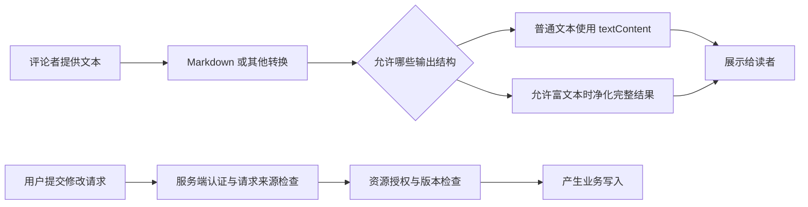

# Web 安全边界学习资料

## SEC-01 让不可信数据停在正确的边界

一条资料评论，既可能作为普通文字显示，也可能被解析为 HTML；一个返回地址，既可能指向站内详情，也可能把用户带到别处。安全问题常发生在这样的转换点：代码把“有人提供的数据”升级成了“页面可以执行的指令”。

本篇用评论预览、返回地址和资料修改三个例子，把 XSS、CSRF、原型污染与授权分开说明。演示只使用本地内容与虚构身份，不读取真实账号或访问外部目标。

### 学习前先确认

- 直接前置：[NET-01 浏览器网络协议、Fetch 与请求可靠性](../chinese-guides/net-01-browser-network-fetch-reliability.md#net-01)。需要理解 origin、Cookie、HTTP 方法、CORS 和请求结果。

### 一、先画出谁提供数据，谁执行动作

**威胁模型（Threat Model）**可以从一页很短的事实开始：要保护什么，输入由谁控制，代码在哪一步获得更高权限，出错会影响谁。不需要先背一长串攻击字符串。

以资料评论为例：正文由评论者提供，Markdown 解析器把它变成 HTML，浏览器插入 DOM 后可能加载资源或执行事件属性。资料管理员看到评论，不意味着评论者应获得管理员页面的脚本权限。



两条路径的控制不同。净化评论不能证明提交者有权修改资料；验证用户身份，也不会自动让评论 HTML 变安全。

### 二、沿 source、transform、sink 追踪数据

**信任边界（Trust Boundary）**描述数据进入更高权限操作前要满足的约定。source 是入口，transform 是解析或转换，sink 是最终产生影响的位置。它们是分析步骤，不是三个必须命名成这样的函数。

| 数据与去向 | 应建立的限制 | 不能拿什么替代 |
| --- | --- | --- |
| 标题进入正文 | 按文本插入 | “已经做过一次正则替换” |
| 富文本进入 HTML | 允许结构与维护中的净化器 | Markdown 解析成功 |
| URL 进入导航 | 解析后限制协议、源与路径 | encodeURIComponent |
| 配置对象进入合并 | 已知字段、类型与层级 | JSON.parse 成功 |
| 请求进入数据修改 | 身份、来源、对象权限与状态 | 页面上隐藏按钮 |

来自自己的 API、数据库或 AI 输出，也可能包含外部用户数据。来源经过了一个熟悉的服务，不意味着最后的输出上下文就自动可信。

### 三、XSS 是数据进入了可执行语境

**XSS** 是 Cross-Site Scripting 的缩写。存储型、反射型和 DOM 型描述不同传播路径，防护仍需要回到数据最终如何被解释。评论存入数据库，只是延迟了它到达页面的时间。

普通文本优先 textContent 或框架安全插值；确实允许富文本时，再选择有维护的 sanitizer。不要把不可信字符串拼进 JavaScript 源码、事件属性或模板编译入口，之后再期待一遍 HTML 转义修复所有上下文。

`innerHTML` 中插入的 script 标签不一定像解析初始 HTML 那样执行，但这不说明该入口安全。事件属性、危险 URL 和其他 HTML 行为仍然可能造成影响。用“我的 script 没运行”证明无 XSS，测试的是一个过窄的现象。

React/Vue 的普通文本渲染与显式 HTML 插入也有不同边界。组件用了 Shadow DOM，更不代表获得安全沙箱，相关封装范围见 [WEB-05](../chinese-guides/web-05-web-components-shadow-dom-interoperability.md#web-05)。

### 四、运行一个只允许少量富文本的预览页

在单独示例目录安装 `dompurify@3.4.12`，把 `node_modules/dompurify/dist/purify.min.js` 复制到该目录，保存下面的 `safe-preview.html`。这里固定的是本次核对版本；正式项目仍需持续关注依赖更新。

可以直接用桌面浏览器打开 HTML。它不发保存请求，只对比“作为文字显示”和“按允许结构显示”。示例允许段落、强调和代码，不允许图片、链接、样式、id/name 或事件属性，避免把结构需求不明的富文本原样开放。

```html example=sec-safe-preview runtime=project file=safe-preview.html
<!doctype html>
<html lang="zh-CN">
<meta charset="utf-8">
<title>评论如何进入页面</title>
<style>
  body { max-width: 58rem; margin: 3rem auto; padding: 0 2rem; font: 18px/1.7 system-ui; color: #172d3c; }
  textarea { display: block; width: 100%; box-sizing: border-box; min-height: 9rem; font: inherit; }
  button { font: inherit; padding: .6rem; margin-block: 1rem; }
  .views { display: grid; grid-template-columns: 1fr 1fr; gap: 1rem; }
  section { border: 1px solid #8e9daa; padding: 1rem; min-width: 0; overflow-wrap: anywhere; }
  :focus-visible { outline: 3px solid #005fcc; outline-offset: 3px; }
  #plain { white-space: pre-wrap; }
</style>
<main>
  <h1>评论如何进入页面</h1>
  <label for="source">评论内容</label>
  <textarea id="source">&lt;p&gt;&lt;strong&gt;重点&lt;/strong&gt;：先理解事件路径。&lt;/p&gt;</textarea>
  <button id="preview">更新预览</button><p id="status" role="status"></p>
  <div class="views">
    <section><h2>普通文字</h2><div id="plain"></div></section>
    <section><h2>允许的富文本</h2><div id="rich"></div></section>
  </div>
</main>
<script src="./purify.min.js"></script>
<script>
  const el = (id) => document.getElementById(id);
  const allowed = {
    ALLOWED_TAGS: ['p', 'strong', 'em', 'code', 'br'],
    ALLOWED_ATTR: [], ALLOW_DATA_ATTR: false, ALLOW_ARIA_ATTR: false,
    RETURN_DOM_FRAGMENT: true,
  };
  function preview() {
    const raw = el('source').value;
    el('plain').textContent = raw;
    if (!window.DOMPurify?.isSupported) {
      el('rich').textContent = raw;
      el('status').textContent = '净化器不可用，按普通文字显示。';
      return;
    }
    const fragment = DOMPurify.sanitize(raw, allowed);
    el('rich').replaceChildren(fragment);
    el('status').textContent = '预览已更新；只保留段落、强调与代码。';
  }
  el('preview').onclick = preview;
  preview();
</script>
</html>
```

先确认粗体与段落能显示，再把输入替换成 `<p onclick="console.log('demo')">正文</p>`。右侧应保留段落正文，但没有 onclick 属性和 img 节点；左侧仍完整显示这些字符。这里只观察净化后的结构，不需要把危险内容先在真实管理页面执行一遍。

净化器缺失时退回纯文本，不能退回原样 innerHTML。返回 DocumentFragment 后用 replaceChildren 插入，也减少了把净化结果重新拼接成 HTML 字符串的机会。

### 五、净化之后不要再引入新的解析边界

**HTML 净化（Sanitization）**按允许结构删除或转换不合要求的部分。它与输出编码不同：编码保留文字含义，净化则决定哪些标记可以成为实际结构。

Markdown 解析器的工作是理解 Markdown，不一定负责安全。可以在最终 HTML 上统一净化，或使用只构造允许节点的渲染链。若净化后又把用户提供的链接、标题或片段拼回去，最后写入的内容已经不是原先核对过的结果。

需求增加链接时，应重新定义允许协议、目标范围和相关属性；增加图片、iframe、SVG 或 CSS 时也各有新边界。不要为了让一个正常样例显示出来，就一次开放所有标签和属性。

例子展示一组窄配置，不是“所有 Markdown 都安全”的证明。净化器版本、运行的 DOM 实现和之后接入的转换库都可能影响结果。CSP 与 Trusted Types 可以进一步限制错误入口，见 [SEC-02](../chinese-guides/sec-02-csp-trusted-types-reporting.md#sec-02)。

### 六、URL 要解析后按业务允许集合判断

encodeURIComponent 用于编码 URL 的某一部分，不会判断整个地址是否可导航。一个编码正确的外部地址仍然可能把用户带离可信页面。

下面只允许固定站点下的数字资料路径，不保留查询与片段。域名使用文档示例域，不发生任何真实跳转。

```js example=sec-return-url
function safeReturnPath(raw) {
  if (typeof raw !== 'string') return null;
  try {
    const url = new URL(raw, 'https://notes.example/');
    if (url.origin !== 'https://notes.example' || url.username || url.password) return null;
    if (!/^\/notes\/\d+$/.test(url.pathname) || url.search || url.hash) return null;
    return url.pathname;
  } catch { return null; }
}
for (const value of ['/notes/7', 'https://notes.example/notes/8', '//other.example/notes/7',
  'javascript:void(0)', '/notes/7?next=elsewhere', '/admin']) {
  console.log(safeReturnPath(value));
}
// => /notes/7
// => /notes/8
// => null
// => null
// => null
// => null
```

只接受规范化后的 pathname，让 URL 解析器处理表示，再由业务规则限制目标。不要用 `startsWith('https://notes.example')` 判断源，类似前缀的主机名不等于同一个源。

这里刻意采用窄允许集合，没有实现 OAuth 回调或合作方外链。需要外部跳转时，应维护精确目标与用途，服务端的重定向入口也执行同等检查，不能只保护前端按钮。

### 七、DOM 命名访问不能承担安全配置

**DOM Clobbering** 利用某些元素的 id/name 参与 window 等对象的命名属性访问。代码原本想读一个配置，实际可能读到页面元素；输入没有 script 标签，也仍可能改变后续逻辑。

因此不要依赖“有个 id=redirectTo 的节点，所以裸变量 redirectTo 总能拿到我的配置”。使用模块局部变量、显式配置来源与类型验证，查节点时调用明确的 DOM API。导航前仍按上一节校验 URL。

完整过滤脚本不等于消除了命名属性影响。本篇富文本不接受 id/name，减少这一入口，但其他模板、第三方控件或遗留代码仍可能引入同类数据流。检查时关注值的真实类型和最终去向，不只是有没有弹窗。

### 八、原型污染要看写入发生在哪里

**原型污染（Prototype Pollution）**与对象属性查找链有关。JSON.parse 得到名为 __proto__ 的自有键，本身不等于已经修改了 Object.prototype；危险可能在之后的合并或路径写入时发生。

下面的错误示范只改变一个新建目标对象的原型，不修改全局 Object.prototype。随后用字段允许集合构造安全结果，让两者的差别可见。

```js example=sec-preference-boundary
const incoming = JSON.parse('{"__proto__":{"approved":true},"theme":"dark","pageSize":20}');
const merged = Object.assign({}, incoming);
console.log(merged.approved, Object.hasOwn(merged, 'approved'));
// => true false
console.log(Object.hasOwn(incoming, '__proto__'), Object.prototype.approved);
// => true undefined
function readPreferences(value) {
  const result = { theme: 'light', pageSize: 10 };
  if (!value || typeof value !== 'object' || Array.isArray(value)) return result;
  if (Object.hasOwn(value, 'theme') && ['light', 'dark'].includes(value.theme)) result.theme = value.theme;
  if (Object.hasOwn(value, 'pageSize') && [10, 20, 50].includes(value.pageSize)) result.pageSize = value.pageSize;
  return result;
}
const safe = readPreferences(incoming);
console.log(safe.theme, safe.pageSize, Object.hasOwn(safe, 'approved'));
// => dark 20 false
```

merged 读到了 inherited approved，并不代表它真的有自己的授权字段。业务权限应来自服务端，不应从任意合并对象的默认值推导。

对必须支持嵌套配置的工具，要在每层限制字段与路径，关注 __proto__、constructor、prototype 等危险路径。Map 或 null-prototype object 适合字典，但不能替代业务 schema；也不要把冻结 Object.prototype 当成没有代价的通用补丁。

### 九、CSRF 为什么不需要读取响应

**CSRF** 是 Cross-Site Request Forgery。浏览器自动携带会话身份时，另一个页面可能诱导它发起有副作用的请求。攻击者即使看不到响应，也可能已经改变了数据。

这与 XSS 不同：CSRF 关注带身份请求的来源，XSS 关注页面内部的执行权限。CORS 控制跨源脚本读取响应，不能代替写操作的来源防护。普通表单和某些不需预检的请求尤其容易让人误以为“被 CORS 挡住就是没发送”。

服务端应优先使用框架成熟的 CSRF 机制，例如与会话绑定的 token，并根据部署检查 Origin、Referer 或 Fetch Metadata。SameSite、Secure、HttpOnly 是相关防线，但职责不同。GET 不应承担业务写入，也不能只在某个前端按钮上附加 token，另一个可写入口却不校验。

### 十、身份、请求来源与资源授权逐道判断

下面是纯函数教学模型，用虚构用户与固定演示 token 区分拒绝原因。真实服务的会话获取、随机 token、比较与验证应由成熟框架处理，不要把固定 token 复制进应用。

```js example=sec-write-gates
function decide({ user, origin, token, owner }) {
  if (!user) return 401;
  if (origin !== 'https://notes.example' || token !== user.csrf) return 403;
  if (owner !== user.id) return 403;
  return 200;
}
const user = { id: 'reader-a', csrf: 'teaching-token-a' };
const normal = { user, origin: 'https://notes.example', token: user.csrf, owner: user.id };
console.log(decide({ ...normal, user: null }));
// => 401
console.log(decide({ ...normal, origin: 'https://other.example' }));
// => 403
console.log(decide({ ...normal, token: 'wrong' }));
// => 403
console.log(decide({ ...normal, owner: 'reader-b' }));
// => 403
console.log(decide(normal));
// => 200
```

认证回答是谁，CSRF 防护检查请求是否满足允许的来源与防伪条件，授权判断能否修改这份资料。真实规则还可能涉及角色、组织、资料状态和版本，不能只比较 owner 就处理所有产品权限。

幂等键防止同一意图重复执行，不授予资源权限；隐藏按钮和路由守卫改善界面，不限制直接构造的请求。例子没有运行真实跨站 Cookie 流程，输出仅证明决策顺序，不应当作部署级 CSRF 验证。

### 十一、site、origin 与脚本权限要分清

origin 包含协议、主机与端口。site 的判断与方案及可注册域等有关，同一主域的不同子域可能 same-site，却是 cross-origin。Cookie 的 SameSite 不能简单理解成“只发给当前 origin”。

HttpOnly 限制普通脚本读取 Cookie，但页面已有 XSS 时，恶意代码仍可能借浏览器会话发同源请求。localStorage、IndexedDB 和前端构建环境变量也不是秘密保险箱。把服务凭据放在前端包里，不会因为变量名叫 SECRET 就隐藏起来。

第三方脚本若在页面上下文运行，通常可以读 DOM、发请求、改导航。给某个域名加入允许列表之前，需要知道它的用途、版本、数据访问和移除方式。必要时用不同源的受限 iframe 划分边界，跨窗口消息验证 origin、source 与结构，而不是只检查消息里自称的角色。

点击劫持是页面被嵌入并诱导操作的问题。frame-ancestors 控制谁能嵌入当前文档；它与当前页面允许加载哪些 iframe 的 frame-src 方向不同。浮层或极大的 z-index 都不能替代这类响应策略。

### 十二、修复要同时保护正常内容和失败路径

一项有用的核对至少包括正常输入与边界输入。评论的粗体应该仍能显示，事件属性和图片却不进入允许结构；合法详情地址可以返回，外部地址被拒绝；正常偏好可以读取，继承的 approved 不被当成权限。

发生问题时记录入口、转换、最终操作、受影响版本和已知影响，不把整段敏感正文、Cookie 或攻击输入原样搬进日志。内部日志页面也要按文本显示，否则一次采集可能变成第二个注入入口。

真正的事故处置需要按证据判断是否停用入口、重新净化历史内容、吊销会话或通知受影响方。只删除一条评论、清缓存或关掉按钮，通常没有修复通用数据流。复盘方法可以接到 [CAREER-04](../chinese-guides/career-04-incident-response-postmortem-learning.md#career-04)。

学完后尝试说明：为什么 JSON.parse 一个特殊键还不等于全局污染，为什么 HttpOnly 不能让 XSS 无害，为什么合法登录仍可能没有某份资料的写权限。准确区分这些边界，才能选择真正解决问题的控制。

### 参考与延伸阅读

审校日期：2026-09-14。中文正文独立组织，官方材料用于核对具体防护边界；示例不是生产安全审计。

- [OWASP：XSS Prevention](https://cheatsheetseries.owasp.org/cheatsheets/Cross_Site_Scripting_Prevention_Cheat_Sheet.html)：输出上下文、净化和框架边界。
- [DOMPurify 官方仓库](https://github.com/cure53/DOMPurify)：配置、版本与净化后处理注意事项。
- [OWASP：DOM Clobbering](https://cheatsheetseries.owasp.org/cheatsheets/DOM_Clobbering_Prevention_Cheat_Sheet.html)：命名属性访问的风险。
- [OWASP：Prototype Pollution](https://cheatsheetseries.owasp.org/cheatsheets/Prototype_Pollution_Prevention_Cheat_Sheet.html)：字典与原型边界。
- [OWASP：CSRF Prevention](https://cheatsheetseries.owasp.org/cheatsheets/Cross-Site_Request_Forgery_Prevention_Cheat_Sheet.html)：token、来源与 Cookie 防线的组合。
