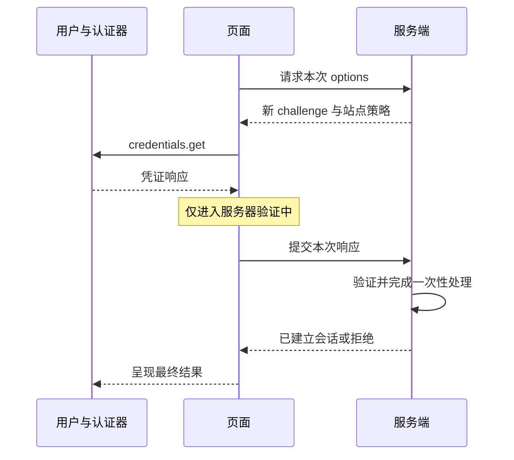

# Web 身份安全知识点讲义

## SEC-03 把通行密钥登录的每一步讲清楚

用户按了指纹，系统弹窗关闭了，页面却提示登录失败。这不一定是前端卡住：认证器已经完成自己的工作，服务端仍可能拒绝过期 challenge、被撤销凭证或不匹配的站点信息。页面应该告诉用户现在走到哪一步，而不是急着画一个成功的勾。

本篇沿“添加一把通行密钥，再用它登录”的过程，解释认证器、浏览器、前端与服务端各自知道什么。案例中的账号与事件都是教学设定，不会创建真实凭证或修改任何账号。

### 学习前先确认

- 直接前置：[NET-01 浏览器网络协议、Fetch 与请求可靠性](../chinese-guides/net-01-browser-network-fetch-reliability.md#net-01)。需要理解 origin、请求取消、迟到结果和服务端最终状态。

### 一、Passkey 把可重复输入的秘密换成站点凭证

**Passkey**（通行密钥）面向用户提供公钥凭证登录体验，可能由凭证提供方同步，也可能绑定设备。**WebAuthn** 是 Web 端调用这类凭证的 API 与协议，不是所有历史 WebAuthn 用法都等同于今天的 Passkey 体验。

**Relying Party**（RP）是提供登录服务的站点；**Authenticator** 是实际管理凭证、完成签名的一方，可能是设备平台、硬件安全密钥或凭证提供方支持的认证器。站点得到公钥和凭证标识，得不到私钥。指纹、面容或 PIN 用来在本地满足用户验证要求，服务端不会因此收到指纹图片。

把它想成“站点发出一个新问题，只有对应凭证能给出可验证的回答”。回答绑定这一次过程及站点上下文，不能像密码一样搬去另一个仿冒站点反复提交。但攻击者若控制已有会话或恢复流程，仍可能绕到认证之外的入口。

### 二、注册保存公钥，登录验证一次新回答

注册通常发生在已确认身份的会话中。用户添加长期凭证时，应要求近期再认证，避免一个被偷的旧会话悄悄给攻击者添加登录方式。注册 options 包含 RP、随机 challenge、不含邮箱等直接身份信息的稳定 user handle、算法和凭证策略。

登录时，服务端重新发 challenge；浏览器调用已有凭证返回 **Assertion**，服务端用注册时保存的公钥检查。可发现凭证允许用户在认证器侧选择账号，因此并非所有登录都要先输入用户名或给出 allowCredentials。



注册的验证过程还涉及认证器数据、凭证公钥、算法、扩展与 attestation 格式。登录则验证 assertion 的签名等信息。不要把两者简化成同一个“比较 challenge 字符串”的函数。

### 三、challenge 是一次过程的凭据，不是固定验证码

**Challenge** 由服务端使用密码学安全随机数生成，具有有效期，并绑定本次注册或登录过程。前端将服务端 options 里的二进制表示转换成 API 需要的形式，不自行生成权威 challenge，也不把上一次 options 当可重用缓存。

考虑下面的教学记录，字符串只是为了方便阅读，不是真正随机值：

| 请求 | 服务端已知状态 | 应有结果 |
| --- | --- | --- |
| 登录尝试 a17，challenge 尚未使用 | 过程、期限、凭证等检查均满足 | 允许继续完成登录 |
| a17 的完全相同响应再次到达 | 已经完成过 a17 | 不产生第二次登录结果 |
| 把注册 challenge 交给登录接口 | 类型不匹配 | 拒绝 |
| 页面等了很久才提交 | 已过期 | 重新开始 |

并发时不能先读 `used=false`、稍后各自写 `used=true`。两个请求都可能穿过检查。应使用服务端的事务或条件更新，将验证后的一次性完成与会话结果协调起来；失败和重试策略也要明确。页面自己的 Set 或按钮禁用不能代替它。

### 四、RP ID 和 origin 为什么都要检查

**RP ID** 不带协议和端口，一般是当前有效域名或允许的域名后缀；origin 则包含协议、主机和端口。教学例子 `https://login.example.com` 可以围绕合法 RP 范围设计凭证，但不能随意要求为另一个无关网站使用凭证。

浏览器检查 RP ID 与页面的关系，认证器数据包含 RP ID 的哈希，client data 包含实际 origin。服务端按已配置的预期值验证，不能从客户端传来的 `expectedOrigin` 决定允许谁。相似拼写的域名并不会继承原站点凭证。

基础部署宜使用清楚的单站点配置。相关来源请求等新机制有额外验证与兼容条件，不应简化为无限扩展 RP 范围。跨源 iframe 还受到 WebAuthn 对应的 Permissions Policy 与调用条件约束；先看本批 [SEC-04 的嵌入与功能授权](../chinese-guides/sec-04-cross-origin-isolation-embedding-permissions.md#七嵌入被嵌入和功能授权分开配置)。

### 五、运行一个逐步推进的认证状态页

将下面保存为 `passkey-stages.html` 后打开。它是纯前端的流程模拟：按钮代替认证器和服务端事件，没有调用真实 WebAuthn、没有签名验证，也不会建立会话。这样的分离便于观察“什么时候可以显示成功”，不用先配置凭证服务。

```html example=sec03-stages-page runtime=project file=passkey-stages.html
<!doctype html>
<html lang="zh-CN">
<meta charset="utf-8"><title>通行密钥：分阶段观察</title>
<style>
body { max-width: 860px; margin: 40px auto; padding: 0 24px; font: 17px/1.7 system-ui; color: #183f36; background: #f3f7f5; }
section { background: white; border: 1px solid #c5d9d0; border-radius: 14px; padding: 24px; margin: 20px 0; }
button { font: inherit; padding: 8px 14px; margin: 5px; } button:disabled { opacity: .5; }
#status { font-size: 23px; font-weight: 650; } li { margin: 5px 0; }
</style>
<h1>通行密钥：分阶段观察</h1>
<p>教学模拟，不调用认证器，也不登录真实账号。</p>
<section><p id="status" role="status"></p>
<button id="start">开始新尝试</button><button id="options">模拟 options 到达</button>
<button id="credential">模拟认证器返回</button><button id="cancel">取消当前尝试</button></section>
<section><h2>服务端回复</h2>
<p>只有提交了凭证响应后，才会产生一个待回复请求。</p>
<button id="approve">模拟验证通过</button><button id="reject">模拟验证拒绝</button>
<button id="late">重放最近一次服务端回复</button></section>
<section><h2>过程记录</h2><ol id="log" aria-live="polite"></ol></section>
<script type="module">
const $ = id => document.getElementById(id);
const labels = { idle: '尚未开始', options: '正在取得登录选项', prompt: '等待认证器', verifying: '服务器验证中', success: '模拟登录完成', cancelled: '已取消当前等待', rejected: '未完成验证，可重新尝试' };
let attempt = 0, stage = 'idle', pending = null, lastReply = null;
const busy = () => ['options', 'prompt', 'verifying'].includes(stage);
function log(text) { const li = document.createElement('li'); li.textContent = text; $('log').append(li); if ($('log').children.length > 30) $('log').firstElementChild.remove(); }
function render() {
  $('status').textContent = labels[stage];
  $('start').disabled = busy(); $('options').disabled = stage !== 'options';
  $('credential').disabled = stage !== 'prompt'; $('cancel').disabled = !busy();
  $('approve').disabled = pending === null; $('reject').disabled = pending === null;
  $('late').disabled = lastReply === null;
}
function reply(message) {
  if (message.attempt !== attempt || stage !== 'verifying') {
    log(`忽略旧回复：尝试 ${message.attempt}，当前尝试 ${attempt}`); return render();
  }
  stage = message.ok ? 'success' : 'rejected';
  log(`服务端回复：${labels[stage]}`); render();
}
$('start').onclick = () => { attempt++; stage = 'options'; pending = null; log(`开始尝试 ${attempt}`); render(); };
$('options').onclick = () => { stage = 'prompt'; log('已取得 options，尚未完成认证'); render(); };
$('credential').onclick = () => { stage = 'verifying'; pending = attempt; log('认证器已有响应，等待服务端验证'); render(); };
$('cancel').onclick = () => { attempt++; stage = 'cancelled'; log('撤回当前界面的提交资格；服务端处理不能靠它撤销'); render(); };
function complete(ok) { if (pending === null) return; lastReply = { attempt: pending, ok }; pending = null; reply(lastReply); }
$('approve').onclick = () => complete(true); $('reject').onclick = () => complete(false);
$('late').onclick = () => { if (lastReply) reply(lastReply); };
render();
</script>
</html>
```

按“开始 → options → 认证器返回”，页面仍显示“服务器验证中”。点“验证拒绝”才得到失败结果。再次尝试，在认证器返回后取消，再点“验证通过”，旧回复会被忽略。已完成后重放回复也不会再推进状态。

这里忽略的是旧回复对当前界面的影响。若真实服务端已经建立会话，前端取消并不自动撤回 Set-Cookie 或服务器状态；必要时要查询当前会话、明确退出。关联原理见 [NET-01 的取消与结果未知](../chinese-guides/net-01-browser-network-fetch-reliability.md#六取消的是等待写入结果还要确认)。

### 六、真实 API 接入时，二进制与业务结果要分开

服务端通常通过 JSON 传递 options，其中二进制字段采用 Base64url。现代浏览器提供 `parseCreationOptionsFromJSON`、`parseRequestOptionsFromJSON` 与凭证的 `toJSON`，可以减少手工转换；能力不存在时应选用维护中的兼容库或保留其他登录入口，不能漏解码 credential ID 等字段。

下面是独立的客户端接入函数，**需要已有服务端接口，不是上一节模拟页的组成部分**。假定同源服务提供两个 POST 接口，并已实现请求来源检查、限流、规范要求的验证与会话管理；返回内容须符合约定。它不包含服务端密码学实现。

```js example=sec03-api-adapter runtime=project file=passkey-client.js
export async function authenticate(signal) {
  if (!globalThis.isSecureContext || !globalThis.PublicKeyCredential
      || typeof PublicKeyCredential.parseRequestOptionsFromJSON !== 'function'
      || typeof PublicKeyCredential.prototype.toJSON !== 'function') {
    return { kind: 'unavailable' };
  }
  async function post(path, body) {
    const response = await fetch(path, {
      method: 'POST', credentials: 'same-origin', cache: 'no-store', signal,
      headers: { 'Content-Type': 'application/json' }, body: JSON.stringify(body),
    });
    if (!response.ok) throw new Error('request-failed');
    return response.json();
  }
  try {
    const optionsJSON = await post('/auth/passkey/options', {});
    const publicKey = PublicKeyCredential.parseRequestOptionsFromJSON(optionsJSON);
    const credential = await navigator.credentials.get({ publicKey, signal });
    if (!(credential instanceof PublicKeyCredential)) return { kind: 'incomplete' };
    const result = await post('/auth/passkey/verify', credential.toJSON());
    return result?.authenticated === true ? { kind: 'authenticated' } : { kind: 'incomplete' };
  } catch (error) {
    if (signal?.aborted || error?.name === 'AbortError') return { kind: 'cancelled' };
    return { kind: 'incomplete' };
  }
}
```

调用方仍需管理唯一的 AbortController、提示阶段和当前尝试编号。接口 options 不是用户界面的成功状态；`authenticated:true` 也只有在受信服务端完成验证和会话建立的约定下才有意义。不要把这段函数复制到没有验证逻辑的假接口上，就称为“实现了 Passkey 登录”。

### 七、服务端的每个检查都在回答不同问题

| 检查 | 排除的问题 |
| --- | --- |
| challenge、期限、过程绑定、一次性完成 | 旧响应重放、串用注册与登录过程 |
| client data 的 type、origin，按策略处理跨源上下文 | 错误操作或来源 |
| rpIdHash、算法、认证器数据与所需 flags | 使用了错误站点或不满足验证策略 |
| credential ID、user handle、所属账号与状态 | 被撤销凭证、错误账号关联 |
| assertion 签名及必要扩展 | 数据被修改或无法证明持有对应凭证 |
| 会话与后续命令授权 | 已认证用户访问不属于自己的资源 |

这张表用于理解责任，不是可自行删减的协议实现清单。生产应使用维护中的服务端库，按官方验证流程配置，避免自己解析 CBOR、COSE 或拼签名字节。注册还要检查 attestation 格式、凭证唯一性等注册专属条件。

签名确认的是凭证参与这次认证，不证明“该用户有权删除项目”。后续每个资源请求仍需服务端授权，对照 [SEC-01 的身份与资源检查](../chinese-guides/sec-01-xss-csrf-trust-boundaries.md#十身份请求来源与资源授权逐道判断)。

### 八、UP、UV、attestation 与计数不要混为一谈

**User Presence**（UP）表示发生用户参与；**User Verification**（UV）表示认证器完成所要求的用户验证。页面要求 `userVerification:'required'` 后，服务端也要检查实际结果，不能信任客户端额外提交的 `verified:true`。

**Attestation** 可提供认证器来源信息，涉及隐私、格式和信任治理。普通消费者场景常使用 `none`，不能因为“更安全”就盲目收集更多设备证明。企业如有设备限制，应建立完整的受信策略及更新过程。

`signCount` 是风险信号，不是绝对单调的账号计数器。某些认证器保持零；同步、并发乱序等也会影响观察。计数异常需要结合凭证状态和产品风险处理，不能仅凭一次不递增就断言发生克隆并永久锁号。

### 九、取消、超时和没有凭证要给用户可继续的路

`NotAllowedError` 可能对应未完成交互、超时、无可用凭证或策略限制等多种情况。直接翻译成“你拒绝了验证”既不准确，也容易让用户困惑。可写“未完成通行密钥验证，请重试或使用其他方式”。

应用主动中断可用 AbortController，并清理离开页面的请求；新尝试到来时撤销旧尝试的界面提交资格。`SecurityError` 等配置问题应在开发侧定位，用户侧保留可理解提示与安全回退。不要靠不断自动重试反复弹出系统窗口。

回退入口要真正可用，例如既有密码与 MFA、恢复码或已配置的其他因子。更弱的回退方式会改变整体安全保证，不能只在 Passkey 主路径上谈抗钓鱼。

### 十、条件式 UI 是增强，不是可用凭证证明

**Conditional mediation** 可以与登录表单自动填充协作。通常在账号输入中包含 `autocomplete="username webauthn"`，检测 `isConditionalMediationAvailable`，再启动条件式请求。API 存在、条件式能力可用、有符合条件的凭证是三个不同问题。

页面只维护一个活动过程。用户改点显式“使用通行密钥”按钮时，应先协调或取消已有请求；组件卸载也要清理。可将这种资源所有权接回 [BROWSER-02 的生命周期](../chinese-guides/browser-02-observers-scheduling-lifecycle-coordination.md#十三资源要有明确的主人)。

匿名 options、错误文案、状态码和明显时序差异都可能暴露账号是否存在。统一文案只是其中一层；后端还要设计防枚举和限流，不通过“该邮箱还没创建 Passkey”给未登录者查询凭证的接口。

### 十一、同步、恢复与撤销决定长期体验

换设备后凭证是否出现，取决于提供方、同步状态、账号和设备策略，不能保证“有 Passkey 就永远不会丢”。允许用户配置多个独立恢复途径，并在已认证页面显示凭证名称、添加时间、最近使用和撤销入口。

丢失一台设备、删除一条凭证、退出当前会话、恢复账号，是四个不同操作。例如，服务端撤销凭证后不能再用它建立新会话，但已有会话是否继续有效，需要独立的会话撤销政策。

恢复成功后，应评估旧凭证、会话与恢复因子，给账号所有者适当通知。客服或邮箱恢复若更容易被接管，Passkey 主路径的强度无法替它补上缺口；高风险恢复可采用等待期、已有设备确认等有明确依据的流程。

### 十二、怎样判断实现完成了哪一层

本篇的状态页证明的是界面事件顺序，真实客户端函数说明 API 边界。两者都不证明密码学验证、硬件交互或恢复策略正确。

实际集成可用浏览器虚拟认证器检查注册与登录交互，再以服务端证据确认旧 challenge、错误 origin、撤销凭证和无效签名被拒绝。虚拟认证器又不能证明真实系统弹窗、凭证同步、企业设备策略或用户恢复体验，需要按实际支持范围补充观察。

保留阶段、耗时、错误类别与关联编号即可，不采集原始凭证响应、签名或生物特征。注册成功率、认证器返回率、服务端验证率分别统计，才能分清问题出在提示、网络还是验证。新增 JSON 转换、Signal API 等能力时先做检测，协议核心边界不随 UI 简化。

### 参考与延伸阅读

- [MDN：Web Authentication API](https://developer.mozilla.org/en-US/docs/Web/API/Web_Authentication_API)：查阅 API 入口、JSON 转换和嵌入条件。
- [W3C：WebAuthn Level 3](https://www.w3.org/TR/webauthn-3/)：核对注册、认证验证步骤及计数、来源和扩展要求；按采用的规范版本实施。
- [web.dev：创建 Passkey](https://web.dev/articles/passkey-registration)：理解注册选项与用户体验。
- [web.dev：通过表单自动填充登录](https://web.dev/articles/passkey-form-autofill)：查阅条件式请求与表单协作。
- [MDN：parseRequestOptionsFromJSON](https://developer.mozilla.org/en-US/docs/Web/API/PublicKeyCredential/parseRequestOptionsFromJSON_static)：检查转换能力与兼容范围。
