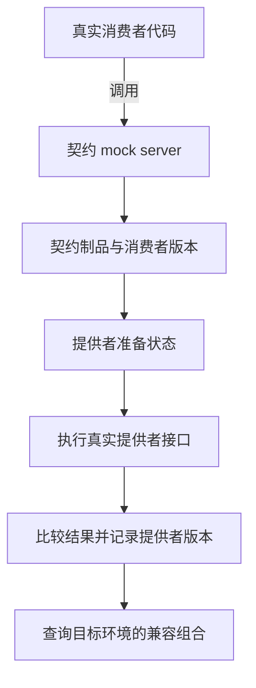

# 接口还能返回 JSON，为什么旧页面却坏了

## TEST-04 API 契约兼容与消费者驱动契约测试

资料接口把 `title` 改成了 `name`。最新编辑页已经更新，仍开着旧版本的阅读页却显示空标题；夜间索引任务依赖的错误码也被一起改了。服务端返回 200，Schema 检查通过，单看最新页面仍很正常。

接口兼容需要回答更具体的问题：哪一个消费者版本，在什么前提下，实际依赖哪些请求和结果？本讲用资料阅读页、编辑页与索引任务解释消费者契约、提供者验证和发布矩阵。代码演示从正文即可独立运行；它们用于理解机制，不假装实现完整 Pact 工具链。

### 学习前先确认

- 直接前置：[BIZ-04 API 契约、DTO 与前端模型](../chinese-guides/biz-04-api-contract-dto-frontend-model.md#biz-04)。先明确字段、未知状态和错误结果的含义。
- 直接前置：[TEST-01 测试预言、性质、Fuzz 与变异测试](../chinese-guides/test-01-test-design-oracles-properties-mutation.md#test-01)。本讲使用独立预期、边界输入和受控替身。

### 一、兼容性属于一个交互和一组版本

消费者是调用接口或处理消息的代码，提供者是实现该边界的代码。同一个 Web 产品也会有旧标签页、新编辑页和后台任务，不需要存在移动端才值得考虑版本并存。

**Consumer-Driven Contract** 从消费者真实依赖出发，记录可执行的交互约定。它不是整个产品的功能验收，也不是把所有可能字段复制成快照。

例如阅读页需要 `GET /materials/m1` 返回标题，找不到时能识别 `MATERIAL_NOT_FOUND`；索引任务可能只需要 ID、标题和版本。只看“都是合法 JSON”无法判断它们是否还能工作。

| 检查 | 主要回答 | 单独不能证明 |
| --- | --- | --- |
| 类型和 Schema | 结构是否符合已声明规则 | 消费者是否真正理解它 |
| 消费者契约验证 | 实际交互依赖是否被满足 | 所有业务路径都正确 |
| 集成检查 | 选定组件之间的真实连接是否工作 | 所有消费者版本都兼容 |
| 端到端观察 | 用户路径在指定环境能否完成 | 所有协议边界与异常都已覆盖 |

先找具有独立发布或长期兼容责任的边界。一个共同发布的小模块，类型加局部检查可能已经足够，不必为了工具名称部署一整套契约仓库。

### 二、消费者测试必须执行真实的消费逻辑

如果测试只验证 mock 返回了自己写入的 JSON，它会永远证明“自己抄得没错”。真正有价值的是让客户端读取响应，再观察它是否使用了所声明的字段与错误。

```js example=test04-consumer-dependency
async function loadTitle(get, id) {
  const reply = await get(`/materials/${encodeURIComponent(id)}`);
  if (reply.status === 404 && reply.body?.code === 'MATERIAL_NOT_FOUND') return '资料不存在';
  if (reply.status !== 200 || typeof reply.body?.title !== 'string') throw new Error('TITLE_CONTRACT');
  return reply.body.title;
}
const requests = [];
const fakeGet = async path => { requests.push(path); return { status: 200, body: { title: '摄影入门', version: 4 } }; };
console.log(await loadTitle(fakeGet, 'm/1'));
console.log(requests[0]);
console.log(await loadTitle(async () => ({ status: 404, body: { code: 'MATERIAL_NOT_FOUND' } }), 'missing'));
try { await loadTitle(async () => ({ status: 200, body: { name: '摄影入门' } }), 'm1'); }
catch (error) { console.log(error.message); }
// => 摄影入门
// => /materials/m%2F1
// => 资料不存在
// => TITLE_CONTRACT
```

这里确实执行了消费函数，并展示字段被重命名后的失败；但 `fakeGet` 没有网络，它既不验证真实 fetch 封装，也不生成 Pact 文件。接入实际工具时，应让真实 HTTP 客户端调用契约 mock server，再由工具记录匹配过的请求与响应。

如果页面另有一套错误转换器，契约测试应覆盖真正使用的那条适配路径。另写一个专供测试的“简化客户端”很容易让生产代码和契约一起分叉。

### 三、匹配器只放宽无关差异，保留关键含义

ID、追踪号和时间戳不一定需要与某个样例精确相等；状态码、字段存在性和消费者据此分支的错误码却不能随便放宽。匹配规则应来自消费代码的依赖。

```ts example=test04-response-matcher
type Reply = { status: number; contentType: string; body: unknown };
function differences(reply: Reply): string[] {
  const errors: string[] = [];
  if (reply.status !== 200) errors.push('status');
  if (reply.contentType.split(';')[0]?.trim().toLowerCase() !== 'application/json') errors.push('content-type');
  const body = reply.body;
  if (body === null || typeof body !== 'object' || Array.isArray(body)) return [...errors, 'body'];
  const record = body as Record<string, unknown>;
  if (typeof record.title !== 'string' || record.title.trim() === '') errors.push('title');
  if (!Number.isSafeInteger(record.version) || (record.version as number) < 1) errors.push('version');
  return errors;
}
const good: Reply = { status: 200, contentType: 'application/json; charset=utf-8', body: { title: '摄影入门', version: 4, extra: true } };
console.log(differences(good).join(',') || '符合阅读页依赖');
console.log(differences({ ...good, body: { name: '摄影入门', version: 4 } }).join(','));
console.log(differences({ ...good, status: 204, body: null }).join(','));
// => 符合阅读页依赖
// => title
// => status,body
```

这个自编匹配器允许额外字段，拒绝空标题和无效版本；它只服务本例，不是 HTTP、JSON Schema 或 Pact 的通用实现。若消费者实际上允许空标题，就应先明确显示规则，再改变匹配，不能因服务端改错而直接把标题检查删掉。

不要把“任意字符串”用在必须区分 `DENIED` 和 `NOT_FOUND` 的错误码上。相反，若客户端从未使用对象键的顺序，就不应因此阻止发布。合同既需要反例，也需要“无关新增字段仍可接受”的正例。

### 四、Provider State 只准备前提，不伪造被测结果

**Provider State** 描述交互开始前的业务事实，例如“m1 已发布”“m1 不存在”“调用者对 m1 无读取权限”。同一路径可以在不同前提下得到不同结果。

状态准备应确定、隔离、可重复，不依赖共享环境恰好存在某条数据。验证顺序也不应有要求：不能先运行“创建成功”，再指望“读取成功”沿用上一条交互的数据。[Pact 的状态说明](https://docs.pact.io/getting_started/provider_states)

提供者验证的有效路径是：准备合成数据，运行待发布提供者的真实路由和必要转换，再比较响应。若状态处理器直接指定返回 JSON，或把 handler 换成按契约作答的 mock，就失去了验证实际实现的作用。

认证可以使用隔离环境签发的测试身份，外部依赖可以在明确边界替换，但要记录范围。契约中有一条 403 并不能证明所有越权路径安全；真实授权执行仍由相应集成和安全观察承担。

### 五、两边的证据通过同一份契约连接

消费者测试产生契约制品，提供者验证这份制品，结果关联双方的实际版本。只有消费者侧通过，就像读者拿着自己编的字典证明自己看得懂，作者是否按字典写作仍未知。



不要手改生成契约来消除差异。若消费者期待本身错了，应修正其真实消费代码、例子和依据，再重新生成。契约文件、验证结果和构建版本必须能对应，不能验证 A 文件却发布 B 文件。

实际采用 Pact 时，consumer test、provider verifier、Broker 各自有版本和配置。本文不复制会随 SDK 变化的整套 API；操作时从 [Pact 官方入口](https://docs.pact.io/) 选择当前语言实现，锁定版本后运行一个最小真实交互，再扩展必要场景。

### 六、发布判断不能把未知组合当成通过

新提供者通常需要满足仍被支持的旧消费者；新消费者上线时，也要考虑当前仍运行的旧提供者。兼容有方向，不是一份“最新版本全绿”报告。

```js example=test04-version-matrix
const results = new Map([
  ['reader@1|api@2', 'pass'],
  ['editor@2|api@2', 'pass'],
  ['indexer@1|api@2', 'fail'],
]);
function decision(provider, activeConsumers) {
  if (activeConsumers.length === 0) return 'UNKNOWN：先确认消费者清单';
  const rows = activeConsumers.map(c => [c, results.get(`${c}|${provider}`) ?? 'unknown']);
  const failures = rows.filter(([, status]) => status === 'fail').map(([c]) => c);
  if (failures.length) return `BLOCK：${failures.join(',')}`;
  const unknown = rows.filter(([, status]) => status === 'unknown').map(([c]) => c);
  return unknown.length ? `UNKNOWN：${unknown.join(',')}` : 'PASS：指定组合均有通过结果';
}
console.log(decision('api@2', ['reader@1', 'editor@2']));
console.log(decision('api@2', ['reader@1', 'indexer@1']));
console.log(decision('api@2', ['reader@1', 'exporter@1']));
console.log(decision('api@2', []));
// => PASS：指定组合均有通过结果
// => BLOCK：indexer@1
// => UNKNOWN：exporter@1
// => UNKNOWN：先确认消费者清单
```

这是教学矩阵，未实现 Broker 的分支、契约内容去重和部署选择。Pact 的 `can-i-deploy` 使用已登记的版本及环境关系查询验证结果，因此部署或发布记录也要及时更新。旧版本仍在使用却被误标为退役，会让正确的查询得到错误的候选集合。[官方发布判断说明](https://docs.pact.io/pact_broker/can_i_deploy)

一个已有通过结果的相同契约，工具可能复用验证关系，不必把所有情况理解为机械重跑。但不能仅靠“上次绿了”跨过规则、制品或环境变化；证据基线见 [BIZ-08](../chinese-guides/biz-08-requirement-acceptance-traceability.md#八证据要对应这次规则和这次构建)。

### 七、HTTP 合同还包含错误、头和流的结束

只比较 200 body 会遗漏许多真实依赖：204 是否真的无正文，404 是否可识别，条件写入失败是否保留 412，分页游标是否可以继续使用，下载是否提供消费者依赖的媒体类型。

查询参数的编码与重复值应按合同处理。不要简单排序所有参数后声称等价；有些列表顺序本身有业务含义。动态认证凭据可在验证环境注入，但租户和资源身份不能从交互中消失。

对于 SSE、下载和 gRPC-Web，要区分连接建立、收到部分数据和完整结束。一个流先到三条记录，最后返回错误，不能显示“全部导入完成”。gRPC-Web 的最终状态及 metadata 需要由实际客户端/代理链观察；原生 gRPC 验证通过不自动证明浏览器能够读到它们。

协议字段如何转成页面结果，见 [BIZ-04](../chinese-guides/biz-04-api-contract-dto-frontend-model.md#六错误结构应该告诉调用方下一步做什么)。契约测试保护这里约定的交互，重试、授权和完整用户流程仍有各自的验证责任。

### 八、Schema 和 Protobuf 检查提供另一层证据

OpenAPI 或 JSON Schema 描述允许的结构；消费者契约用具体交互表达已知依赖。前者可以发现声明上的破坏，后者可以暴露声明虽然允许、旧代码却不能处理的变化。两者都需要与真实实现对应。

Protobuf 字段号是线上字段身份。删除字段后保留号码和名称，避免被新含义复用；`3=status` 不能为了“整理顺序”改成 `3=reason`。二进制还能解析，不意味着业务语义相同。

```text
旧定义：string title = 1;  int32 status = 3;
安全演进方向：保留既有含义，在新编号上增加新字段。
移除后的保留：reserved 3;  reserved "status";
危险反例：把 3 重新分配给含义不同的字段。
```

这个片段展示编号约束，不是完整可编译的 proto 文件。具体类型变化、JSON 映射、字段存在性和生成器行为，要按当前协议与工具版本核对。未知枚举必须让真实消费者走到安全分支，不能用“能解码”替代验证。[Protobuf 更新规则](https://protobuf.dev/programming-guides/proto3/#updating)

### 九、消息内容与消息投递分别验证

事件合同通常需要类型、版本、事件身份、对象身份和必要载荷。生产者侧应由真实事件构造代码产生样本，消费者侧让真实处理逻辑消费代表样本。对消息验证，工具也可以支持用于准备生成前提的状态；它不是只能存在于 HTTP 场景。

能解析消息，不证明重复消息不会重复应用，也不证明乱序和缺口恢复正确。Broker 的消息契约验证通常不会替你验证队列的投递、ack、分区和重试行为。内容兼容与运输行为要明确分工。

例如 `MaterialPublished` 加一个可选标签可能不影响索引；把事件从“发布已提交”改成“发布已请求”，字段可以完全相同，含义却变了。重复与增量恢复见 [BIZ-07](../chinese-guides/biz-07-errors-idempotency-eventual-consistency.md#七旧快照可以忽略增量缺口不能随手跳过)。

### 十、兼容迁移要等真实消费者离开旧合同

常见做法是先添加替代字段或端点，提供者暂时同时支持；消费者迁移并发布；确认支持窗口和使用情况后，再移除旧合同。不是加了一个 `deprecated` 标记，下一次部署就能删除。

浏览器旧标签页、缓存中的旧 HTML、离线资源和合作方任务，都可能延长窗口。版本观测应足以识别仍活跃的合同，但不要记录多余业务载荷。未知消费者不能被统计上的“零请求”自动判定为不存在。

两个消费者期待互相矛盾时，先回到业务含义和版本策略。把它们合成一个特别宽松的 matcher，可能只是让测试接受两个互不相容的世界。必要时显式版本化或增加兼容适配。

### 十一、从故障差异定位最小修复

一份有用的失败报告会告诉你消费者版本、提供者版本、交互前提、请求、必要期待、实际差异以及重放入口。“contract failed”不足以判断问题。

排查可以依次问：是否选中了正确组合；状态是否真的准备完成；请求是否经过真实路由；匹配器是否表达当前消费依赖；提供者是否改变了必要字段或错误含义。不要先把 provider state 的异常吞掉，或无限重跑到绿。

故意把 `title` 改为 `name`，确认消费路径报错；把索引消费者从矩阵中漏掉，确认清单审查能发现。这类少量反例通常比新增大量相似 200 场景更有效。报告中将“契约未知”和“契约明确失败”分别表达，恢复动作也不同。

### 十二、让检查投入与边界风险相称

契约检查应让接口团队更早发现兼容问题，而不是让每次改文案都启动所有系统。优先覆盖真实独立发布的边界、重要错误语义和长期存续的消费者，再由少量真实集成观察覆盖代理、认证和存储边界。

在 CI 中保存版本、契约摘要、结果和适用环境，失败报告带负责人。对外依赖不可用时，结果是未验证，不能当通过；已经授权的其他独立检查仍可继续。紧急例外若由团队采用，应留下具体风险、期限和恢复计划。

最终验收仍关注用户能否完成任务、权限是否真正执行、系统是否承受目标负载。契约通过是一份范围明确的证据，可靠之处在于它把“哪些组合已验证”说清楚，而不是声称所有问题都解决了。

### 动手想一想

阅读页和编辑页都通过，索引任务的验证结果缺失。能否凭“两个主要页面都正常”发布提供者？先列出目标环境仍使用的消费者，再分别写出通过、失败和未知需要什么动作。

### 参考与延伸阅读

- [Pact：验证范围](https://docs.pact.io/getting_started/testing-scope)：区分通信合同与页面、业务逻辑验证。
- [Pact：Provider States](https://docs.pact.io/getting_started/provider_states)：核对隔离交互与前提准备。
- [Pact：Can I Deploy](https://docs.pact.io/pact_broker/can_i_deploy)：查阅当前版本矩阵与部署记录机制。
- [Protocol Buffers：proto3 指南](https://protobuf.dev/programming-guides/proto3/)：查证字段编号、保留字段和兼容边界。
