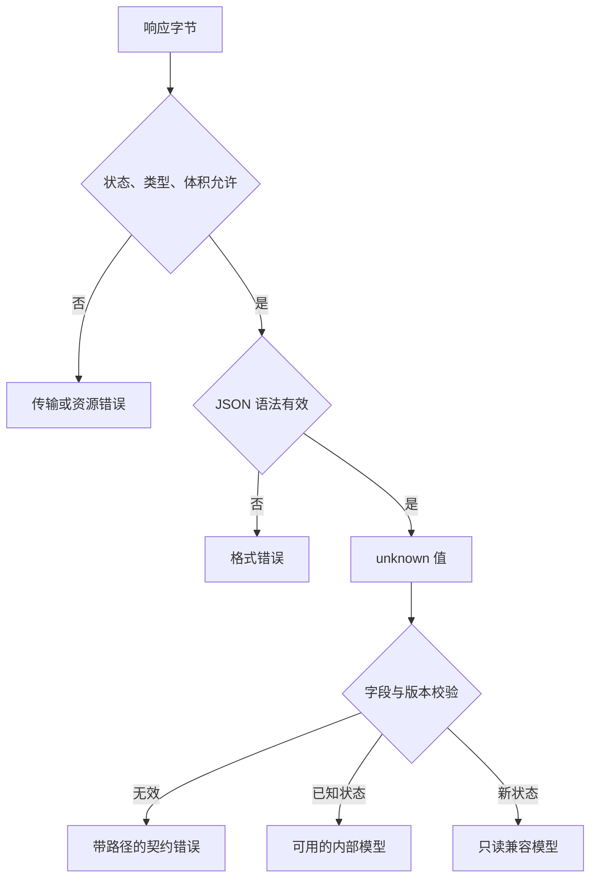

# TypeScript 知识点讲义

## TS-07 接口契约、运行时校验与错误模型

页面声明了一种订单类型，上游却返回 `amount: '9'`。编辑器没有红线，页面计算金额时才出错。问题不在于 TypeScript 不够严格，而在于真实数据没有经过检查，程序就把它当成了已经可信的订单。

本讲沿着“收到字节 → 解析 JSON → 校验字段 → 形成内部模型 → 显示结果”逐层建立约定。主例子使用订单读取接口，金额暂按演示协议使用非负有限数字；它不是生产计费模型。代码块可分别运行，类型检查基线为 TypeScript 5.7.2 的严格模式。

### 学习前先确认

- 直接前置：[TS-02 联合类型、收窄、never 与穷尽检查](../chinese-guides/ts-02-unions-narrowing-never-exhaustiveness.md#ts-02)。需要能通过判别字段区分成功、失败和兼容分支。

读完应能说明每一步究竟证明了什么，写出带稳定错误码的解析器，并让未知状态得到可理解的只读展示。

### 一、类型描述预期，解析器检查实际输入

**接口契约（Contract）**不止是一份字段表。它还约定状态码、数据含义、版本、失败形式、可选字段、未知值的处理与资源限制。

`response.json()` 完成 JSON 语法解析，不检查业务字段。把返回值断言为 Order，只会改变编译器的看法。把入口保存为 unknown，才能要求后续代码先提供证据。

```ts example=ts07-unknown-boundary
const raw: unknown = JSON.parse('{"amount":"9"}');
function rejected() {
  // @ts-expect-error 还不知道 raw 是什么，更没有证明 amount 是数字
  raw.amount.toFixed(2);
}
if (typeof raw === 'object' && raw !== null && 'amount' in raw) {
  console.log(typeof raw.amount); // => string
}
```

object 检查还要排除 null；数组虽然也是 object，但未必是协议要求的记录。来自 JSON 的普通数据和任意 JavaScript 对象也有区别：后者可能带 getter、Proxy 或原型行为。下文解析器面向 JSON 数据，不把“接受任意对象而绝不触发用户代码”作为承诺。

### 二、先画出每层失败应该去哪里



请求失败不等于字段错误；语法正确也不等于订单有效。比如 HTML 登录页可能以 200 返回，但不是约定的 JSON；`{"id":1}` 是合法 JSON，却缺少业务字段。

把错误分层，用户才有合适的下一步。网络暂时失败可以重试；字段格式不兼容应保留页面并提示刷新或联系支持；权限拒绝不能靠无限重试解决。请求时序与取消可回看[NET-01](../chinese-guides/net-01-browser-network-fetch-reliability.md#net-01)。

### 三、用完整解析器把 unknown 变成可用结果

下面只接受 id、amount、status 三个字段；发现额外字段直接拒绝。id 必须是正安全整数，amount 必须是非负有限数字，status 必须是长度合理的字符串。已知状态是 paid 和 unpaid；其他非空状态作为只读兼容结果保留，不能当成已付款。

**Result** 把成功与失败写成判别联合。未知状态是可展示的成功解析结果，但不具备已知业务状态的操作能力。

```ts example=ts07-order-parser
type Issue = {
  code: 'OBJECT' | 'UNKNOWN_FIELD' | 'ID' | 'AMOUNT' | 'STATUS';
  path: string;
};
type OrderView =
  | { kind: 'known'; id: number; amount: number; status: 'paid' | 'unpaid' }
  | { kind: 'unsupported'; id: number; amount: number; rawStatus: string };
type ParseResult =
  | { ok: true; value: OrderView }
  | { ok: false; issues: readonly Issue[] };

function parseOrder(raw: unknown): ParseResult {
  const fail = (code: Issue['code'], path: string): ParseResult =>
    ({ ok: false, issues: [{ code, path }] });
  if (typeof raw !== 'object' || raw === null || Array.isArray(raw)) {
    return fail('OBJECT', '$');
  }
  if (Object.keys(raw).some(key => !['id', 'amount', 'status'].includes(key))) {
    return fail('UNKNOWN_FIELD', '$');
  }
  if (!('id' in raw) || typeof raw.id !== 'number'
      || !Number.isSafeInteger(raw.id) || raw.id <= 0) {
    return fail('ID', '$.id');
  }
  if (!('amount' in raw) || typeof raw.amount !== 'number'
      || !Number.isFinite(raw.amount) || raw.amount < 0) {
    return fail('AMOUNT', '$.amount');
  }
  if (!('status' in raw) || typeof raw.status !== 'string'
      || !/^[a-z][a-z0-9_-]{0,31}$/.test(raw.status)) {
    return fail('STATUS', '$.status');
  }
  if (raw.status === 'paid' || raw.status === 'unpaid') {
    return { ok: true, value: {
      kind: 'known', id: raw.id, amount: raw.amount, status: raw.status,
    } };
  }
  return { ok: true, value: {
    kind: 'unsupported', id: raw.id, amount: raw.amount, rawStatus: raw.status,
  } };
}
const messages: Record<Issue['code'], string> = {
  OBJECT: '订单格式不正确',
  UNKNOWN_FIELD: '订单字段与当前版本不兼容',
  ID: '订单编号无效',
  AMOUNT: '订单金额无效',
  STATUS: '订单状态格式无效',
};
function describe(result: ParseResult): string {
  if (!result.ok) {
    const first = result.issues[0];
    return first ? first.code + ' ' + first.path + '：' + messages[first.code] : '订单校验失败';
  }
  const order = result.value;
  if (order.kind === 'unsupported') return '暂不支持此订单状态，仅供查看';
  return order.id + '：' + (order.status === 'paid' ? '已付款' : '未付款');
}
const samples: unknown[] = [
  { id: 1, amount: 9, status: 'paid' },
  { amount: 9, status: 'paid' },
  { id: 1, amount: '9', status: 'paid' },
  { id: 1, amount: 9, status: 'refunded' },
  { id: 1, amount: 9, status: 'pending' },
  { id: 1, amount: 9, status: 'paid', role: 'admin' },
];
for (const sample of samples) console.log(describe(parseOrder(sample)));
// => 1：已付款
// => ID $.id：订单编号无效
// => AMOUNT $.amount：订单金额无效
// => 暂不支持此订单状态，仅供查看
// => 暂不支持此订单状态，仅供查看
// => UNKNOWN_FIELD $：订单字段与当前版本不兼容
```

注意成功分支重新构造对象，没有把 raw 展开进去。这让内部模型只含明确选取的字段。解析器采用“遇到第一个错误即返回”，所以错误数量天然有上限；表单希望一次展示多个问题时，可以收集有限数量的 issues，但要同时限制输入规模。

### 四、解析、归一化与业务校验分开决定

**归一化（Normalization）**是主动改变表示，例如去掉标题首尾空格；它应该是明确的产品规则，不是“想办法让任何输入通过”。

把字符串 '9' 自动变成 9，看起来友好，却可能顺手把空字符串变成 0，掩盖上游类型错误。订单读取接口与用户表单应有各自的入口规则。

```ts example=ts07-normalization
type TitleResult = { ok: true; title: string } | { ok: false; code: 'TITLE' };
function parseTitle(raw: unknown): TitleResult {
  if (typeof raw !== 'string') return { ok: false, code: 'TITLE' };
  const title = raw.trim();
  if (title.length === 0 || title.length > 80) return { ok: false, code: 'TITLE' };
  return { ok: true, title };
}
console.log(JSON.stringify(parseTitle('  条件类型  '))); // => {"ok":true,"title":"条件类型"}
console.log(JSON.stringify(parseTitle(9))); // => {"ok":false,"code":"TITLE"}
console.log(Number('')); // => 0
```

这里的 80 按 JavaScript 字符串长度计数，即 UTF-16 code unit，不等同于 80 个用户感知字符。若产品按字数或字素限制，应明确另一套计数规则。

“标题非空”属于输入规则；“此用户能修改这份资料”属于授权；“资料是否已经发布”属于业务状态。不要把它们都藏在一个名为 validate 的巨大函数里，否则错误来源和测试边界都会变得模糊。

### 五、数字、日期和数组不能只检查 typeof

`typeof NaN` 和 `typeof Infinity` 都是 number。JSON 本身不能直接写这两个名字，但其他入口或极大指数值仍可能带来非有限数字。ID 需要安全整数，金额还要明确币种与精度，不能只看数字类型。

```ts example=ts07-number-boundaries
function parseMinorUnits(raw: unknown): number | null {
  return typeof raw === 'number' && Number.isSafeInteger(raw) && raw >= 0
    ? raw : null;
}
console.log(parseMinorUnits(900), parseMinorUnits(9.5)); // => 900 null
console.log(parseMinorUnits(Infinity), parseMinorUnits(Number.MAX_SAFE_INTEGER + 1)); // => null null
```

这个工具接受按最小货币单位计数的整数，只展示精度边界；真正订单还要带币种，不同币种的单位规则不能写死成“都乘 100”。

日期字符串要约定时区、精度和格式。Date.parse 能解析不代表它符合协议，自动日期纠正也可能把不存在的日期变成另一天。需要时先校验协议格式，再验证各日期分量能往返一致。时间区间还要检查开始不晚于结束。

数组先限制长度，再检查每项；需要唯一 ID 时还要检查重复。嵌套数据应限制深度与总节点数。类型上的 readonly 也不冻结数组，接收后是否复制或冻结，是单独的运行时决策。

### 六、未知字段和未知枚举需要各自的策略

对未知字段通常有三种选择：拒绝、删除后接受、原样保留。它们不是同一程度的“宽松”。

| 场景 | 一种可解释的选择 | 原因 |
| --- | --- | --- |
| 修改账号权限的请求 | 拒绝未声明字段 | 及时暴露错误或越权参数 |
| 允许上游加字段的只读响应 | 校验已知字段，再投影新对象 | 保持兼容，同时不让额外字段流入内部 |
| 代理透传协议 | 在明确隔离的原始载荷里保留 | 必须有独立用途、体积限制和下游边界 |

本讲主例子选择拒绝额外字段，是为了让契约偏差立即可见。实际读取接口若允许增量字段，可以改为投影策略，但应把这项改变写进契约，不能只去掉一个报错就称作兼容。

未知枚举则涉及业务含义。refunded 不应被猜成 paid，也不应被默认赋予退款操作。解析器保留 rawStatus 供内部定位，UI 使用固定兼容文案，后续动作必须确认是已知状态。若未知值影响写操作、金额计算或权限，通常应拒绝继续处理。类型过滤不会替你做这些决定，见[TS-05 的联合过滤](../chinese-guides/ts-05-conditional-infer-distribution.md#七过滤联合靠的是失败分支返回-never)。

### 七、稳定错误码连接日志与用户的下一步

**错误模型（Error Model）**至少分开面向程序的 code、定位用的路径，以及面向用户的文案。错误 message 可能被翻译或修改，不适合拿来做分支判断。

例如订单金额错误保留 `AMOUNT` 与 `$.amount`，页面显示“订单金额无效”，日志用请求追踪编号定位原始处理过程。内部 cause 可以包含异常链，但不应直接显示响应全文、访问令牌、数据库信息或用户输入。

```ts example=ts07-error-mapping
type Failure =
  | { code: 'OFFLINE' }
  | { code: 'FORBIDDEN' }
  | { code: 'CONFLICT'; currentVersion: number };
function recovery(error: Failure): string {
  switch (error.code) {
    case 'OFFLINE': return '连接恢复后重试';
    case 'FORBIDDEN': return '当前账号无法执行此操作';
    case 'CONFLICT': return '资料已更新，请重新查看第 ' + error.currentVersion + ' 版';
  }
}
console.log(recovery({ code: 'CONFLICT', currentVersion: 4 })); // => 资料已更新，请重新查看第 4 版
```

意外异常从 unknown 开始收窄；不要假定任何 throw 都是 Error。日志可以记录经过筛选的分类和堆栈，页面使用兜底文案。校验失败、业务拒绝与程序缺陷最好能区分，否则一个“请求失败”会让排查失去方向。

### 八、资源限制必须发生在昂贵操作之前

先调用 response.json，再检查数组长度，无法阻止超大响应占用内存。Content-Length 只能作为提示，可能缺失或不能代表解码后读到的字节。下面直接累计响应流的字节，并在达到上限后取消读取。

这是独立的 JSON 读取器，返回值仍是 unknown，之后必须交给业务解析器。示例在支持 Fetch API 的 Node 22 或浏览器中运行，不发真实网络请求。

```ts example=ts07-bounded-json
type ReadResult =
  | { ok: true; value: unknown }
  | { ok: false; code: 'HTTP' | 'CONTENT_TYPE' | 'TOO_LARGE' | 'BODY' | 'JSON' };
async function readJson(response: Response, maxBytes: number): Promise<ReadResult> {
  if (!Number.isSafeInteger(maxBytes) || maxBytes <= 0) throw new Error('无效字节上限');
  const stop = async () => { await response.body?.cancel().catch(() => {}); };
  if (!response.ok) { await stop(); return { ok: false, code: 'HTTP' }; }
  const media = response.headers.get('content-type')?.split(';')[0]?.trim().toLowerCase() ?? '';
  if (media !== 'application/json' && !/^application\/[a-z0-9.+-]+\+json$/.test(media)) {
    await stop(); return { ok: false, code: 'CONTENT_TYPE' };
  }
  if (!response.body) return { ok: false, code: 'BODY' };
  const reader = response.body.getReader();
  const chunks: Uint8Array[] = [];
  let total = 0;
  try {
    while (true) {
      const { done, value } = await reader.read();
      if (done) break;
      total += value.byteLength;
      if (total > maxBytes) {
        await reader.cancel().catch(() => {});
        return { ok: false, code: 'TOO_LARGE' };
      }
      chunks.push(value);
    }
  } catch {
    return { ok: false, code: 'BODY' };
  } finally {
    reader.releaseLock();
  }
  const bytes = new Uint8Array(total);
  let offset = 0;
  for (const chunk of chunks) { bytes.set(chunk, offset); offset += chunk.byteLength; }
  try {
    const text = new TextDecoder('utf-8', { fatal: true }).decode(bytes);
    const value: unknown = JSON.parse(text);
    return { ok: true, value };
  } catch {
    return { ok: false, code: 'JSON' };
  }
}
const make = (body: string) => new Response(body, { headers: { 'Content-Type': 'application/json' } });
console.log(JSON.stringify(await readJson(make('{"id":1}'), 32))); // => {"ok":true,"value":{"id":1}}
console.log(JSON.stringify(await readJson(make('{"id":1}'), 4))); // => {"ok":false,"code":"TOO_LARGE"}
console.log(JSON.stringify(await readJson(make('{'), 32))); // => {"ok":false,"code":"JSON"}
```

这里把 UTF-8 解码失败与 JSON 语法失败统一归入 JSON 类别，业务需要时可以细分。示例限制了保留的数据量，但分配合并缓冲区仍会增加一份内存；流到达前的网络缓冲也由运行环境管理。它不是任意大文件的流式 JSON 解析方案。

实际 fetch 还应传入超时或取消信号，避免小而永不结束的响应一直等待。请求端也要在服务端限制字节和解析深度；浏览器限制不能替服务器兜底。

### 九、版本字段让变化有明确入口

**Schema** 是数据形状和校验规则的说明，可以手写，也可以由库执行。协议变化时，版本字段使解析器知道该按哪套规则解释，而不是猜测某个字段缺失意味着什么。

一个消息信封可以规定 `{ version: 1, kind: 'order.updated', payload: ... }`。先检查 version 与 kind，再调用对应 payload 解析器。未知版本进入“不支持的协议版本”分支，不应直接断言成当前结构。

旧版本若仍受支持，流程应是“按旧规则解析 → 显式迁移 → 当前内部模型”。迁移不能仅给旧对象加一个新版本号；金额单位改变、字段改名和状态拆分，都需要真实转换与边界样本。

浏览器存储、URL、postMessage、插件消息和 AI 输出也是外部入口。尤其不要把 AI 输出声称符合某个 JSON Schema，等同于已经通过本地校验。跨窗口消息还需要核对发送来源与窗口，见[SEC-04 的消息检查](../chinese-guides/sec-04-cross-origin-isolation-embedding-permissions.md#八postmessage-同时核对三件事)。

### 十、输入、记录、响应与页面模型不必长得一样

| 模型 | 例子 | 不应顺手混入 |
| --- | --- | --- |
| 输入命令 | 修改标题、期望版本 | 客户端自报的管理员身份 |
| 数据库记录 | 存储 ID、审计字段、内部状态 | 直接整体返回页面 |
| API 响应 | 对调用者公开的订单字段 | 密钥、内部排错细节 |
| 页面模型 | 显示文案、只读兼容状态 | 被当成服务端权威结果 |

从一份类型反复使用 Partial、Omit 派生所有模型，容易让某个新内部字段意外进入公开接口。类型工具有用，但公开边界最好能够逐字段审阅。可对照[TS-04 的运行时投影](../chinese-guides/ts-04-mapped-utility-template-literal-types.md#三pick-与-omit-不会从对象里删除字段)。

品牌类型可以标记“已通过某项解析”的 ID，减少误传，但品牌并不随 JSON 自动保存，也不能证明授权。品牌构造应集中在校验入口，网络往返后重新解析。状态与权限的关系见[TS-08](../chinese-guides/ts-08-domain-state-permission-modeling.md#ts-08)。

### 十一、生成代码能减少重复，不能代替执行校验

OpenAPI 或其他契约文件可以生成类型、客户端、校验器；具体工具生成了哪一种，要看产物和运行路径。只有生成 .d.ts 或 interface，运行时就没有多出任何检查。

选择校验库时，先看对象默认是拒绝、删除还是保留未知字段，再看数值转换、异步规则、错误路径和包体积。把推导出的类型与实际解析入口放在一起，可以减少手写两份规则的漂移，但不要把库的默认行为当作业务规则。

提供方应验证实际响应符合发布契约；消费方应保留几个代表样本，覆盖成功、缺失、错误类型、新枚举和版本变化。两边测试关注的是边界承诺，不是重复检查所有字段赋值语句。

### 十二、把失败做成用户能继续的状态

重读主例子的六条输出：有效数据进入已知模型；缺 ID 和金额类型错误给出明确 code 与路径；新增状态只读展示；额外权限字段被拒绝。每个结果都能说明原因，不依赖渲染器在访问字段时碰巧抛异常。

页面遇到兼容问题时，应尽量保留用户已经输入的内容，给出刷新、重新登录、查看新版本或联系支持的合适入口。不要自动把失败解析成空列表，否则用户可能误以为数据被删除。

日志同样需要边界：记录错误分类、有限数量的路径和追踪编号，避免完整载荷、令牌及高基数原始状态值大量进入指标标签。读者最终应能从一条错误沿原路径找到是哪层约定被破坏，而不是在整个应用里搜索“请求失败”。

### 参考与延伸阅读

- [TypeScript：收窄](https://www.typescriptlang.org/docs/handbook/2/narrowing.html)：unknown 入口与判别联合。
- [MDN：Response.json](https://developer.mozilla.org/en-US/docs/Web/API/Response/json)：JSON 读取与失败。
- [MDN：读取响应流](https://developer.mozilla.org/en-US/docs/Web/API/ReadableStreamDefaultReader/read)：逐块读取的结果。
- [继续阅读 TS-08](../chinese-guides/ts-08-domain-state-permission-modeling.md#ts-08)：从已经解析的数据出发判断业务动作。
