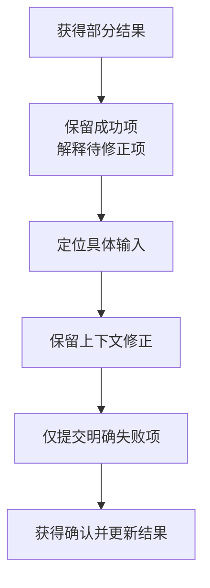

# 看见失败之后，用户能顺利继续吗

## UX-01 交互状态、信息架构与可用性验证

一次资料导入共处理 12 条，其中 10 条成功，2 条标题缺失。界面只弹出“操作失败”，旁边有一个“重新导入”按钮。用户不知道成功的内容是否还在，也不知道再导入会不会重复，于是重新选择文件、再等一遍。

把提示改成红色、把按钮做大，都没有回答真正的问题：现在完成到哪里，哪些内容需要修正，下一步会处理哪一部分。本讲从这种具体困惑出发，把任务、信息组织、状态、反馈、恢复和研究证据连接起来。视觉层次服务于这些决定，不能代替它们。

### 学习前先确认

- 直接前置：[A11Y-01 可访问性与验证](../chinese-guides/a11y-01-wcag-testing-governance.md#a11y-01)。本讲直接使用标签、键盘顺序、焦点、动态反馈和辅助技术的概念。
- 直接前置：[BIZ-02 状态机与业务不变量](../chinese-guides/biz-02-state-machines-business-invariants.md#biz-02)。先区分业务事实与允许的状态变化，再讨论如何让用户理解。

### 一、先说明谁要完成什么事

**交互设计（Interaction Design）**安排用户动作、系统反馈和下一步选择。一个有用的起点是“资料维护者需要修正本次导入的两条标题，并保留已经成功的十条”，而不是“做一个高级导入面板”。

前一句可以继续拆出开始条件、成功标准和代价：用户已经有一份导入结果；成功是修正项得到明确确认；重复创建和丢失修正文字属于错误。情境还包括使用频率、资料量、权限、网络状态和时间压力。本系统以桌面为主，应优先考虑键盘、高信息密度、长文本与连续编辑。

访谈里的“给我加个全部重试”是一个方案请求，不等于完整需求。可以追问发生了什么、现在怎样处理、哪一步让人不确定，再结合任务观察和支持记录判断。频繁使用的人可能熟悉内部术语，新用户却不知道“重新校验”和“重新提交”的区别。

任务陈述也要避免把站内练习当产品需求。下面的例子只用于解释机制；真实项目应从实际用户和业务约束重新建立成功条件。

### 二、信息架构让对象和路径找得到

**信息架构（Information Architecture）**组织对象、名称、层级、导航和搜索。导入页可以按“本次结果 → 待修正资料 → 修正内容”组织，而不是按后台的 job、row、payload 三张表直接命名菜单。

先列出内容对象，再看用户用哪些词。目录名称应让人能够预期点进去会看到什么；“异常资料”与“未完成资料”可能对应不同事实，不宜为了统一文风混成“待处理”。按钮也要说出动作对象，例如“提交这 2 条修正”。

卡片分类有助于探索人们如何归组，树测试可以在没有视觉提示的情况下观察是否找得到位置，搜索词和无结果记录则提供日常线索。它们回答的问题不同，不是随便做一种就证明导航合理。

层级不必一律压平。把所有功能挤到首页会增加选择负担；合理分组、当前位置、保留筛选的返回路径、可用的搜索和相关入口共同支持定位。学习资料中的概念交叉引用也属于这一责任：链接应说明为什么值得去，回来后还能继续原来的阅读。

### 三、先区分事实，再决定显示哪些状态

“加载中”是请求过程，“部分成功”是业务结果，“按钮禁用”是控件表现。把它们塞进同一个 status 字符串，会很难表达“已有结果，但正在重取”。

| 事实 | 合适的说明与动作 | 容易误导的表达 |
| --- | --- | --- |
| 尚未开始 | 说明输入和预期结果 | 显示“没有任何资料” |
| 首次读取中 | 有界等待、取消或离开方式 | 无限转圈且没有解释 |
| 查询成功但为空 | 解释本次条件没有匹配 | 当成连接失败 |
| 有旧数据，刷新失败 | 保留可用内容并标明未更新 | 清空整个页面 |
| 部分确认成功 | 分别说明成功与待修正部分 | 只显示整体失败 |
| 结果未知 | 查询原操作，保留上下文 | 鼓励新建同一操作 |
| 离线或权限变化 | 说明当前仍可做什么 | 统一显示“请刷新” |

具体状态由任务决定，不要求每个小组件都拥有这张表的全部项。先确认接口能区分什么，再决定文案；没有已确认结果，界面不应自行创造“完成”。查询状态与旧数据关系见 [DATA-01](../chinese-guides/data-01-server-state-cache-keys-invalidation-deduplication.md#二有旧数据和正在请求可以同时成立)。

```ts example=ux01-recovery-action
type Outcome =
  | { kind: 'partial'; confirmed: number; rejected: number }
  | { kind: 'unknown'; operationId: string }
  | { kind: 'empty' };
function action(outcome: Outcome): string {
  switch (outcome.kind) {
    case 'partial': return `已确认 ${outcome.confirmed} 条，修正 ${outcome.rejected} 条后再提交`;
    case 'unknown': return `查询原操作 ${outcome.operationId} 的结果`;
    case 'empty': return '调整筛选条件';
  }
}
console.log(action({ kind: 'partial', confirmed: 10, rejected: 2 }));
console.log(action({ kind: 'unknown', operationId: 'import-7' }));
console.log(action({ kind: 'empty' }));
// => 已确认 10 条，修正 2 条后再提交
// => 查询原操作 import-7 的结果
// => 调整筛选条件
```

本例假定输入已经由可信合同解析；它只证明不同事实需要不同动作，不提供业务幂等或真实数量计算。

### 四、反馈要对应用户刚做的事

点击后的按下反馈、请求已送出、服务端已确认和后台任务完成，是不同阶段。一个迅速出现的“已提交”只能表达它所对应的事实，不能让用户误以为所有行已经处理。

关键反馈靠近动作和对象，并持续足够长。表单错误不能只放在转瞬即逝的 toast；任务完成可以在结果区留下可回看的记录。加载较长时说明已知阶段，只有可信总量才展示百分比，没有依据时不要捏造 99%。

用户可以继续编辑时，当前输入和上次结果要能区别。晚到结果不能清空新文字；页面跳动也可能让正在点按钮的人误点另一个对象。先保持布局与输入连续性，再考虑装饰动画。已有确认值和新草稿的关系见 [COMP-02](../chinese-guides/comp-02-controlled-uncontrolled-state-imperative.md#七重置和迟到响应都要验证归属)。

### 五、恢复动作说清将处理哪一部分

“重试”至少可能指重新读取、重新查询原操作结果、重新提交失败项、重新导入文件。用具体文字区分，可以避免用户为理解系统而承担额外试错。

```js example=ux01-retry-selection
const rows = [
  { id: 'm1', state: 'confirmed' },
  { id: 'm2', state: 'rejected' },
  { id: 'm3', state: 'unknown' },
];
const submitAgain = rows.filter(row => row.state === 'rejected').map(row => row.id);
const investigate = rows.filter(row => row.state === 'unknown').map(row => row.id);
console.log(submitAgain.join(','));
console.log(investigate.join(','));
console.log(rows.filter(row => row.state === 'confirmed').length);
// => m2
// => m3
// => 1
```

只有业务合同明确拒绝、并允许修正后重新提交的项，才进入第一组；未知结果先确认。示例没有把所有非成功项混在一起。部分成功如何成为业务结果，可接 [BIZ-06 异步任务](../chinese-guides/biz-06-async-jobs-import-export-progress.md#biz-06)。

错误预防也要看代价。合理默认、单位、示例、预览和输入约束可以提前避免误操作。可可靠撤销的低风险动作未必需要层层确认；高损且难恢复的动作则应说明对象和后果。前端所谓“撤销”必须有实际恢复合同，不能只把提示藏掉。

字段尚未输入完整时不宜不断报错，尤其在中文输入法组合期间。提交后再展示明确错误时，保留原输入、指出问题并提供可定位入口；服务端仍负责最终业务验证。

### 六、焦点和状态文字一起设计

错误摘要说明哪几项需要修正，摘要中的入口带用户到对应字段。字段保留真实 label，用 `aria-describedby` 关联提示，有错误时再设置 `aria-invalid`。完成修正后，不应仍把旧错误挂在输入上。

普通后台刷新不必强行抢焦点；用户提交后出现阻断错误，可以把焦点移到可聚焦的错误摘要。若关闭一个弹层，应决定焦点回到哪里；如果原按钮已经消失，则选择任务上合理、仍存在的目标。

`role="status"` 可以提供温和动态反馈，但声明存在不等于已验证所有读屏行为。错误、数量和按钮名称应共同传达含义，颜色是辅助。原生键盘行为、顺序与可见焦点是基础；拖动和 hover 也需要适当替代入口。[WAI 表单通知](https://www.w3.org/WAI/tutorials/forms/notifications/)



### 七、用完整页面观察修正与键盘路径

保存为 `recovery-lab.html`，用桌面浏览器打开。示例是固定内存原型：两条资料分别已确认和待修正。提交结果由同步函数模拟，不读取文件、不请求服务器、不构成用户研究。

```html example=ux01-recovery-lab runtime=project file=recovery-lab.html
<!doctype html><html lang="zh-CN"><meta charset="utf-8"><title>资料修正观察页</title>
<style>
:root{font:16px/1.7 system-ui,sans-serif;color:#253d39;background:#f1f4ef}*{box-sizing:border-box}main{max-width:1060px;margin:40px auto;padding:0 24px}h1{font-size:32px}section,article{border:1px solid #d2ddd5;background:white;border-radius:15px;padding:22px;margin:18px 0}.grid{display:grid;grid-template-columns:1fr 1fr;gap:20px}h2{font-size:20px;margin:0 0 12px}.muted{color:#607069}input,button{font:inherit;border:1px solid #91aa9b;border-radius:8px;padding:9px 13px}input{width:100%;margin-top:8px}button{background:#f4f9f4;color:#275c44;cursor:pointer;margin:8px 8px 0 0}:focus-visible{outline:3px solid #b46c18;outline-offset:4px}.error{color:#8b352b}.badge{font-weight:650}#summary{background:#fff8e9;border-color:#cbb68a}pre{white-space:pre-wrap;overflow-wrap:anywhere}[hidden]{display:none!important}
</style><main><p class="muted">B23 / 明确结果 · 定位问题 · 保留上下文</p><h1>只修正尚未完成的资料</h1><p>已有一条资料完成，另一条需要补充标题。成功项会保留。</p>
<section id="summary" tabindex="-1" aria-labelledby="summary-title"><h2 id="summary-title">1 条已确认，1 条待修正</h2><p id="summary-text">第二条缺少标题，请补充后提交这一条。</p><button id="locate" type="button">定位待修正标题</button></section>
<form id="form" novalidate><div class="grid"><article><h2>资料一</h2><p>闭包与作用域</p><p class="badge">已确认 · 不会重复提交</p></article><article><h2>资料二</h2><label for="title">资料标题</label><input id="title" aria-describedby="title-help title-error" aria-invalid="true"><p id="title-help" class="muted">使用能描述内容的标题。</p><p id="title-error" class="error">请输入标题。</p><p id="row-state" class="badge">待修正</p></article></div><button id="submit" type="submit">提交这 1 条修正</button></form>
<p id="feedback" role="status"></p><section><h2>原型观察记录</h2><label><input id="offline" type="checkbox" style="width:auto"> 模拟提交前发现离线</label><p class="muted">该开关仅模拟尚未发送的本地阻断。已经发出后断网，应另建“结果未知”路径。</p><pre id="payload">尚未提交修正。</pre></section></main>
<script>
const el=id=>document.getElementById(id);let phase='rejected';
el('locate').onclick=()=>el('title').focus();
function problem(message){el('title-error').textContent=message;el('title').setAttribute('aria-invalid','true');el('summary-text').textContent='第二条仍需修正：'+message;el('summary').focus();}
el('form').addEventListener('submit',event=>{event.preventDefault();if(phase==='confirmed')return;const title=el('title').value.trim();if(!title){problem('请输入标题。');return;}
 el('title-error').textContent='';el('title').removeAttribute('aria-invalid');
 if(el('offline').checked){el('summary-text').textContent='尚未发送，标题已保留。恢复连接后可提交这条修正。';el('feedback').textContent='本次没有发出请求。';el('summary').focus();return;}
 const request={items:[{id:'m2',title}]};el('payload').textContent=JSON.stringify(request,null,2);phase='confirmed';el('row-state').textContent='已确认';el('title').readOnly=true;el('summary-title').textContent='2 条资料均已确认';el('summary-text').textContent='刚才只提交了资料二，资料一保持原结果。';el('feedback').textContent='这 1 条修正已确认。';el('summary').focus();el('locate').hidden=true;el('submit').hidden=true;
});
</script></html>
```

不输入标题就提交，焦点应到摘要；通过“定位待修正标题”回到输入。填入标题后勾选离线，提交不会生成载荷，文字保持。取消离线再提交，记录只含 `m2`，成功项不会被重新发送；页面明确展示两条均确认。

这里的离线是发送前检查的教学开关，不能推广成“浏览器提示在线就一定可达”。真实提交中的超时需要区分已拒绝与结果未知；后者通常查询原操作，不能使用本例的本地阻断文案。权限与幂等仍由实际接口完成。

### 八、信息多少取决于当前决定

**渐进披露（Progressive Disclosure）**把低频细节放在可发现的后续位置，让当前任务需要的信息先出现。导入结果先说明完成数量、失败原因和修正入口，原始请求 ID 与诊断日志可以展开查看。

但价格、权限、不可逆后果和数据是否已保存，是当前决定的必要条件，不能为了“简洁”藏起来。高级操作入口要可被键盘发现，并让用户知道它会展开什么。

新手需要解释和明确动作，熟练用户需要快捷键、批量和保留视图。快捷方式应有可见替代，不能成为唯一入口。平台习惯也应保持：链接可以按浏览器惯例打开，返回能恢复合理上下文，表单 Enter 有可预期行为。

桌面优先不等于固定像素截图。应检查窗口变化、页面放大、长中文标题与操作密度；内容缩窄时按任务优先级重排或滚动，不能隐藏关键状态。本系统不对移动端开放，这一批不扩展触摸、横竖屏或移动端专用布局。

### 九、原型先验证最不确定的部分

如果不确定的是栏目名称，用低保真结构就能开始；如果不确定的是键盘焦点和异步恢复，需要可操作原型；如果是性能或接口返回语义，则需要接近实际运行边界的观察。保真度跟着问题走。

原型要明示哪些是假数据、哪些动作有效。参与者点不到一个设计上尚未实现的按钮，不应被算成他不会使用。为关键失败路径提供可触发方式，比如上面的离线开关，但正式任务描述不要提示该点哪里。

保留每轮假设、改动和结果。观察“大家犹豫很久”以后，可以提出按钮含义不清的假设，再改变文案并用同类任务复查；不能同时改五处，最后笼统宣布整个新版更好。

### 十、让真实参与者完成任务，而不是评价截图

**可用性测试（Usability Testing）**观察代表性参与者在具体情境下是否能完成任务。可以说：“这些资料尚未全部完成，请让它们达到可使用状态，同时保留已经完成的内容。”不要说：“点击定位按钮，修改标题，再点提交。”后者已经把答案告诉了参与者。

开始前写好目标人群、成功条件、可提供的帮助和停止条件。主持人保持中立，必要时询问他正尝试什么；一旦教学式提示了下一步，就应将完成记为“有帮助”，不要继续算独立完成。[GOV.UK 可用性测试指南](https://www.gov.uk/service-manual/user-research/using-moderated-usability-testing)

| 观察记录 | 如何保存 | 能支持的判断 |
| --- | --- | --- |
| 先点了哪里、说了什么 | 时间点与经允许的录制或笔记 | 推测标签和预期是否匹配 |
| 是否完成预定结果 | 独立、有帮助、未完成分别记 | 任务能否继续、阻断在哪 |
| 重复提交、丢输入、走错对象 | 具体动作与结果 | 风险及恢复代价 |
| 所需时间和主观信心 | 同一口径分别记录 | 效率与理解，不等同正确性 |

招募应覆盖关键经验与限制，内部员工不能自动代表新用户。说明研究用途、记录方式、保留期限和退出方式，使用合成资料并减少个人信息。辅助技术体验需要相应参与者与真实环境；自动化脚本和 AI 的自我评价不能替代这一层证据。

### 十一、指标有分母，结论有适用范围

下面是完全合成的观察记录，只演示统计口径，不代表已经邀请任何参与者：

```js example=ux01-study-denominator
const observations = [
  { result: 'independent', errors: 0 },
  { result: 'assisted', errors: 1 },
  { result: 'incomplete', errors: 2 },
];
const independent = observations.filter(x => x.result === 'independent').length;
const assisted = observations.filter(x => x.result === 'assisted').length;
console.log(`独立完成 ${independent}/${observations.length}，帮助后完成 ${assisted}/${observations.length}`);
console.log(`已观察错误 ${observations.reduce((sum,x)=>sum+x.errors,0)} 次`);
// => 独立完成 1/3，帮助后完成 1/3
// => 已观察错误 3 次
```

把前两人合成“成功率 67%”会隐藏帮助成本；把三人的结果外推为所有用户的稳定概率，也超出了证据。少量形成性研究可以发现具体问题，不能据此保证问题穷尽或统计显著。

改版前后比较尽量保持任务、成功口径与参与者条件一致，同时说明样本差异和重复任务的学习效应。严重阻断即使只观察到一次，也可能值得优先处理；出现频率不应替代后果判断。

停留时间长可能是认真阅读，也可能是找不到答案；点击更多可能是任务复杂，也可能是反复尝试。把任务完成、错误、返工、取消和支持求助一起看。A/B 或漏斗帮助比较数量，不自动解释机制；不应为了短期指标隐藏退出入口、制造假紧迫感或诱导未经理解的同意。

### 十二、把发现交付成可实现的状态合同

交付不只是一张成功截图。至少说明对象名称、任务路径、状态与迁移、恢复文案、焦点、键盘、API 返回边界和统计事件含义。让设计、工程和测试对“确认成功”“部分成功”“未知结果”使用同一词汇。

问题记录可以写成：“在结果未知时，按钮仍叫重新导入，参与者据此新建同一任务；应先提供查询原操作，并保留输入。”这比“体验不顺滑”更容易修改和复查。维护决定的依据、负责人、未选方案与复查条件，后续数据变化时再重新判断。

本地化要校对完整句子、标签和读屏名称，允许文本扩展；时间应有明确时区，数量和单位不能只靠格式猜测。性能也回到任务：先让输入有反馈、主要内容稳定，再优化次要装饰。必要时结合技术指标，但不把跑分当用户已经完成任务的证据。

持续线索来自支持工单、搜索无结果、反复撤销和用户放弃；先还原发生在哪个状态，再决定是否新增功能。与需求证据的衔接可阅读 [BIZ-08](../chinese-guides/biz-08-requirement-acceptance-traceability.md#biz-08)。

### 动手想一想

把“操作失败，重试”分别改写为三种文案：字段明确拒绝、发送前离线、发送后结果未知。每种都写明保留了什么、动作将处理什么。

可用的方向是：“标题缺失，补充后提交这一条”“尚未发送，输入已保留，连接恢复后提交”“尚未确认结果，先查询原操作”。如果不能确定对应事实，就先补接口合同，不要用更自信的语气掩盖未知。

### 参考与延伸阅读

- [GOV.UK：Using moderated usability testing](https://www.gov.uk/service-manual/user-research/using-moderated-usability-testing)：规划任务、主持与观察，区别研究和教学。
- [WAI：User Notifications](https://www.w3.org/WAI/tutorials/forms/notifications/)：表单反馈、错误摘要与定位。
- [A11Y-01](../chinese-guides/a11y-01-wcag-testing-governance.md#a11y-01)：继续核对键盘与辅助技术证据。
- [BIZ-02](../chinese-guides/biz-02-state-machines-business-invariants.md#biz-02)：回到业务状态和允许的变化。
