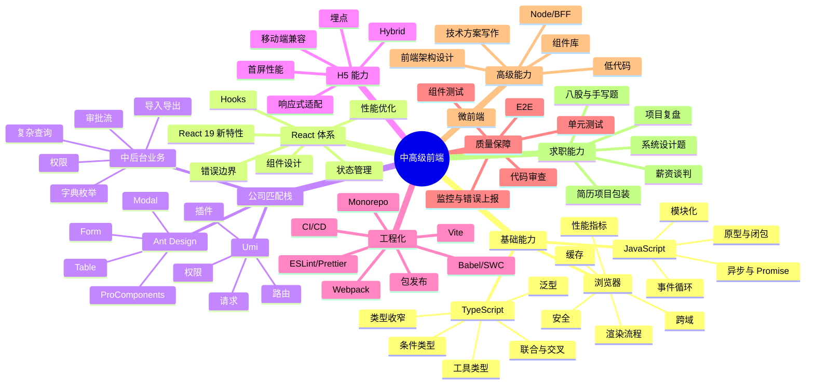

# 5 年前端开发求职执行计划

更新时间：2026-07-13  
当前画像：5 年前端开发，负责 Web 端与 H5 端，公司常用技术栈为 React + UmiJS + Ant Design。  
定位说明：这份文档是求职执行附录，服务于当前找工作阶段。长期成长主线请看[前端长期成长路线图](frontend-growth-roadmap.md)，每日容量上限 390 分钟的定制执行计划请看[个人定制前端成长计划](personalized-frontend-mastery-plan.md)。

## 结论先行

结合你维护过的 `gungnir-web`、`gungnir-h5`、`teaching-web`、`digitalteacher-web`、`digitalteacher-h5`、`teaching-h5`、`aiui`、`get_apidoc`，你现在最适合优先投递的岗位不是“泛前端”，而是：

1. 中高级 React 中后台前端：React、TypeScript、Umi、Ant Design、复杂表单/表格/权限/流程、工程化、性能优化。
2. Web + H5 业务前端：移动端适配、Hybrid/H5、埋点、性能、兼容性、活动页/业务闭环。
3. AI 教学/内容平台前端：AIUI、Markdown/公式/代码渲染、课程问答、资料处理、视频/PDF。
4. 前端工程化/平台型前端：组件库、低代码/配置化、微前端、Monorepo、CI/CD、构建优化。
5. 前端工具化/接口治理方向：Node、MCP、OpenAPI/YAML、代码生成、研发提效工具。

短期求职策略：先用你已有的 React + Umi/Max + AntD + H5 + AIUI + 工具化经验吃到匹配岗位，不要一开始把目标发散到“大前端全栈、纯算法、纯 Node 架构”全部重学。学习顺序应该服务成长主线：项目复盘、TypeScript 深度、React 原理与性能、中后台业务建模、工程化质量、H5 性能、组件库/工具化能力依次补强。

## 杭州前端岗位调研口径

这次尝试访问了以下公开招聘入口：

- BOSS 直聘杭州前端搜索页：`https://www.zhipin.com/web/geek/job?query=前端&city=101210100`
- 前程无忧杭州前端搜索页：`https://we.51job.com/pc/search?jobArea=080200&keyword=前端&searchType=2`
- 拉勾杭州前端搜索页：`https://www.lagou.com/wn/jobs?pn=1&kd=前端&city=杭州`
- 猎聘职位搜索页：`https://www.liepin.com/zhaopin/`

限制说明：这些平台当前大多使用登录、反爬、SPA 动态渲染或访问验证。未经你的账号登录授权，无法可靠抓取“杭州所有在招前端岗位”的全量清单。因此本文不伪造全量岗位列表，而是按公开可访问渠道、常见 JD 结构、你当前技术栈和杭州互联网/企业软件岗位画像，整理可执行的求职技能模型。后续最准确的方式是你登录招聘平台后导出或复制 30-50 个目标岗位 JD，我可以继续帮你做岗位技能频次统计和简历逐条匹配。

## 杭州前端岗位常见技能画像

| 岗位类型 | 常见要求 | 你当前匹配点 | 需要补强 |
| --- | --- | --- | --- |
| React 中后台前端 | React、TypeScript、AntD、Umi/路由/权限、表单表格、接口联调、状态管理 | 高匹配 | TS 深度、复杂组件抽象、性能优化、项目复盘表达 |
| H5/移动端前端 | 移动端适配、Hybrid、微信生态、埋点、首屏性能、兼容性 | 有经验基础 | H5 性能指标、适配方案、调试链路、离线包/JSBridge 理解 |
| 高级前端/技术骨干 | 方案设计、模块拆分、组件库、代码质量、跨团队协作、疑难问题定位 | 部分匹配 | 系统设计表达、工程化体系、质量保障、带人/推动经验 |
| 前端工程化 | Vite/Webpack、CI/CD、Monorepo、构建性能、规范、自动化测试 | 可能薄弱 | 构建原理、插件机制、包管理、发布流程 |
| 微前端/低代码/平台 | qiankun/Module Federation、权限模型、配置化、物料、设计器 | 可作为加分项 | 低代码架构、schema 设计、微前端隔离与通信 |
| 全栈/BFF 前端 | Node.js、Nest/Express、接口聚合、SSR、Next.js | 加分项 | Node 服务端基础、鉴权、缓存、日志、部署 |
| AI 教学/内容平台前端 | AIUI、Markdown、代码高亮、公式、PDF/视频、课程问答、资料管理 | 有真实项目基础 | 组件 API 设计、内容渲染性能、AI 交互体验、可测试性 |
| AI 加持前端 | AI 编码、业务提效、ChatGPT/Codex、前端智能化工具 | 新兴加分 | 用 AI 做需求拆解、代码审查、测试生成、文档生成 |

## 必须掌握的知识图谱



## 8 周求职优先学习计划

节奏原则：长期成长是主线，求职是外部校准。你现在每天有 8 小时，建议每天固定 1 小时做岗位/JD/简历/模拟面试，其余时间按[个人定制前端成长计划](personalized-frontend-mastery-plan.md)做系统学习和项目实战。

### 第 1 周：定位、简历、岗位采样

目标：把“我做过什么”整理成“岗位愿意买单的能力”。

- 产出一版中高级前端简历。
- 从 BOSS、猎聘、拉勾、前程无忧各收集 10 个杭州前端 JD，优先 React/TypeScript/中后台/H5。
- 建立岗位表：公司、岗位、薪资、技术栈、硬性要求、加分项、匹配度、投递状态。
- 复盘 3 个项目：中后台复杂业务、H5 业务、工程化/效率提升。

重点补课：

- TypeScript 常见面试题：泛型、keyof、infer、条件类型、工具类型。
- React Hooks 原理、依赖问题、性能优化。
- Umi + AntD 中后台项目架构表达。

### 第 2 周：React + TypeScript 面试主线

目标：能讲清楚 React 项目为什么这样设计，以及遇到性能/状态/副作用问题怎么处理。

- React：组件渲染、state 更新、Hooks 规则、useMemo/useCallback 使用边界。
- TypeScript：业务接口建模、表单类型、枚举/字典类型、泛型组件。
- 手写题：debounce、throttle、Promise.all、深拷贝、发布订阅、LRU。
- 输出 2 篇项目复盘：复杂表单/表格、权限/流程。

### 第 3 周：中后台深度与 AntD/Umi 项目力

目标：把你最强的工作经验变成最容易通过面试的标签。

- AntD Form/Table：动态表单、联动校验、Editable Table、大数据量表格。
- Umi：路由、权限、请求封装、运行时配置、插件机制。
- 业务抽象：枚举字典、权限按钮、详情页、审核流、导入导出、文件下载。
- 做一个小型 Demo：岗位管理/审批流/表格检索/详情弹窗/导入导出模拟。

### 第 4 周：浏览器、性能、H5

目标：补齐移动端和性能面试高频点。

- 浏览器：事件循环、渲染流水线、缓存、跨域、CSP、XSS/CSRF。
- 性能：LCP、INP、CLS、首屏、分包、懒加载、图片优化、缓存策略。
- H5：rem/vw、safe-area、滚动穿透、键盘遮挡、微信调试、JSBridge 基础。
- 输出一份“某 H5 页面性能优化方案”。

### 第 5 周：工程化

目标：从“业务开发”升级为“能改善团队研发效率的人”。

- Vite/Webpack：入口、loader/plugin、dev server、HMR、代码分割、tree-shaking。
- 包管理：pnpm、workspace、依赖冲突、lockfile。
- 质量：ESLint、Prettier、lint-staged、commitlint、CI。
- 测试：React Testing Library、Playwright 基础。
- 输出一份“前端项目工程化治理方案”。

### 第 6 周：架构题与高级岗位表达

目标：准备中高级面试常见开放题。

- 组件库如何设计：Button/Form/Table/主题/文档/发布。
- 权限系统如何设计：菜单权限、按钮权限、数据权限、路由守卫。
- 微前端如何落地：应用拆分、样式隔离、通信、鉴权、部署。
- 低代码如何设计：schema、物料、属性面板、渲染器、表达式。
- 输出 4 个方案题答案，每个 800-1200 字。

### 第 7 周：集中投递与面试复盘

目标：进入面试节奏。

- 每天投递 10-20 个岗位。
- 每场面试后记录问题、答得不好的点、补课动作。
- 针对 JD 改简历标题和项目排序。
- 做 2 次模拟面试：一次八股 + 手写，一次项目 + 架构。

### 第 8 周：补短板、谈薪、选择

目标：提高 offer 转化率。

- 整理面试问题错题本。
- 对意向岗位做公司/业务/技术栈调查。
- 准备离职原因、职业规划、期望薪资、到岗时间。
- 对 offer 做比较：薪资、业务成长、技术成长、稳定性、通勤、团队。

## 每日学习与求职时间表

8 小时空档推荐：

| 时间 | 内容 | 产出 |
| --- | --- | --- |
| 30 分钟 | 计划与复盘 | 今日主线和任务清单 |
| 1.5 小时 | 系统学习：React/TS/浏览器/工程化/H5 轮换 | 结构化笔记 |
| 1 小时 | 面试基础和手写题 | 1-2 道题解 |
| 2.5 小时 | 项目实战：从真实项目抽场景练习 | 代码、Demo、重构记录 |
| 1 小时 | 项目复盘或技术方案写作 | 可进入简历/面试的表达材料 |
| 1 小时 | JD 分析、投递、简历修改、模拟面试 | 岗位表和错题清单 |
| 30 分钟 | 当日总结 | 明日计划 |

## 每天固定任务清单

- 投递：至少 10 个匹配岗位，优先“React/TypeScript/中后台/H5/杭州”。
- JD 统计：记录出现频率最高的 3 个技能。
- 面试题：JS 2 题、React 2 题、项目题 1 题。
- 项目表达：每天改进 1 段项目经历，让它包含“背景、难点、方案、结果”。
- 代码练习：每天 1 个手写题或 1 个业务组件练习。

## 简历包装方向

你的简历应该突出“5 年业务前端 + React/Umi/AntD 中后台 + H5”的组合优势。

项目描述建议模板：

```text
项目背景：负责某业务 Web/H5 端核心模块，覆盖 xxx 用户/xxx 场景。
技术栈：React、Umi、Ant Design、TypeScript、xxx。
核心工作：
1. 设计并实现 xxx 流程，封装 xxx 组件，支持 xxx 业务规则。
2. 优化 xxx 性能/体验，将 xxx 从 A 降到 B，或减少重复开发成本。
3. 处理 xxx 复杂联动/权限/状态/兼容性问题。
结果：提升交付效率、减少缺陷、支撑业务上线、沉淀通用能力。
```

不要只写“负责页面开发、接口联调、bug 修复”。5 年经验需要体现：

- 复杂业务拆解能力。
- 组件抽象能力。
- 工程质量意识。
- 性能和稳定性意识。
- 跨端/Web/H5 经验。
- 能独立负责模块，而不只是接需求。

## 面试准备重点题库

### JavaScript

- 事件循环、宏任务/微任务。
- 闭包、作用域、原型链、this。
- Promise、async/await、并发控制。
- 深拷贝、防抖节流、发布订阅、虚拟列表。

### TypeScript

- interface 与 type。
- 泛型约束、keyof、typeof、infer。
- 联合类型、交叉类型、类型收窄。
- Partial、Pick、Omit、Record、ReturnType 实现。
- 如何给接口数据、表单、表格列建模。

### React

- setState/useState 更新机制。
- Hooks 规则和依赖数组。
- useEffect 常见坑。
- memo/useMemo/useCallback 使用边界。
- 组件通信与状态管理。
- 列表 key、受控/非受控组件。
- React 性能优化。

### Umi/AntD/中后台

- 路由和权限如何设计。
- 请求封装、错误处理、登录态。
- AntD Form 联动校验。
- Table 查询、分页、排序、筛选、导出。
- 审批流/详情页/字典枚举如何抽象。

### 浏览器与 H5

- 渲染流程与重排重绘。
- 缓存策略。
- 跨域方案。
- XSS/CSRF。
- 移动端适配。
- 首屏性能优化。
- 微信/H5 常见兼容问题。

### 工程化

- Webpack/Vite 构建流程。
- loader/plugin 原理。
- 代码分割和缓存。
- Monorepo。
- CI/CD。
- ESLint/Prettier/测试体系。

## 岗位采集模板

建议保存为表格，后续我可以按表格继续做技能频次统计。

| 日期 | 平台 | 公司 | 岗位 | 薪资 | 年限 | 技术栈 | JD 高频词 | 匹配度 | 投递状态 | 备注 |
| --- | --- | --- | --- | --- | --- | --- | --- | --- | --- | --- |
| 2026-07-13 | BOSS |  |  |  |  | React/TS/AntD |  | 高/中/低 | 未投/已投/沟通/面试 |  |

## 当前最该补的 10 个能力

按求职收益排序：

1. TypeScript 深度：让你从“会写 TS”变成“能设计类型”。
2. React 原理与 Hooks：中高级面试必问。
3. 项目复盘表达：这是 5 年经验最值钱的部分。
4. AntD/Umi 中后台方案：直接匹配你目标岗位。
5. 浏览器与性能：区分普通业务前端和高级前端。
6. H5 兼容与性能：匹配你 Web + H5 背景。
7. 工程化：提升岗位上限。
8. 测试与质量：高级岗位加分。
9. 微前端/低代码：杭州中大型企业和平台岗加分。
10. Node/BFF：不是短期主线，但能提高议价空间。

## 参考资料

- React 官方文档：`https://react.dev/learn`
- TypeScript Handbook：`https://www.typescriptlang.org/docs/handbook/intro.html`
- Umi 官方文档：`https://umijs.org/docs/introduce/introduce`
- Ant Design React 文档：`https://ant.design/docs/react/introduce/`
- Vite 官方指南：`https://vite.dev/guide/`
- Webpack Concepts：`https://webpack.js.org/concepts/`
- React Testing Library：`https://testing-library.com/docs/react-testing-library/intro/`
- Playwright：`https://playwright.dev/docs/intro`

## 我接下来需要你补充的信息

为了把规划从“通用可执行”变成“你的个人求职方案”，建议你补充：

1. 你现在薪资和期望薪资区间。
2. 你更想去的公司类型：大厂、外企、国企/央企、创业公司、传统企业数字化、教育/电商/金融等。
3. 你最拿得出手的 2-3 个项目，最好包含业务背景、技术难点、个人贡献、结果数据。
4. 你是否愿意接受 Vue 技术栈岗位、Node/BFF 岗位、低代码/平台岗。
5. 你每天稳定能投入学习和投递的时间。
