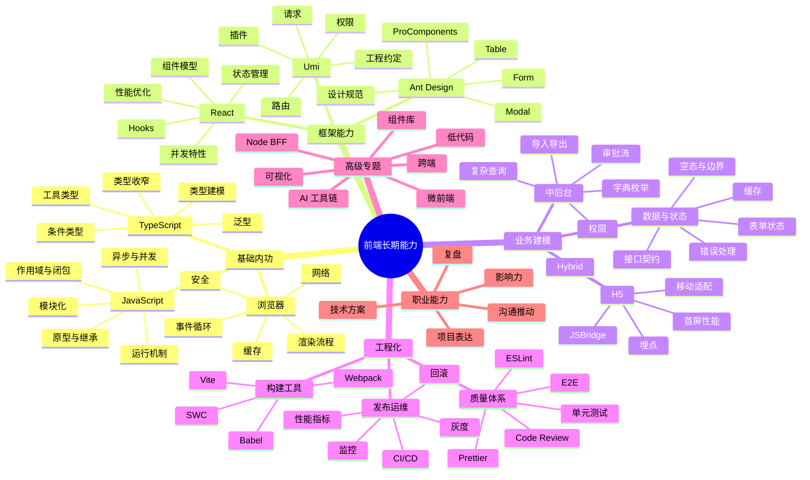

# 前端长期成长路线图：从 5 年业务前端到高级/资深前端

更新时间：2026-07-13

文档关系：这份文件是长期方向图；更细的每日上限 390 分钟执行计划见[个人定制前端成长计划](personalized-frontend-mastery-plan.md)，每日安排见[每日 6 小时 30 分钟安排](../../templates/daily-6h30m-learning-schedule.csv)，项目资产沉淀见[项目经验资产库](../knowledge/project-assets.md)。

## 这份规划的主线

找工作不是终点，它只是一次外部校准：市场会告诉你哪些能力有价值，面试会暴露你哪些知识不成体系，新工作会提供新的业务场景和成长土壤。真正的主线应该是：

```text
明确方向 -> 建立能力地图 -> 设计刻意练习 -> 用项目验证 -> 用求职校准 -> 在新环境继续升级
```

你现在不是零基础转行，也不是刚入门的前端。你已经有 5 年 React + Umi/Max + Ant Design + Ant Design Mobile + Web/H5 经验，并且参与过大型业务系统、AI 教学系统、可复用组件包和接口工具。下一阶段最重要的不是“学更多名词”，而是把已有经验系统化，补齐底层、质量、工程化、性能、组件平台和工具化能力，并逐步从“能完成需求”升级到“能定义方案、稳定交付、推动团队效率”。

## 你的当前阶段判断

按前端成长阶段看，你大概率处在 **L2 到 L3 的过渡期**：

| 阶段 | 典型状态 | 能力关键词 | 你的目标 |
| --- | --- | --- | --- |
| L1 初级前端 | 能按需求完成页面和交互 | API 使用、页面开发、Bug 修复 | 已经越过 |
| L2 中级前端 | 能独立负责模块 | 业务理解、组件复用、联调、交付 | 你已有基础 |
| L3 高级前端 | 能负责复杂业务域 | 架构设计、质量、性能、抽象、稳定性 | 未来 6-12 个月目标 |
| L4 资深/技术骨干 | 能影响团队研发方式 | 工程体系、组件平台、技术规划、跨团队推动 | 未来 1-3 年目标 |
| L5 前端负责人/专家 | 能定义方向和培养团队 | 技术战略、组织协作、业务结果、人才培养 | 长期可选方向 |

你当前的核心问题不是“我什么都不会”，而是知识分散在 `gungnir-web`、`gungnir-h5`、`teaching-web`、`digitalteacher-web`、`digitalteacher-h5`、`teaching-h5`、`aiui`、`get_apidoc` 这些项目里，没有形成一张可复用、可表达、可迁移的能力网络。所以你会迷茫：会做很多事，但不知道哪些能力决定未来。

## 项目证据校准

后续所有学习都要尽量回到你的真实项目里验证。

| 项目资产 | 已证明的能力 | 应该转化成的成长主题 |
| --- | --- | --- |
| `gungnir-web` | 大型 Umi Max + AntD 中后台、权限菜单、服务接口、复杂业务页、公共组件 | 中后台架构、业务建模、权限流、表单表格抽象、性能和工程化 |
| `gungnir-h5` | 大型 H5、AntD Mobile、企业微信/钉钉、视频、地图、签名、KeepAlive | 移动端适配、Hybrid、H5 性能、多媒体和兼容性 |
| `teaching-web` / `digitalteacher-web` | 教学业务、AIUI、Markdown、富文本、PDF、视频、知识内容 | AI 教学场景、内容渲染、复杂交互、资料处理 |
| `digitalteacher-h5` / `teaching-h5` | 移动端教学场景、课程问答、评价、督导、分享 | H5 业务闭环、移动端体验、企业应用接入 |
| `aiui` | father 构建、React peerDependency、类型声明、AI 对话 UI | 组件库设计、包构建、API 文档、版本管理 |
| `get_apidoc` | Node/TypeScript、MCP、Zod、YAML、tsup、测试 | 工具化、CLI/MCP、接口治理、AI 辅助研发 |

你的长期路线不应该从零开始找方向，而应该沿着这些项目资产升级：

```text
大型业务系统经验 -> 业务建模能力 -> 组件/工具沉淀 -> 工程质量体系 -> 技术负责人能力
```

## 未来 3 年职业方向选择

前端发展不是只有一条路。你可以先把自己定位成“中高级业务前端”，再根据机会往下面 3 个方向分化。

### 方向 A：高级业务前端 / 业务域 Owner

适合你当前背景，短期求职成功率最高。

核心能力：

- 深刻理解业务流程，能把复杂业务拆成稳定页面、组件、状态和接口模型。
- 擅长中后台、审核流、权限、表单、表格、详情、导入导出、H5 闭环。
- 能处理交付质量、边界条件、性能、线上问题。

适合岗位：

- 中高级前端开发工程师
- 高级 React 前端
- Web/H5 前端
- 业务前端负责人

1 年目标：成为一个业务线里最可靠的前端 owner。

### 方向 B：前端工程化 / 平台型前端

适合你在业务前端基础上提升天花板。

核心能力：

- 构建、发布、规范、测试、组件库、Monorepo、CI/CD。
- 能提升团队效率，而不只是完成自己的需求。
- 能做脚手架、物料、低代码、权限平台、表单平台、配置化页面。

适合岗位：

- 高级前端工程师
- 前端工程化工程师
- 低代码平台前端
- 组件库/设计系统前端

2 年目标：从“业务执行者”升级为“效率体系建设者”。

### 方向 C：前端架构 / 技术负责人

这是长期方向，不建议短期强行跳。

核心能力：

- 技术选型、系统拆分、跨端策略、稳定性、性能治理。
- 带人、评审、推动规范、跨团队协作。
- 能从业务目标反推技术方案。

适合岗位：

- 资深前端工程师
- 前端技术负责人
- 前端架构师

3 年目标：能负责一条产品线或一个前端平台的技术质量。

## 前端知识图谱总览



## 能力模型：你要成为怎样的前端

一个优秀的中高级前端，不是“框架 API 背得多”，而是这 6 类能力都能站住。

### 1. 基础内功能力

目标：遇到复杂问题时能解释原因，而不是只靠搜索。

你需要掌握：

- JS 执行机制：调用栈、作用域、闭包、原型链、事件循环。
- 异步模型：Promise、async/await、并发控制、取消、重试。
- 浏览器：HTML/CSS/DOM、渲染流程、缓存、网络、安全、性能。
- TypeScript：不是只写 `any` 和接口，而是能为业务建模。

判断标准：

- 你能解释一个线上 bug 为什么发生。
- 你能写出可靠的工具函数，而不是只会调库。
- 你能在面试中把原理讲成“现象 -> 原因 -> 解决方案”。

### 2. 框架与工程实践能力

目标：不只是“会用 React”，而是理解 React 的设计边界。

你需要掌握：

- React 组件拆分、状态提升、Hooks、Context、性能优化。
- Umi 的路由、权限、请求、运行时配置、插件机制。
- Ant Design 的 Form/Table/Modal/ProComponents 复杂场景。
- 状态管理：局部状态、服务端状态、全局状态分别怎么选。

判断标准：

- 你能讲清楚一个复杂页面为什么这样拆组件。
- 你能处理复杂表单联动、列表性能、弹窗状态、权限按钮。
- 你能写出可维护的业务模块，而不是堆页面代码。

### 3. 业务建模能力

目标：从“按 UI 写页面”升级为“理解业务对象、状态和流程”。

你需要掌握：

- 业务对象：用户、岗位、订单、审批、任务、合同、结算等。
- 业务状态：草稿、待提交、审核中、通过、驳回、撤回、终止。
- 业务动作：新增、编辑、提交、审核、导出、导入、分配、归档。
- 异常场景：权限不足、数据为空、接口失败、重复提交、状态过期。

判断标准：

- 接到需求时，你先问业务状态和边界，而不是马上写页面。
- 你能沉淀字典、状态机、权限、详情展示、操作按钮等公共逻辑。
- 你能减少同类需求的重复开发。

### 4. 工程化与质量能力

目标：让项目更稳定，让团队更省力。

你需要掌握：

- 构建：Vite/Webpack、代码分割、缓存、产物分析。
- 规范：ESLint、Prettier、TypeScript strict、提交规范。
- 测试：工具函数、组件测试、关键流程 E2E。
- 发布：CI/CD、环境变量、灰度、回滚、错误监控。

判断标准：

- 你能定位构建慢、包体大、线上白屏、环境差异问题。
- 你能设计团队可执行的规范，而不是只写文档。
- 你能把质量前置到开发流程里。

### 5. 架构与抽象能力

目标：面对复杂系统时能做取舍。

你需要掌握：

- 组件库：API 设计、主题、文档、版本、兼容性。
- 微前端：拆分边界、隔离、通信、部署、权限。
- 低代码/配置化：schema、渲染器、物料、表达式、权限。
- Node/BFF：接口聚合、鉴权、缓存、日志、错误处理。

判断标准：

- 你能说明为什么用或不用某个架构方案。
- 你能识别“过度设计”和“缺少抽象”的边界。
- 你能写技术方案并推动落地。

### 6. 职业表达与影响力

目标：让别人理解你的价值。

你需要掌握：

- 项目复盘：背景、难点、方案、结果、反思。
- 技术方案：目标、约束、选型、风险、排期、验收。
- 沟通推动：和产品、后端、测试、设计协作。
- 知识沉淀：文档、分享、模板、工具、规范。

判断标准：

- 你能在面试里讲出“我解决了什么问题”，而不是只说“我参与了项目”。
- 你能让团队因为你的沉淀变得更快、更稳。
- 你能把经验迁移到新公司。

## 你未来 12 个月的主线

### 第 1 阶段：1-2 个月，建立体系并完成求职启动

关键词：简历、面试、知识补漏、项目复盘。

目标：

- 找到新工作机会。
- 建立自己的前端知识图谱。
- 把 3 个项目讲透。
- 补齐 React、TypeScript、浏览器、工程化高频短板。

关键产出：

- 一版高质量简历。
- 30-50 个目标岗位 JD 分析。
- 100 道高频题答案。
- 3 个项目复盘文档。
- 1 个中后台 Demo 或组件沉淀。

### 第 2 阶段：3-6 个月，成为新团队可靠交付者

关键词：业务熟悉、稳定交付、质量意识。

目标：

- 快速理解新公司业务。
- 接住复杂模块。
- 建立个人交付口碑。
- 开始沉淀公共组件或业务工具。

关键产出：

- 负责 1-2 个核心模块。
- 输出业务流程图和接口/状态说明。
- 沉淀 2-3 个可复用组件或工具。
- 参与或推动代码规范。

### 第 3 阶段：6-12 个月，向高级前端站稳

关键词：方案设计、工程化、影响力。

目标：

- 能独立做技术方案。
- 能推动性能、质量或效率优化。
- 能在团队里承担前端 owner 角色。

关键产出：

- 一次性能优化或工程化优化。
- 一个组件库/低代码/配置化/微前端相关实践。
- 一份团队规范或最佳实践。
- 一次技术分享。

## 3 年成长路线

| 时间 | 主线目标 | 能力重点 | 可验证成果 |
| --- | --- | --- | --- |
| 0-3 个月 | 求职与体系重建 | React、TS、项目复盘、面试表达 | 拿到面试和 offer，形成学习体系 |
| 3-6 个月 | 新环境稳定交付 | 业务建模、代码质量、协作 | 独立负责核心模块 |
| 6-12 个月 | 高级前端能力成型 | 性能、工程化、方案设计 | 推动一次团队级优化 |
| 1-2 年 | 平台化/工程化突破 | 组件库、低代码、微前端、CI/CD | 负责一个平台或基础设施方向 |
| 2-3 年 | 技术骨干/负责人 | 技术规划、跨团队协作、带人 | 负责产品线前端技术质量 |

## 学习方法：不要再用“收藏式学习”

你现在最需要避免的是：看到什么学什么，收藏很多课程，最后没有产出。

建议采用“四步学习法”：

```text
输入 -> 复述 -> 实战 -> 复盘
```

### 输入

看官方文档、源码解析、优质文章、课程都可以，但每次只围绕一个问题。

示例：

- `useEffect` 为什么会重复执行？
- AntD Form 动态校验怎么设计？
- Vite 为什么启动快？
- H5 首屏慢怎么定位？

### 复述

学完后必须用自己的话写出来。

模板：

```text
问题是什么：
常见表现：
底层原因：
解决方案：
业务项目里怎么用：
面试中怎么表达：
```

### 实战

每个知识点至少落到一个小代码或真实项目改造里。

示例：

- 学 TS 泛型，就写一个泛型表格列类型。
- 学 React 性能，就优化一个大表格/复杂表单。
- 学工程化，就做一次包体分析和拆包。

### 复盘

每周问自己 5 个问题：

- 本周学的东西解决了什么真实问题？
- 哪些只是“知道”，还不能“做到”？
- 哪个知识点能写进简历？
- 哪个问题能在面试里讲 3 分钟？
- 下周最值得继续深入什么？

## 每周学习结构

你不需要每天都学不同内容。建议一周围绕一个主题。

| 星期 | 任务 | 目的 |
| --- | --- | --- |
| 周一 | 主题阅读：官方文档/文章 | 建立概念 |
| 周二 | 代码练习：写 Demo/手写题 | 形成手感 |
| 周三 | 项目迁移：找工作项目中的对应场景 | 连接经验 |
| 周四 | 面试表达：整理问答 | 训练输出 |
| 周五 | 简历/文档沉淀 | 转化为职业资产 |
| 周六 | 深度实战 2-4 小时 | 做出作品 |
| 周日 | 复盘和计划 | 防止迷航 |

## 12 周成长计划

这 12 周兼顾求职和长期成长。求职是外部校准，学习是内部升级。

### 第 1-2 周：职业定位与项目复盘

学习重点：

- 梳理你做过的所有 Web/H5 项目。
- 选出 3 个最能体现能力的项目。
- 用“背景、难点、方案、结果、反思”重写项目经历。

输出：

- 个人能力盘点表。
- 3 篇项目复盘。
- 简历第一版。

### 第 3-4 周：TypeScript + React 深水区

学习重点：

- TypeScript 类型建模、泛型、工具类型。
- React Hooks、状态管理、性能优化。
- 常见手写题和高频面试题。

输出：

- 30 道 TS/React 面试题答案。
- 1 个复杂表单或表格 Demo。
- 1 篇 React 性能优化复盘。

### 第 5-6 周：中后台业务抽象

学习重点：

- 权限、审批流、字典、状态机、详情页、导入导出。
- AntD Form/Table/Modal/ProComponents 最佳实践。
- Umi 路由、权限、请求、运行时配置。

输出：

- 中后台通用能力清单。
- 一个“审批/管理后台”小型 Demo。
- 一套业务状态和操作按钮抽象方案。

### 第 7-8 周：浏览器、H5 与性能

学习重点：

- 浏览器渲染、缓存、网络、安全。
- H5 适配、兼容、JSBridge、埋点。
- 性能指标和优化路径。

输出：

- H5 性能优化方案。
- 移动端问题排查清单。
- 20 道浏览器/H5 面试题答案。

### 第 9-10 周：工程化与质量体系

学习重点：

- Vite/Webpack 构建原理。
- ESLint、Prettier、测试、CI/CD。
- 包体积、构建速度、发布稳定性。

输出：

- 工程化治理方案。
- 一个测试或 E2E 示例。
- 一次构建产物分析记录。

### 第 11-12 周：高级专题与面试整合

学习重点：

- 组件库、微前端、低代码、Node/BFF。
- 架构设计题。
- 面试表达和简历迭代。

输出：

- 4 个架构题方案。
- 简历第二版。
- 面试错题本。
- 下一季度学习计划。

## 每日学习计划

如果每天只有 2 小时：

| 时间 | 内容 |
| --- | --- |
| 20 分钟 | 看岗位/JD 或复盘面试问题，用市场校准方向 |
| 40 分钟 | 学一个核心知识点，只学一个 |
| 40 分钟 | 写代码、Demo、手写题或项目改造 |
| 20 分钟 | 写学习笔记，整理成面试表达 |

如果每天有 3 小时：

| 时间 | 内容 |
| --- | --- |
| 30 分钟 | 岗位分析/投递/沟通 |
| 45 分钟 | 主线学习 |
| 60 分钟 | 实战练习 |
| 30 分钟 | 面试题/手写题 |
| 15 分钟 | 复盘 |

## 每月复盘模板

每个月用这张表检查自己有没有真的进步。

| 维度 | 问题 | 本月答案 |
| --- | --- | --- |
| 技术深度 | 我本月讲透了哪个底层问题？ |  |
| 项目能力 | 我把哪个项目经验表达得更清楚了？ |  |
| 工程能力 | 我沉淀了哪个组件、工具、规范或流程？ |  |
| 求职反馈 | 哪些 JD 或面试暴露了我的短板？ |  |
| 作品资产 | 我新增了什么可以展示的文档或代码？ |  |
| 下月重点 | 下个月只抓哪 1-2 条主线？ |  |

## 项目经验资产库

你要开始把项目经验当成长期资产管理。每个项目都按同一结构沉淀。

```text
项目名称：
业务背景：
用户/业务目标：
我的角色：
技术栈：
核心模块：
最大难点：
我的方案：
关键代码/架构：
结果数据：
踩坑和复盘：
如果重做我会怎么改：
面试 1 分钟版本：
面试 5 分钟版本：
```

## 求职在这条主线里的位置

求职不是“临时抱佛脚”，它有 4 个作用：

1. 校准市场：知道杭州岗位现在要什么。
2. 倒逼表达：把工作经历变成可证明的能力。
3. 暴露短板：面试题会告诉你哪里不扎实。
4. 开启新阶段：换到更适合成长的业务和团队。

所以找工作阶段不要只追求“背题通过”，而要把每一次 JD、沟通、面试都变成学习反馈。

## 你现在最该做的 5 件事

1. 选定主方向：先以“中高级 React 中后台 + Web/H5 前端”为主，不要发散。
2. 建立项目资产库：先写 3 个项目复盘。
3. 补齐四大面试主线：TypeScript、React、浏览器、工程化。
4. 做一个展示型 Demo：复杂表单/表格/审批流/权限/导入导出。
5. 用岗位反推学习：每周统计 JD 高频要求，调整学习优先级。

## 判断你是否走在正确路上的信号

好的信号：

- 你能把一个项目讲出难点、方案和结果。
- 你遇到 bug 会先分析链路，而不是盲试。
- 你开始沉淀组件、工具、文档和规范。
- 你能看懂岗位 JD 背后的真实能力要求。
- 你每周都有一个可见产出。

危险信号：

- 收藏很多课程，但没有代码和笔记。
- 每天换方向，React、Vue、Node、算法、AI 都碰一点。
- 简历只写“负责页面开发”。
- 面试失败后只背答案，不复盘原因。
- 学习计划很满，但没有和项目、求职、作品连接。

## 推荐资料

- React 官方文档：`https://react.dev/learn`
- TypeScript Handbook：`https://www.typescriptlang.org/docs/handbook/intro.html`
- Umi 官方文档：`https://umijs.org/docs/introduce/introduce`
- Ant Design React 文档：`https://ant.design/docs/react/introduce/`
- Vite 官方指南：`https://vite.dev/guide/`
- Webpack Concepts：`https://webpack.js.org/concepts/`
- React Testing Library：`https://testing-library.com/docs/react-testing-library/intro/`
- Playwright：`https://playwright.dev/docs/intro`

## 下一步我建议你补充的信息

为了把这份规划继续细化到你个人，我需要这些信息：

1. 你过去 5 年最重要的 3 个项目分别是什么？
2. 你现在对自己的短板判断是什么：基础、算法、表达、工程化、业务深度、学历/履历，还是别的？
3. 你期望未来 3 年更偏业务专家、工程化平台、技术负责人，还是先不确定？
4. 你每天稳定能投入多少时间？
5. 你现在的薪资和期望薪资区间是多少？
